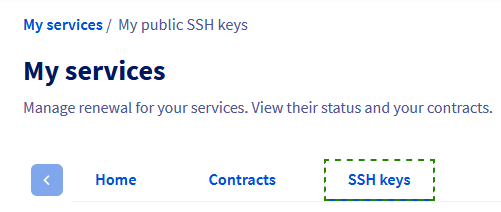
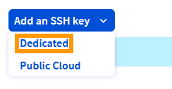
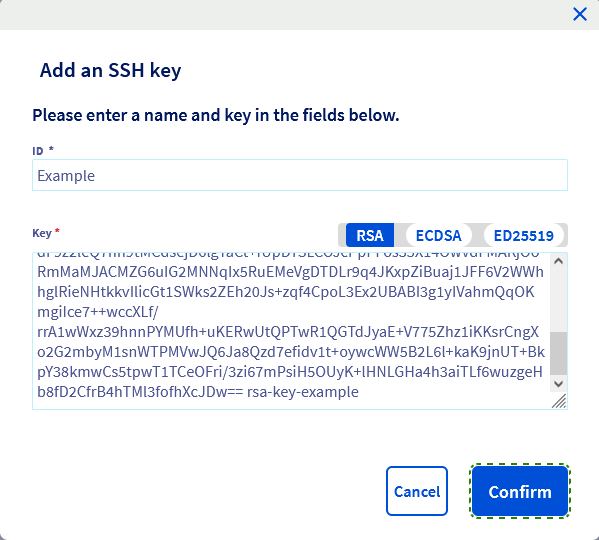

## Objetivo

Los pares de claves se utilizan para autenticar las conexiones SSH entre los hosts, por ejemplo, entre el cliente local del equipo y un servidor remoto. Al reinstalar un servidor dedicado o un VPS desde el área de cliente, puede añadir una clave pública al sistema operativo. El almacenamiento de claves SSH públicas en el área de cliente facilita este proceso.

**Esta guía explica cómo almacenar las llaves SSH públicas en el área de cliente.**

## Requisitos

- Un [servidor dedicado](/links/bare-metal/bare-metal) o un [VPS](/links/bare-metal/vps) en su cuenta de OVHcloud
- Tienes acceso a tu [área de cliente de OVHcloud](/links/manager).

> [!primary]
>
> Para más información sobre el uso de las llaves SSH con los servicios [Public Cloud](/links/public-cloud/public-cloud), consulte nuestra guía dedicada:
>
> [Cómo crear llaves SSH con OpenSSH para instancias Public Cloud](/pages/public_cloud/compute/creating-ssh-keys-pci)

## Procedimiento

Si aún no ha creado ningún par de llaves SSH, consulte nuestras guías:

- [Crear y utilizar llaves SSH](/pages/bare_metal_cloud/dedicated_servers/creating-ssh-keys-dedicated)
- [Tutorial - Cómo utilizar PuTTY para conexiones SSH y autenticación](/pages/web_cloud/web_hosting/ssh_using_putty_on_windows)

Conéctese a su [área de cliente de OVHcloud](/links/manager), haga clic en el nombre de la cuenta en la parte superior derecha y abra `Catálogo de productos`{.action}.

{.thumbnail}

En la sección `Mis servicios` del área de cliente, haga clic en `Llaves SSH`{.action}.

{.thumbnail}

Haga clic en el botón `Añadir una llave SSH`{.action} y seleccione `Dedicado`{.action} en el menú.

{.thumbnail}

Se abrirá una ventana en la que deberá introducir un "label" para la clave en el primer campo.  
Copie toda la cadena de clave pública y péguela en el segundo campo.

{.thumbnail}

Haga clic en el botón `Aceptar`{.action}.

La llave estará disponible cuando reinstale un servidor dedicado o un VPS en su área de cliente.

Consulte nuestras guías «Primeros pasos» para más información sobre este tema:

- [Servidor dedicado](/pages/bare_metal_cloud/dedicated_servers/getting-started-with-dedicated-server)
- [Servidor dedicado de la gama **Eco**](/pages/bare_metal_cloud/dedicated_servers/getting-started-with-dedicated-server-eco)
- [VPS](/pages/bare_metal_cloud/virtual_private_servers/starting_with_a_vps)

## Más información

Para servicios especializados (posicionamiento web, desarrollo...), póngase en contacto con los [partners de OVHcloud](/links/partner).

Si quiere disfrutar de ayuda para utilizar y configurar sus soluciones de OVHcloud, puede consultar nuestras distintas soluciones [pestañas de soporte](/links/support).

Interactúe con nuestra [comunidad de usuarios](/links/community).