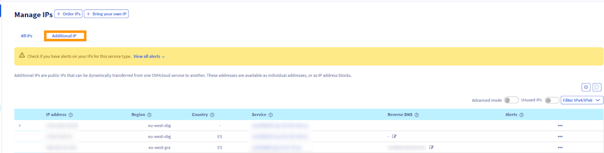
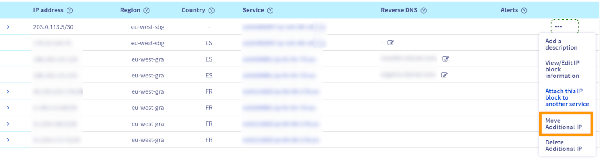

> [!primary]
>
> Since October 6th, 2022 our service "Failover IP" is named [Additional IP](/links/network/additional-ip). This renaming has no effect on its technical features.
>

## Objective

Additional IP addresses can be moved between the services you use. This provides an advantage since you can maintain your IP reputation, your SEO and improve the continuity of service of your applications and systems.

With this technology, you can switch IP addresses from one solution to another in less than a minute, with virtually no interruption to services for your users. It is useful for service migrations (e.g. moving projects from development to production), or when switching to a backup server during a technical issue.

> [!primary]
> You can assign your IP address blocks to any compatible service within a region. IP address blocks in a region can be moved from one datacenter to another within that region but cannot be moved outside of that region. Consult our [Limitations](#limitations) section below.
>
> Except for the 3 regions eu-west-gra, eu-west-rbx, and eu-west-sbg, where IP address blocks can be moved between these three regions.
>
> A region is a geographical area composed of one or more datacenters.
>
> Migration only works for whole blocks, it is not possible to migrate individual IPs within a block.

**This guide explains how to move an Additional IP in your OVHcloud Control Panel or via the OVHcloud API.**

## Requirements

- A [dedicated server](/links/bare-metal/bare-metal) in your OVHcloud account
- An [Additional IP address](/links/network/additional-ip)
- Access to the [OVHcloud Control Panel](/links/manager)

> [!warning]
> This feature might be unavailable or limited on servers of the [**Eco** product line](https://eco.ovhcloud.com/en-au/about/).
>
> Please visit our [comparison page](https://eco.ovhcloud.com/en-au/compare/) for more information.

> [!warning]
> If the Additional IP address or one of the block IP addresses has a virtual MAC attached, the target server must support the vMAC functionality.
> See [this guide](/pages/bare_metal_cloud/dedicated_servers/network_support_virtual_mac) for details.
>
> Otherwise, the virtual MACs must be removed from the Additional IPs before the transfer.

## Instructions

> [!primary]
> When an IP block containing unique virtual MAC addresses is moved between two servers, those addresses are temporarily suspended. They will appear on the new server once the move is complete.
>
> On the other hand, blocks containing duplicate virtual MAC addresses cannot be moved. You must first delete the duplicate virtual MAC address on the block to be moved.
>
> If an IP block is moved/added to the vRack, it is no longer linked to a physical server. In this case, any virtual MAC address will be lost during the transfer.
>

### Geolocalised IP blocks

The geolocation of an IP address is independent of its region of attachment.

If you order an additional IP block on a server but choose a different location (geolocation) for the IP block, this IP block cannot be moved to another server located in the same country as this block. For example, an additional IP block geolocated in Poland (eu-central-war) and ordered on a server located in a French datacentre (eu-west-gra) cannot be moved to a server located in a Polish datacentre (eu-central-war). The IP block can only be moved to an eligible server located in a French datacentre.

### Moving an IP from the OVHcloud Control Panel

> [!warning]
> Only a single size block (/32) can be moved from a dedicated server to a VPS.
>

Log in to the [OVHcloud Control](/links/manager), go to the `Bare Metal Cloud`{.action} menu and click on `Network`{.action}. Next, click on `IP`{.action}.

Click the `Additional IP`{.action} tab.

{.thumbnail}

Next, click the `...`{.action} button to the right of the additional IP or block of IP addresses you want to move and select `Move Additional IP`{.action} or `Attach this IP block to another service`{.action}.

{.thumbnail}

In the pop-up window, select the service to move the IP address to from the menu.

{.thumbnail}

Click `Next`{.action}, then `Confirm`{.action}.

### Moving an IP via the API

Log in to the OVHcloud [API webpage](https://ca.api.ovh.com/).

First, it is best to check if the IP address can be moved.
 To check if the IP can be moved to one of your dedicated servers, use the following call:

> [!api]
>
> @api {v1} /dedicated/server GET /dedicated/server/{serviceName}/ipCanBeMovedTo
>

- `serviceName`: the destination dedicated server reference
- `ip`: the Additional IP address to move

To move the IP address, use the following call:

> [!api]
>
> @api {v1} /dedicated/server POST /dedicated/server/{serviceName}/ipMove
>

- `serviceName`: the destination dedicated server reference
- `ip`: the Additional IP address to move

### Limitations 

Please note that there are certain limitations when moving an additional IP block. The table below shows the compatibility between regions.

For more information, consult our list of [available regions](/links/network/additional-ip).

| Zones  | eu-west-par | eu-west-gra | eu-west-rbx | eu-west-sbg | eu-west-lim | eu-central-war | eu-west-eri | ca-east-bhs | ca-east-tor | ap-southeast-sgp | ap-southeast-syd |
|----------------|-------------|-------------|-------------|-------------|-------------|----------------|-------------|-------------|-------------|-------------|-------------|
| eu-west-par    |      ✅        |      ❌       |     ❌        |     ❌        |      ❌       |      ❌          |       ❌       |       ❌      |     ❌      | ❌      |     ❌      |
| eu-west-gra    |       ❌      |       ✅       |      ✅       |      ✅      |       ❌       |       ❌         |       ❌        |     ❌        |    ❌        | ❌      |     ❌      |
| eu-west-sbg    |       ❌        |      ✅       |      ✅       |      ✅       |      ❌       |      ❌           |      ❌       |      ❌        |    ❌        | ❌      |     ❌      |
| eu-west-rbx |       ❌        |      ✅       |      ✅       |      ✅       |      ❌       |      ❌           |      ❌       |      ❌        |    ❌        | ❌      |     ❌      |
| eu-west-lim    |        ❌       |      ❌       |      ❌       |     ❌        |     ✅       |      ❌         |      ❌        |     ❌        |     ❌       | ❌      |     ❌      |
| eu-central-war |      ❌       |      ❌       |     ❌       |      ❌       |      ❌        |       ✅         |       ❌       |       ❌       |       ❌        | ❌      |     ❌      |
| eu-west-eri    |         ❌      |       ❌      |        ❌     |       ❌     |      ❌       |       ❌         |     ✅        |      ❌         |      ❌       | ❌      |     ❌      |
| ca-east-bhs    |     ❌        |      ❌       |    ❌         |        ❌    |        ❌       |      ❌          |       ❌      |     ✅        |      ❌       | ❌      |     ❌      |
| ca-east-tor    |    ❌         |      ❌       |     ❌        |        ❌       |      ❌       |       ❌         |      ❌       |      ❌       |       ✅     | ❌      |     ❌      |
| ap-southeast-sgp|    ❌         |      ❌       |     ❌        |        ❌       |      ❌       |       ❌         |      ❌       |      ❌       |       ❌       | ✅       |     ❌      |
| ap-southeast-syd|    ❌         |      ❌       |     ❌        |        ❌       |      ❌       |       ❌         |      ❌       |      ❌       |       ❌       | ❌      |     ✅       |

## Go further

Join our [community of users](/links/community).