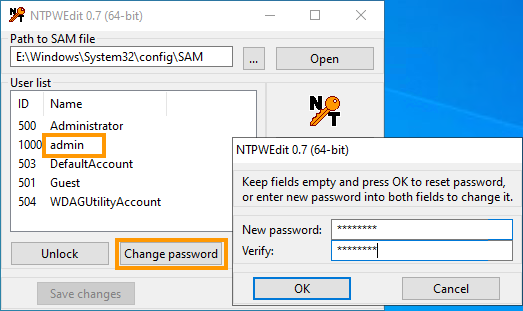

## Ziel

Diese Anleitung erklärt, wie Sie das Passwort für den Administrator-Account mithilfe der Funktion mit dem **Windows Customer Rescue System** zurückzusetzen.

## Voraussetzungen

- Sie haben einen [Dedicated Server](/links/bare-metal/bare-metal), auf dem eine Version von Microsoft Windows installiert wurde.
- Der Server verfügt über mindestens 16 GB RAM.
- Sie haben Zugriff auf Ihr [OVHcloud Kundencenter](/links/manager).

> [!warning]
>
> Diese Anleitung gilt nicht für den veralteten `Windows PE` (WinRescue) Rescue-Modus.
>
> Befolgen Sie stattdessen [diese Anleitung](/pages/bare_metal_cloud/dedicated_servers/changing-admin-password-on-windows), wenn Sie den Modus `WinPE Rescue` (WinRescue) im OVHcloud Kundencenter verwenden.

## In der praktischen Anwendung

### Schritt 1 - Neustart des Servers im Rescue-Modus 

Das System muss im **Windows Customer Rescue System** gestartet werden, bevor das Administratorkennwort geändert werden kann.

Detaillierte Anweisungen finden Sie in der [Anleitung zum Windows Rescue-Modus](/pages/bare_metal_cloud/dedicated_servers/rescue-customer-windows).

### Schritt 2 - Löschen des aktuellen Passworts 

Stellen Sie mithilfe den per E-Mail bereitgestellten Anmeldedaten eine Verbindung mit dem Server über *Remote Desktop* her.

Beachten Sie, dass der Benutzername für den Rescue-Modus "Administrator" ist.

- Wenn der Server Software-RAID auf der Windows-Disk verwendet, müssen Sie die lokale Windows-Disk importieren, um darauf zugreifen zu können: Befolgen Sie die Anweisungen im Abschnitt [A](#sectionA) unten.
- Wenn der Server kein Software-RAID auf der Windows-Disk verwendet, sollten Sie wie im [Abschnitt B](#sectionB) dieser Anleitung beschrieben direkt auf die lokale Windows-Disk zugreifen können.

#### A - Import des lokalen Windows-Datenträgers 

##### 1. Zugriff auf Datenträgerverwaltung

Klicken Sie mit der rechten Maustaste auf das Menü `Start`{.action} und wählen Sie `Datenträgerverwaltung`{.action}.

{.thumbnail}

Sie können dann die Disks und Volumes des Servers anzeigen.

{.thumbnail}

Die Windows-Disk Ihres Servers ist wahrscheinlich *Disk 1*. Sie müssen sie importieren, um darauf zugreifen zu können.

Beachten Sie, dass die Anzahl der Windows-Datenträger variieren kann, wenn Sie über mehrere Datenträgergruppen verfügen. Möglicherweise müssen Sie mehrere Datenträger importieren, um die Windows-Disk zu erhalten.

Außerdem müssen Sie die zweite Disk importieren, um Ihr Software-RAID-Volume ordnungsgemäß zu importieren.

##### 2. Lokale Datenträger importieren

Klicken Sie mit der rechten Maustaste auf *Disk 1* und wählen Sie `Online`{.action}.

{.thumbnail}

Führen Sie dasselbe für die zweite Disk (*Disk 2*) aus, um das Software-RAID-Volume ordnungsgemäß zu importieren.

Klicken Sie mit der rechten Maustaste auf *Disk 2* und wählen Sie `Online`{.action}.

{.thumbnail}

Datenträger werden jetzt als "Dynamic" und "Foreign" angezeigt.

Klicken Sie erneut mit der rechten Maustaste auf *Disk 1* und wählen Sie `Fremde Datenträger importieren`{.action}.

{.thumbnail}

Klicken Sie wiederholt auf `OK`{.action}.

{.thumbnail}

{.thumbnail}

Sie sehen, dass jetzt auf den lokalen Datenträger zugegriffen werden kann und dass `(E:)` der Windows-Datenträger ist (verteilt auf zwei Software RAID Datenträger vom Typ *Mirrored Volume*).

{.thumbnail}

> [!primary]
> In diesem Beispiel ist der Volume-Status "*Resynching*", da der Server im Rescue-Modus neu gestartet wurde. Dies ist ein erwarteter Zustand, der nicht vom Rescue-Modus selbst verursacht wird.
>
> Die Daten auf dem Volume sind hiervon nicht betroffen, und die Neusynchronisierung wird fortgesetzt, sobald der Server auf dem installierten Betriebssystem neu gestartet wird.

> [!Warnung]
>
> Sie müssen dann den Pfad Ihres lokalen Windows-Verzeichnisses (hier ist es `E:\Windows`) verwenden, wenn Sie nach der unten stehenden SAM-Konfigurationsdatei suchen.

Sie können das Passwort jetzt zurücksetzen, indem Sie die folgenden Anweisungen ausführen.

#### B - Zurücksetzen des Passworts 

Zum Zurücksetzen von Passwörtern ist das Tool NTPWEdit erforderlich. 
Sobald Sie über *Remote Desktop* verbunden sind, öffnen Sie den Browser und laden die Software von der [offiziellen Website](http://www.cdslow.org.ru/files/ntpwedit/ntpwed07.zip) herunter. 
Navigieren Sie zu dem Ordner, in dem sich die heruntergeladene ZIP-Datei befindet, und extrahieren Sie den Inhalt. 
Öffnen Sie anschließend die ausführbare Datei `ntpwedit64`, um die Anwendung zu starten.

In dieser Benutzeroberfläche können Sie die SAM-Datei bearbeiten, um das Kennwort des Administrator-Accounts zu löschen.

Sie müssen das lokale Windows-Laufwerk durchsuchen, um die SAM-Datei Ihres Systems zu finden.

Klicken Sie auf `...`{.action}, um das Laufwerk mit dem lokalen Windows-Ordner Ihres Servers zu durchsuchen.

Normalerweise ist dies das Laufwerk `Windows (E:\)`.

{.thumbnail}

Gehen Sie zu `E:\WINDOWS\SYSTEM32\CONFIG\`.

Öffnen Sie die SAM-Datei, um die Benutzerkonten anzuzeigen, indem Sie auf `Open`{.action} klicken.

{.thumbnail}

Wählen Sie das Benutzerkonto "admin" und klicken Sie auf `Change password`{.action}.

{.thumbnail}

Geben Sie im angezeigten Fenster in beiden Feldern Ihr neues Passwort ein und klicken Sie auf `OK`{.action}.

> [!warning]
>
> Das neue Passwort wird ohne Überprüfung seiner Komplexität akzeptiert.
>
> Denken Sie daran, dass dieses Passwort die Remote-Verbindung zum Server ermöglicht, nachdem der Server mit seinem Betriebssystem neu gestartet wurde.

Klicken Sie zum Abschluss auf `Save changes`{.action} und dann auf `Exit`{.action}.

Danach muss der Server mit dem regulären Betriebssystem neu gestartet werden.

### Schritt 3 - Neustart des Servers 

Ändern Sie zuerst den Netboot-Modus im OVHcloud Kundencenter wieder auf "Von Festplatte booten" (siehe [Schritt 1](#step1)).

Wechseln Sie wieder zum Fenster der KVM-Sitzung und wählen Sie die Herunterfahren-Option `Neustart`{.action} über den Windows-Button unten links aus. 

{.thumbnail}

## Weiterführende Informationen

Treten Sie unserer [User Community](/links/community) bei.