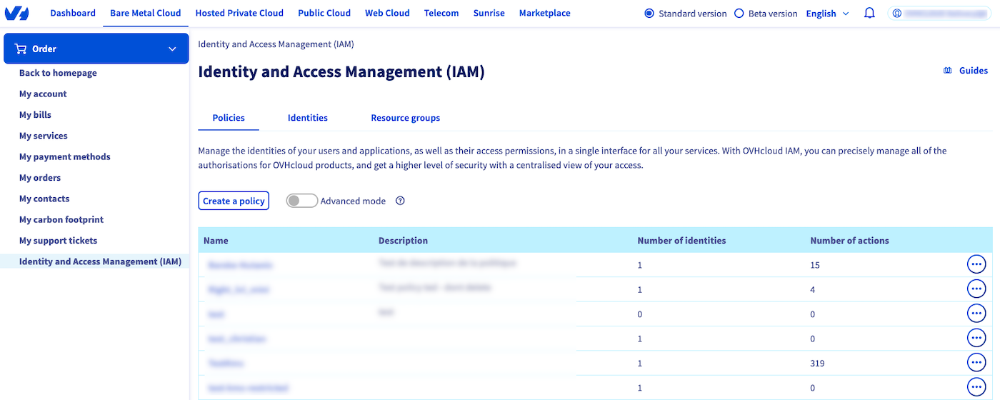
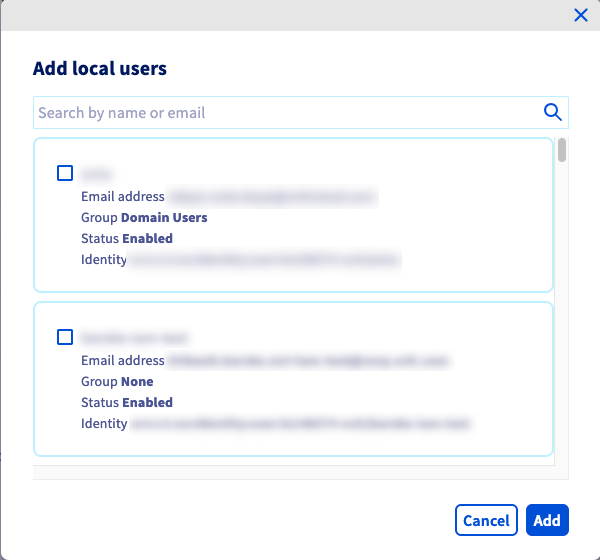

> [!primary]
> IAM is currently in beta phase. This guide can be updated in the future with the advances of our teams in charge of this product.
>

## Objective

**This guide details how to associate an OVHcloud identity (a user) with a global IAM policy**.

## Requirements

- An [OVHcloud account](/pages/account_and_service_management/account_information/ovhcloud-account-creation).
- One or more Hosted Private Cloud products - VMware on OVHcloud linked to this account (Hosted Private Cloud powered by VMware, VMware Service Pack).
- IAM enabled for your Hosted Private Cloud service - VMware on OVHcloud. Follow the steps in the guide [IAM for VMware on OVHcloud - How to enable IAM](/pages/hosted_private_cloud/hosted_private_cloud_powered_by_vmware/vmware_iam_activation).

## Instructions

### How do I associate a user with a global IAM policy?

Log in to your [OVHcloud Control Panel](/links/manager). Click on your name in the top right-hand corner of the OVHcloud Control Panel, then click on your initials to go to the `My account`{.action} section.

Under `My account`{.action}, click `Identities and Access Management (IAM)`{.action} and stay in the `Policies`{.action} tab.

{.thumbnail}

You will find here the policies you have already created.

Click your policy or click the `...`{.action} then `Modify policy`{.action}.

{.thumbnail}

Then enter the identity you want in the `Local users` and `User groups` boxes, by clicking `Add users`{.action} or `Add user groups`{.action}.

{.thumbnail}

Only IAM Groups (not vSphere IAM Groups) appear automatically, so make sure you copy/paste your choice without errors.

Confirm the addition of your user by clicking `Add`{.action}.

Then, to finish your policy, click `Modify policy`{.action}.

> [!primary]
> If your identity is not present, you will need to add it first in the OVHcloud Control Panel.

## Go further

**IAM for VMware on OVHcloud - Guide index:**

- Guide 1: [IAM for VMware on OVHcloud - Overview and FAQ](/pages/hosted_private_cloud/hosted_private_cloud_powered_by_vmware/vmware_iam_getting_started)
- Guide 2: [IAM for VMware on OVHcloud - How to enable IAM](/pages/hosted_private_cloud/hosted_private_cloud_powered_by_vmware/vmware_iam_activation)
- Guide 3: [IAM for VMware on OVHcloud - How to create an IAM vSphere role](/pages/hosted_private_cloud/hosted_private_cloud_powered_by_vmware/vmware_iam_role)
- Guide 4: [IAM for VMware on OVHcloud - How to associate a vSphere role with an IAM policy](/pages/hosted_private_cloud/hosted_private_cloud_powered_by_vmware/vmware_iam_role_policy)
- Guide 5: IAM for VMware on OVHcloud - How to associate a user with a global IAM policy

If you need training or technical assistance to implement our solutions, contact your sales representative or click on [this link](/links/professional-services) to get a quote and ask our Professional Services experts for a custom analysis of your project.

Join our [community of users](/links/community).
