<style>
details>summary {
    color:rgb(33, 153, 232) !important;
    cursor: pointer;
}
details>summary::before {
    content:'\25B6';
    padding-right:1ch;
}
details[open]>summary::before {
    content:'\25BC';
}
</style>

## Objectif

HYCU for Nutanix est un logiciel de sauvegarde disponible pour Nutanix. 

**Apprenez à installer, configurer et utiliser HYCU sur un cluster Nutanix avec un stockage de type Object Storage fourni par OVHCloud**

> [!warning]
> OVHcloud vous met à disposition des services dont la configuration, la gestion et la responsabilité vous incombent. Il vous appartient donc de ce fait d’en assurer le bon fonctionnement.
>
> Ce guide a pour but de vous accompagner au mieux sur des tâches courantes. Néanmoins, nous vous recommandons de faire appel à l'équipe [Professional Services OVHcloud](/links/professional-services) ou à un [prestataire spécialisé](/links/partner) si vous éprouvez des difficultés ou des doutes concernant l’administration, l’utilisation ou la mise en place d’un service sur un serveur.
>

## Prérequis

- Une licence [HYCU for OVHcloud](/links/hycu) valide dans votre compte OVHcloud (la première étape de ce guide vous détaille la procédure à suivre) ou une licence HYCU acquise depuis un fournisseur tiers.
- Disposer d'un cluster Nutanix on OVHcloud dans votre compte OVHcloud.
- Être connecté à votre [espace client OVHcloud](/links/manager).
- Être connecté sur le cluster via Prism Central.
- Avoir un projet Public Cloud avec un bucket de stockage de type High Performance Object Storage ainsi qu'un utilisateur ayant les droits en lecture et écriture sur ce bucket. Vous trouverez plus d'informations sur la création d'un projet Public Cloud et sur l’utilisation du service High Performance Object Storage sur les pages suivantes :
    - [Création d'un projet Public Cloud](/pages/public_cloud/compute/create_a_public_cloud_project).
    - [Débuter avec S3 High Performance](/pages/storage_and_backup/object_storage/s3_getting_started_with_object_storage).
- 60 Go de stockage, 8 Go de mémoire et 8 cœurs sur votre Cluster Nutanix pour l'Instance/Appliance HYCU.

## En pratique

### Présentation du contenu

- [Commander une licence HYCU for OVHcloud](#license-order)
    - [Activer la licence](#license-activation)
    - [Régénérer une licence HYCU for OVHcloud](#license-renew)
    - [Résilier un abonnement HYCU for OVHcloud (et sa licence associée)](#license-cancel)
    - [Mettre à niveau une licence HYCU for OVHcloud](#license-upgrade)
- [Installer et configurer HYCU](#installation)
    - [Ajouter l'image d'installation d'HYCU](#adding-image)
    - [Configurer l'adresse IP pour ISCSI](#adding-ip)
    - [Ajouter un compte utilisateur dans Prism Element pour HYCU](#adding-user)
    - [Créer la machine virtuelle pour HYCU](#create-vm)
    - [Configurer la redirection de l'URL HYCU vers le réseau public](#url-redirection)
    - [Configurer HYCU](#hycu-configuration)
- [Mise à jour d'HYCU](#hycu-update)
    - [Ajouter les sources d'une nouvelle version d'HYCU](#adding-new-sources)
    - [Lancer la mise à jour à partir d'HYCU](#update-launch)
- [Configurer la sauvegarde dans HYCU](#backup-configuration)
    - [Paramétrer les mots de passe de connexion aux machines virtuelles](#setting-passwords)
    - [Créer des stratégies de sauvegardes](#backup-strategies)
    - [Affecter des stratégies de sauvegardes](#backup-strategies-assignment)
- [Contrôler l'état des sauvegardes](#backup-check)
- [Restaurer à partir d'HYCU](#restoring)
    - [Restaurer une machine virtuelle](#restoring-vm)
    - [Récupérer un fichier](#restoring-file)
    - [Restaurer une application](#restoring-app)

### Commander une licence HYCU for OVHcloud <a name="license-order"></a>

Nous vous proposons différents packs de licences selon le nombre de machines virtuelles (VM) utilisées par vos charges de travail Nutanix.

> [!success]
> Retrouvez plus d'informations sur notre page [HYCU for OVHcloud](/links/hycu).

> [!primary]
> **Vous avez déjà une licence HYCU ?**<br>
> Poursuivez la lecture de ce guide à l'étape « [Installer et configurer HYCU](installation) ».

Connectez-vous à [l'espace client OVHcloud](/links/manager) puis rendez-vous successivement dans `Hosted Private Cloud`{.action} et `Stockage et sauvegarde`{.action}.

Cliquez sur `HYCU`{.action} puis sur `Toutes mes licenses`{.action}. 

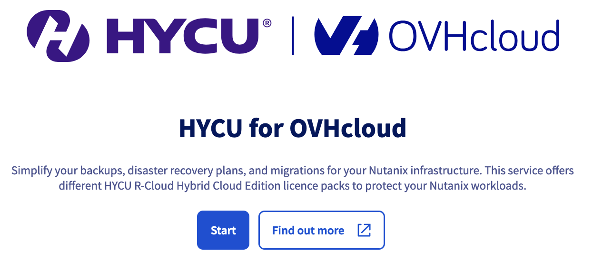{.thumbnail}

Cliquez alors sur le bouton `Commencer`{.action} pour choisir et commander un pack HYCU for OVHcloud.

Une fois votre commande effectuée, vous recevrez un e-mail de confirmation et votre souscription apparaîtra dans le tableau de bord `Toutes mes licenses`{.action}.

Cliquez sur votre licence pour procéder à son activation.

#### Activer la licence <a name="license-activation"></a>

> [!warning]
> Cette étape nécessite d'avoir préalablement **installé et configuré le logiciel HYCU sur votre cluster Nutanix**.<br>
> Si ce n'est pas déjà le cas, poursuivez la lecture de ce guide à l'étape « [Installer et configurer HYCU](installation) » avant de suivre l'étape d'activation de la licence HYCU ci-dessous.
>

/// details | Activer la licence HYCU

Lorsque vous cliquez sur une licence dans votre tableau de bord, un menu vous permet de renommer, d'activer, de renouveler ou de résilier votre licence HYCU for OVHcloud.

Cliquez sur le bouton `Activer la licence`{.action} (dans le cadre `Raccourcis`).

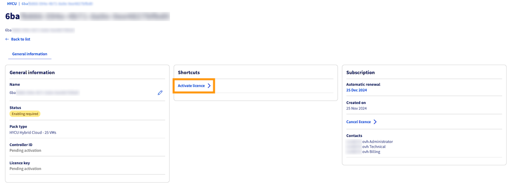{.thumbnail}

Une fenêtre s'affiche pour transférer le fichier de demande de licence.

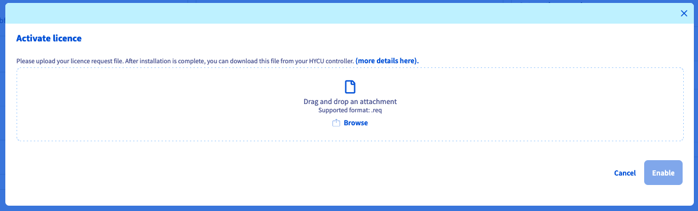{.thumbnail}

Pour obtenir votre fichier de demande de licence, connectez-vous à votre instance/appliance Hybrid Cloud HYCU et accédez au menu des licences (`Licensing`{.action}).

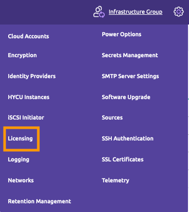{.thumbnail}

Cliquez sur `Download Request`{.action} et téléchargez le fichier.

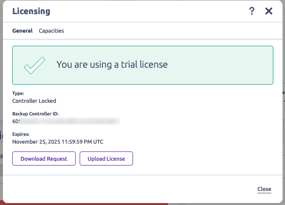{.thumbnail}

De retour dans l'espace client OVHcloud, glissez-déposez le fichier téléchargé dans la fenêtre restée ouverte puis cliquez sur `Activer`{.action}.

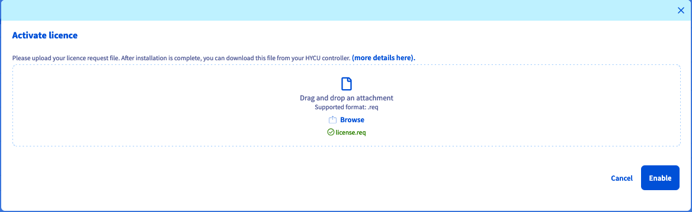{.thumbnail}

Après vérification, le statut de votre licence passera à `Active`.

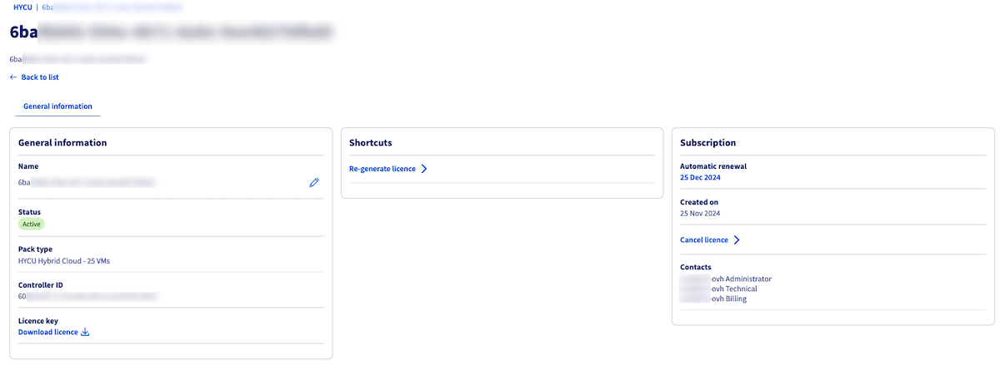{.thumbnail}

Une fois la licence active, cliquez sur le bouton `Télécharger la licence`{.action} (en bas du cadre `Informations générales`).

Retournez dans le menu `Licensing`{.action} de votre instance/appliance Hybrid Cloud HYCU et transférez la licence que vous venez de télécharger depuis l'espace client OVHcloud.

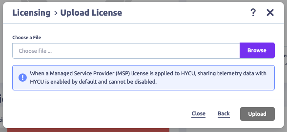{.thumbnail}

Une fenêtre vous indiquera alors que votre licence est validée.

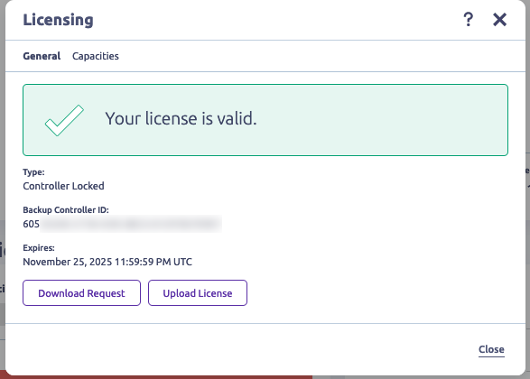{.thumbnail}

///

#### Régénérer une licence HYCU for OVHcloud <a name="license-renew"></a>

Si votre configuration technique HYCU a changé, vous devrez effectuer une nouvelle demande afin d'obtenir un nouveau fichier de licence compatible avec votre contrôleur HYCU.

/// details | Régénérer une licence HYCU for OVHcloud

Connectez-vous à [l'espace client OVHcloud](/links/manager) puis rendez-vous successivement dans `Hosted Private Cloud`{.action} et `Stockage et sauvegarde`{.action}. Cliquez sur `HYCU`{.action}.

Une fois dans votre tableau de bord de licences, cliquez sur le bouton `Régénérer la licence`{.action} (dans le cadre `Raccourcis`).

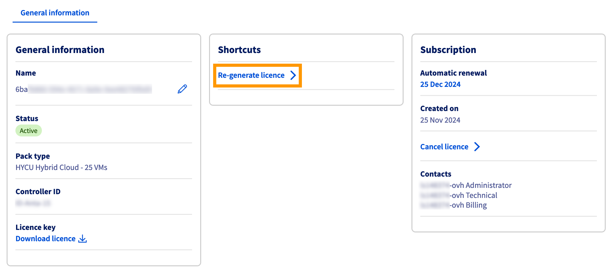{.thumbnail}

Comme précédemment pour l'activation de votre licence, téléchargez et transférez votre demande de licence.

Suivez ensuite le même processus que pour l'activation de la licence :

- Téléchargez la clé de licence.
- Transférez la clé de licence sur votre instance/appliance Hybrid Cloud.

///

#### Résilier un abonnement HYCU for OVHcloud (et sa licence associée) <a name="license-cancel"></a>

/// details | Comment résilier un abonnement HYCU for OVHcloud

Connectez-vous à [l'espace client OVHcloud](/links/manager) puis rendez-vous successivement dans `Hosted Private Cloud`{.action} et `Stockage et sauvegarde`{.action}. Cliquez sur `HYCU`{.action}.

Une fois dans votre tableau de bord de licences, cliquez sur `Résilier la licence`{.action} dans le cadre `Abonnement`.

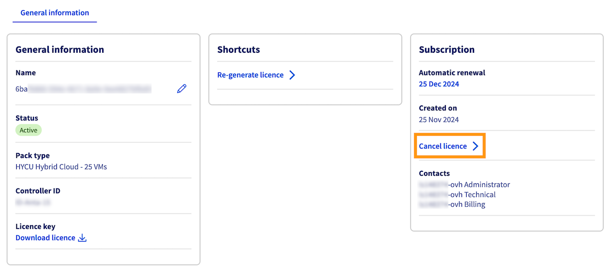{.thumbnail}

Confirmez ensuite la résilitation en saisissant `TERMINATE`dans le cadre prévu à cet effet, puis cliquez sur `Résilier`{.action}.

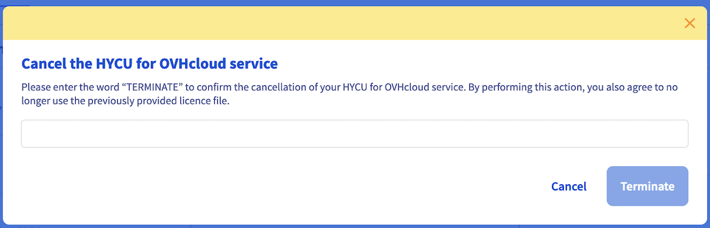{.thumbnail}

///

#### Mettre à niveau une licence HYCU for OVHcloud <a name="license-upgrade"></a>

Pour mettre à niveau votre offre, vous devez d'abord résilier votre abonnement HYCU for OVHcloud (voir ci-dessus) puis [commander un nouvel abonnement](/links/hycu) avec le pack de machines virtuelles nécessaire.

### Installer et configurer HYCU <a name="installation"></a>

Connectez-vous à **Prism Central**.

Pour plus d'informations sur la connexion au cluster, reportez-vous à la section « [Aller plus loin](#gofurther) » de ce guide. 

Via le menu principal, cliquez sur `Images`{.action} depuis le menu `Compute & Storage`{.action}

{.thumbnail}

Cliquez sur `Add Image`{.action}.

{.thumbnail}

Choisissez `URL`{.action} comme type de source, saisissez l'URL `https://download.hycu.com/ec/v4.X.X/hycu-4.X.X-XXXX.qcow2` dans **Enter Image URL** et cliquez sur `Upload file`{.action}. 

> [!primary]
> 
> L'URL utilisée pour le téléchargement correspond à la dernière version disponible sur le site d'HYCU.

{.thumbnail}

Retirez l'extension **.qcow2** derrière le nom et laissez `hycu-4.X.X-XXXX`. Saisissez une description et cliquez sur `Next`{.action}.

> [!warning]
> Il est important d'enlever l'extension dans le nom afin de faciliter le processus de configuration d'HYCU.

{.thumbnail}

Cliquez sur `Save`{.action} pour importer l'image.

{.thumbnail}

Sur le tableau de bord de **Prism Central**, cliquez sur le `nom du cluster`{.action} dans la section **Cluster Quick Access** afin de vous rendre sur **Prism Element**.

{.thumbnail}

#### Configurer l'adresse IP pour ISCSI <a name="adding-ip"></a>

Allez dans les paramètres en cliquant sur l'icône représentant un `engrenage`{.action}.

{.thumbnail}

Cliquez sur `Cluster Details`{.action}.

{.thumbnail}

Saisissez `une adresse IP locale non utilisée`{.action} dans **Virtual IP** et cliquez sur `Save`{.action}.

{.thumbnail}

Vérifiez votre choix et cliquez sur `Yes`{.action}.

{.thumbnail}

L'adresse IP est affichée dans **virtual IP**.

{.thumbnail}

#### Ajouter un compte utilisateur dans **Prism Element** pour HYCU <a name="adding-user"></a>

Cliquez sur l'engrenage pour aller dans la configuration de **Prism Element**

{.thumbnail}

Faites défiler le menu et cliquez sur `Local User Management`{.action}.

{.thumbnail}

Cliquez sur `New User`{.action}.

{.thumbnail}

Saisissez ces valeurs :

- **Username** : `svc_hycu`
- **First Name** : `HYCU`
- **Last Name** : `HYCU`
- **Email** : `hycu@example.com`
- **Password** : `mot de passe`

> [!primary]
> Ces informations sont fournies à titre d'exemple, l'adresse de messagerie est obligatoire mais n'est pas utilisée.

Cochez la case `Cluster Admin`{.action} et cliquez sur `Save`{.action}

{.thumbnail}

L'utilisateur est alors créé.

{.thumbnail}

#### Créer la machine virtuelle pour HYCU <a name="create-vm"></a>

Allez dans **Prism Central**.

Via le menu principal, cliquez sur `VMs`{.action} depuis le menu `Compute & Storage`{.action}.

{.thumbnail}

Cliquez sur `Create VM`{.action}.

{.thumbnail}

Nommez la machine virtuelle et modifiez les propriétés de la machine virtuelle avec ces paramètres:

- **CPU** : `4 vCPU`
- **Cores Per CPU** : `2 Cores`
- **Memory** : `8GB`

Cliquez sur `Next`{.action}.

{.thumbnail}

Cliquez sur `Attach Disk`{.action}.

{.thumbnail}

Saisissez ces informations :

- **Type** : `Disk`
- **Operation** : `Clone from Image`
- **Image** : `hycu-4.X.X-XXXX`

Cliquez sur `Save`{.action}.

{.thumbnail}

Cliquez sur `Attach Disk`{.action}.

{.thumbnail}

Choisissez ces options :

- **Type** : `Disk`
- **Operation** : `Allocate on Storage Container`
- **Image** : `default-container`
- **Capacity** : `32Gib`

Cliquez sur `Save`{.action}.

{.thumbnail}

Cliquez sur `Attach to Subnet`{.action}.

{.thumbnail}

Sélectionnez le réseau `infra`{.action} dans le menu déroulant **Subnet** et `Connected`{.action} dans le menu déroulant **Network Connection State**. Cliquez ensuite sur `Save`{.action}.

{.thumbnail}

Cliquez sur `Next`{.action}.

{.thumbnail}

Créez un fichier **yaml** en modifiant ces valeurs :

- **< Adresse IP >** : Adresse IP locale de la machine virtuelle avec le masque de sous-réseau sous la forme XX.XX.XX.XX/XX. 
- **< GATEWAY >** : Passerelle locale de la machine virtuelle pour aller sur Internet.
- **< DNS >** : DNS utilisé sur Internet.

```yaml
#cloud-config
bootcmd:
- /opt/grizzly/bin/cloud_init_setup.sh hycubc < Adresse IP > < GATEWAY >  < DNS > "hycu.local,ntnx.local"
```

Modifiez les options de **Guest Customization** en sélectionnant `Cloud-init (Linux)`{.action} dans le menu déroulant **Script Type** et `Custom Script`{.action} dans le menu déroulant **Configuration Method**.

Copiez le contenu du script yaml et collez-le à l'emplacement réservé au-dessous de **Clear Script**. Cliquez ensuite sur `Next`{.action}.

{.thumbnail}

Cliquez sur `Create VM`{.action}.

{.thumbnail}

Sélectionnez la machine virtuelle créée en utilisant la `case à cocher`{.action} à droite de la machine virtuelle.

{.thumbnail}

Cliquez sur `Power On`{.action} dans le menu `Actions`.

{.thumbnail}.

La machine virtuelle est démarrée et possède l'adresse IP définie dans **cloud-init**.

{.thumbnail}

#### Configurer la redirection de l'URL HYCU vers le réseau public <a name="url-redirection"></a>

Dans cette section, nous allons configurer une redirection pour que vous puissiez configurer HYCU en utilisant l’interface web de l’extérieur de votre cluster.

Depuis votre espace client OVHcloud, sélectionnez `Bare Metal Cloud`{.action} puis cliquez sur votre `Load Balancer`{.action} dans la barre de menu à gauche.

Dans l'onglet `Fermes de serveurs`{.action}, cliquez sur `Ajouter une ferme de serveurs`{.action}.

{.thumbnail}

Nommez votre ferme de serveurs puis selectionnez `TCP`{.action} et saisissez ces informations

- **Port** : `8443`
- **Datacenter** : `ALL`
- **Réseau privé** : `nutanix`

Cliquez sur `Ajouter`{.action} pour valider la création de la ferme de serveurs.

{.thumbnail}

Cliquez sur `Ajouter un serveur`{.action}

{.thumbnail}

Saisissez ces valeurs :

- **Name (optional)** : `VM-HYCU`
- **Adresse IPv4** : `addresseiphycu`
- **Port** : `8443`

Cliquez sur `Ajouter`{.action} pour valider la création du cluster.

{.thumbnail}

Cliquez ensuite sur l'onglet `Frontends`{.action} et sur `Ajouter un frontend`{.action}.

{.thumbnail}

Nommez votre frontend, choisissez le protocole `TCP`{.action} et modifiez ces valeurs :

- **Port** : `8443`
- **Datacenter** : `ALL`
- **Ferme par défaut** : `HYCU (TCP)`

Cliquez sur `Ajouter`{.action}.

{.thumbnail}

Cliquez sur `Appliquer la configuration`{.action}.

{.thumbnail}

Sélectionnez le `Datacenter`{.action} et cliquez sur `Appliquer la configuration`{.action}.

{.thumbnail}

Dans l'onglet `Tâches`{.action}, vous pourrez suivre l'avancement de l'application des changements.

{.thumbnail}

Pour plus d'informations concernant le Load Balancer OVHcloud, reportez-vous à la section « [Aller plus loin](#gofurther) » de ce guide. 

#### Configurer HYCU <a name="hycu-configuration"></a>

Connectez-vous avec un navigateur web à l'interface d'administration de HYCU qui doit avoir cette forme **https://fqdnclusternutanix:8443**. La variable `fqdn` correspond à l'URL fournie lors de la création du cluster Nutanix.

Saisissez le mot de passe par défaut et cliquez sur `Sign In`{.action}.

{.thumbnail}

Changez le mot de passe de connexion pour plus de sécurité.

Cliquez sur `Change Password`{.action} dans le menu `admin`{.action} en haut à droite de l'interface.

{.thumbnail}

Saisissez le mot de passe par défaut dans le champ **OLD PASSWORD**, le nouveau mot de passe dans les champs **PASSWORD** et **CONFIRM PASSWORD**.

Cliquez ensuite sur `Save`{.action}.

{.thumbnail}

Nous allons connecter HYCU au cluster Nutanix.

Cliquez sur l'icône `Administration`{.action} en forme d'engrenage en haut à droite et choisissez `Sources`{.action}

{.thumbnail}

Saisissez les informations concernant **Prism Element** :

- **URL** : `https://url_prism_element_local:9440`
- **USERNAME** : `utilisateur Prism Element`
- **PASSWORD** : `mot de passe de l'utilisateur Prism Element`

Cliquez sur `Next`{.action}.

{.thumbnail}

Saisissez ces informations concernant **Prism Central** :

- **URL** : `https://url_prism_central_local:9440`
- **USERNAME** : `utilisateur de Prism Central`
- **PASSWORD** : `mot de passe de Prism Central`

Cliquez sur `Next`{.action}.

{.thumbnail}

L'information `VALIDATION SUCCESSFUL` apparaît pour signifier que les informations saisies sont correctes, cliquez sur `Save`{.action}.

{.thumbnail}

Cliquez sur `Close`{.action}.

{.thumbnail}

Sélectionnez `Targets`{.action} dans le menu à gauche et cliquez sur `+ Add`{.action} en haut à droite de l'interface.

{.thumbnail}

Saisissez les paramètres de configuration et les clés d’authentification de votre utilisateur S3 ayant les droits d’accès en lecture/écriture au bucket S3 utilisé comme expliqué ci-dessous :

- **Name** : Nom
- **Size** : Taille du stockage
- **Type** : `AWS S3/Compatible`

> [!warning]
> Le service **High Performance Object Storage** d'OVHcloud n'a pas de limites de stockage et est facturé à l'utilisation .
> Dans la configuration du logiciel HYCU, il est nécessaire de fixer une taille comme dans l'exemple ci-dessous. Vous pouvez bien sûr choisir une autre valeur.
>

Activez `ENABLE COMPRESSION`{.action} et faites défilez la fenêtre avec la `barre de défilement`{.action}. 

{.thumbnail}.

Finalisez la saisie des informations :

- SERVICE ENDPOINT: `URL Stockage S3`
- BUCKET NAME: `Nom du bucket`
- ACCESS KEY ID: `Clé d'accès de l'utilisateur S3`
- SECRET ACCESS KEY `Clé secrète de l'utilisateur S3`

Activez `TARGET ENCRYPTION`{.action} et cliquez sur `Save`{.action}.

{.thumbnail}.

La cible est activée pour les sauvegardes du cluster Nutanix.

{.thumbnail}.

### Mise à jour d'HYCU <a name="hycu-update"></a>

HYCU fournit régulièrement des mises à jour dont nous détaillons le processus ci-dessous.

#### Ajouter les sources d'une nouvelle version d'HYCU <a name="adding-new-sources"></a>

Via le menu principal de **Prism Central**, cliquez sur `Images`{.action} depuis le menu `Compute & Storage`{.action}.

{.thumbnail}

Cliquez sur `Add Image`{.action}.

{.thumbnail}

Sélectionnez `URL`{.action}. 

Saisissez l'URL de l'image qcow2 de la dernière version d'HYCU, tel que : 

- `https://download.hycu.com/ec/v4.X.X/hotfixes/4.X.X-XXXX/hycu-4.X.X-XXXX.qcow2`

> [!primary]
> 
> L'URL utilisée pour le téléchargement correspond à la dernière version disponible sur le site d'HYCU. 

Cliquez sur `Upload file`{.action}.

{.thumbnail}

Retirez l'extension **.qcow2** derrière le nom `hycu-'4.X.X-XXXX`, saisissez une description et cliquez sur `Next`{.action}.

> [!warning]
> Il est important de retirer l'extension dans le nom afin de faciliter le processus de mise à jour d'HYCU.

{.thumbnail}

Cliquez sur `Save`{.action} pour importer l'image. 

{.thumbnail}

#### Lancer la mise à jour à partir d'HYCU <a name="update-launch"></a>

Connectez-vous via l'URL fournie lors de la création du cluster Nutanix en remplaçant le port **https://fqdnclusternutanix:8443**.

Rendez-vous dans la configuration d'HYCU en cliquant sur l'icône `Administration`{.action} en forme d'engrenage et choisissez `Power Options`{.action}.

{.thumbnail}
 
Sélectionnez `Suspend All`{.action}, cochez `AUTO RESUME AFTER`{.action} et laissez le champ **Hours** à`1`{.action} puis cliquez sur `Save`{.action}.

{.thumbnail}

Cliquez sur `Software Upgrade`{.action} depuis le menu `Administration`{.action} en forme d'engrenage. 

{.thumbnail}

Choisissez la dernière version dans le menu déroulant **AVAILABLE VERSIONS** et cliquez sur `Software Upgrade`{.action}.

{.thumbnail}

Cliquez sur `Yes`{.action} pour lancer le processus de mise à jour.

{.thumbnail}

Une copie de sauvegarde est effectuée lors du processus de mise à jour pour pouvoir revenir en arrière en cas de problèmes.

{.thumbnail}

Connectez-vous à l'interface d'administration d'HYCU. 

Cliquez sur l'icône en forme d'engrenage et cliquez sur `Power Options`{.action}.

{.thumbnail}

Décochez `Suspend All`{.action} et cliquez sur `Save`{.action}.

{.thumbnail}

### Configurer la sauvegarde dans HYCU <a name="backup-configuration"></a>

#### Paramétrer les mots de passe de connexion aux machines virtuelles <a name="setting-passwords"></a>

Les mots de passe de connexion aux machines virtuelles permettent la sauvegarde des applications comme une base Microsoft SQL ou un serveur Exchange.

Connectez-vous via le menu `Virtual Machines`{.action} à gauche et cliquez sur l'icône `Credentials`{.action} en forme de clé en haut à droite de l'interface.

{.thumbnail}

Cliquez sur le signe `+`{.action}.

{.thumbnail}

Saisissez ces valeurs :

- **NAME** : nom du stockage de mot de passe
- **PROTOCOL** : `AUTOMATIC`
- **USERNAME** : compte utilisateur de la machine virtuelle
- **PASSWORD** : mot de passe

Cliquez sur `Save`{.action}.

{.thumbnail}

Cliquez sur le signe `+`{.action} pour ajouter un autre compte.

{.thumbnail}

Saisissez ces valeurs :

- **NAME** : nom du stockage de mot de passe
- **PROTOCOL** : `AUTOMATIC`
- **USERNAME** : compte utilisateur de la machine virtuelle
- **PASSWORD** : mot de passe

Cliquez sur `Save`{.action}.

{.thumbnail}

Cliquez sur `Close`{.action}

{.thumbnail}

Sélectionnez les machines virtuelles qui vont utiliser un mot de passe en cochant la case à droite de la machine virtuelle puis cliquez sur l'icône `credentials`{.action} en forme de clé.

{.thumbnail}

Sélectionnez le mot de passe à utiliser et cliquez sur `Assign`{.action}.

{.thumbnail}

Sélectionnez une autre machine virtuelle qui va utiliser un mot de passe en cochant la case  à droite de la machine virtuelle puis cliquez sur l'icône `credentials`{.action} en forme de clé.

{.thumbnail}

Sélectionnez le mot de passe à utiliser et cliquez sur `Assign`{.action}.

{.thumbnail}

#### Créer des stratégies de sauvegardes <a name="backup-strategies"></a>

Allez dans le menu `policies`{.action} à gauche et cliquez en haut à droite sur l'icône avec le signe `+`{.action}.

{.thumbnail}

Saisissez ces informations :

- **NAME** : `HYCU VM`
- **BACKUP EVERY** : `4 hours`
- **BACKUP THRESHOLD** : `42`

Laissez l'option `BACKUP`{.action} cochée et utilisez la barre de défilement à droite.

{.thumbnail}

Cliquez sur `Save`{.action}.

{.thumbnail}

Cette stratégie est créée pour la machine virtuelle HYCU. 

Dans le menu `policies`, cliquez en haut à droite sur l'icône avec le signe `+`{.action}.

{.thumbnail}

Définissez le nom de la stratégie `BACKUP to S3 OVHcloud and local SNAPSHOTS`{.action} dans le champ **NAME**.

Cochez l'option `FAST RESTORE`{.action}, laissez l'option `BACKUP`{.action} cochée.

Modifiez les options de sauvegardes dans  **Backup** puis modifiez la valeur **BACKUP THREESHOLD** à `25`{.action}. Utilisez ensuite la `barre de défilement`{.action} à droite.

{.thumbnail}

Modifiez l'option **Fast restore** avec vos paramètres et cliquez sur `Save`{.action}

{.thumbnail}

Cette stratégie fait une sauvegarde sur le stockage S3 d'OVHcloud et aussi des **snapshots** à l'intérieur du cluster Nutanix, ce qui permet une plus grande rapidité de restauration.

#### Affecter des stratégies de sauvegardes <a name="backup-strategies-assignment"></a>

Sélectionnez toutes les machines virtuelles via la case à cocher à coté de **NAME**, puis cliquez sur l'icône `Policies`{.action} en forme de bouclier en haut à droite pour affecter une stratégie à toutes les machines virtuelles.

{.thumbnail}

Choisissez la stratégie `Exclude`{.action} et cliquez sur `Assign`{.action}.

{.thumbnail}

Sélectionnez la machine virtuelle HYCU en sélectionnant la case à cocher à coté de la machine virtuelle HYCU, puis cliquez sur l'icône `Policies`{.action} pour affecter une stratégie à cette machine virtuelle.

{.thumbnail}

Choisissez la stratégie `HYCU VM`{.action} et cliquez sur `Assign`{.action}.

{.thumbnail}

Sélectionnez quatre machines virtuelles puis cliquez sur l'icône `Policies`{.action} pour affecter une stratégie.

{.thumbnail}

Choisissez la stratégie `BACKUP to S3 OVHcloud and local SNAPSHOTS`{.action} et cliquez sur `Assign`{.action}.

{.thumbnail}

### Contrôler l'état des sauvegardes <a name="backup-check"></a>

Rendez-vous dans le menu `Dashboard`{.action} à gauche pour afficher le tableau de bord et connaître l'état de la sauvegarde.

{.thumbnail}

Ouvrez le menu `Jobs`{.action} à gauche pour afficher l'état des travaux.

{.thumbnail}

### Restaurer à partir d'HYCU <a name="restoring"></a>

Utilisez le menu `Virtual Machines`{.action} et cliquez sur une machine virtuelle sauvegardée.

{.thumbnail}

#### Restaurer une machine virtuelle <a name="restoring-vm"></a>

Cliquez en bas à droite sur l'icône `Restore VM`{.action}.

{.thumbnail}

Sélectionnez `Restore VM`{.action} et cliquez sur `Next`{.action}.

{.thumbnail}

Laissez les options par défaut et cliquez sur `Restore`{.action}.

{.thumbnail}

La machine virtuelle est entièrement restaurée. 

#### Récupérer un fichier <a name="restoring-file"></a>

Cliquez en bas à droite sur l'icône `Restore files`{.action}

{.thumbnail}

Laissez `AUTOMATIC`{.action} dans le menu déroulant **RESTORE FROM** et cliquez sur `Next`{.action}.

{.thumbnail}

Sélectionnez le fichier à restaurer et cliquez sur `Next`{.action}.

{.thumbnail}

Laissez les options par défaut et cliquez sur `Next`{.action}.

{.thumbnail}

Choisissez `Rename restored`{.action} et cliquez sur `Restore`{.action}.

{.thumbnail}

Le fichier restauré se trouve à l'intérieur de la machine virtuelle avec un nouveau nom pour ne pas supprimer l'ancien fichier.

#### Restaurer une application <a name="restoring-app"></a>

Cliquez sur le menu `Applications`{.action} puis choisissez une application à restaurer en cliquant sur une application en dessous de **Name**.

{.thumbnail}

Cliquez sur l'icône `Restore`{.action} en bas à droite.

{.thumbnail}

Sélectionnez `Restore databases`{.action} et cliquez sur `Next`{.action}.

{.thumbnail}

Choisissez une base de données et cliquez sur `Next`{.action}.

{.thumbnail}

Désactivez `OVERWRITE EXISTING DATABASES`{.action} et cliquez sur `Restore`{.action}.

{.thumbnail}

La base de données est restaurée dans une nouvelle base de données.

## Aller plus loin <a name="gofurther"></a>

[Nutanix on OVHcloud - Documentation générale](/pages/hosted_private_cloud/nutanix_on_ovhcloud/01-global-high-level-doc)

[Hyper-convergence Nutanix](/pages/hosted_private_cloud/nutanix_on_ovhcloud/03-nutanix-hci)

[Page d'accueil HYCU](https://www.hycu.com/)

[Documentation HYCU](https://support.hycu.com/hc/en-us/sections/115001018365-Product-documentation)

[Documentation OVHcloud Load Balancer](/products/network-load-balancer)

[Nos solutions OVHcloud Object Storage](/links/public-cloud/object-storage)

Si vous avez besoin d'une formation ou d'une assistance technique pour la mise en oeuvre de nos solutions, contactez votre commercial ou cliquez sur [ce lien](/links/professional-services) pour obtenir un devis et demander une analyse personnalisée de votre projet à nos experts de l’équipe Professional Services.

Échangez avec notre [communauté d'utilisateurs](/links/community).
