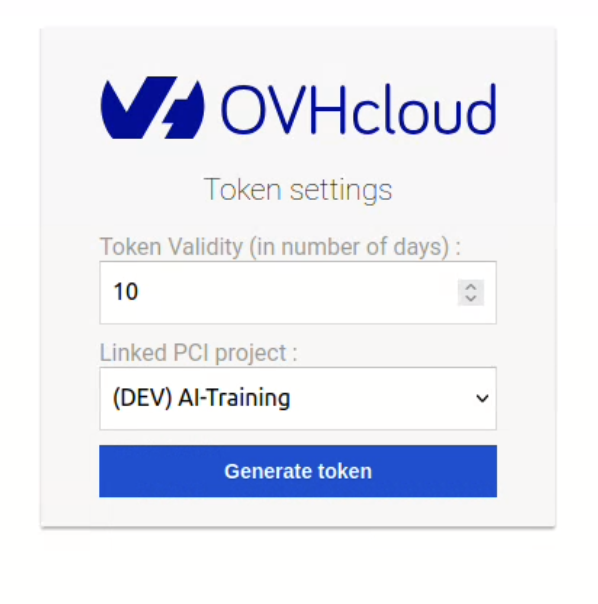
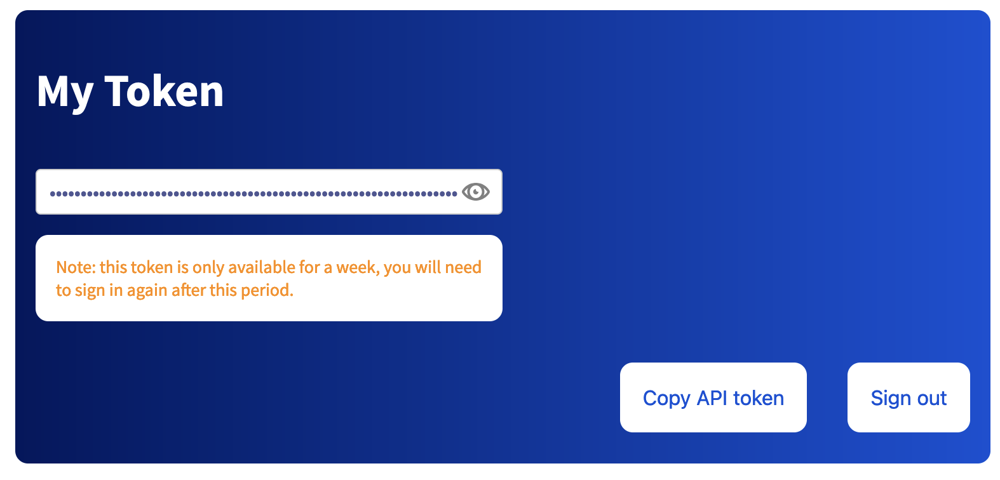
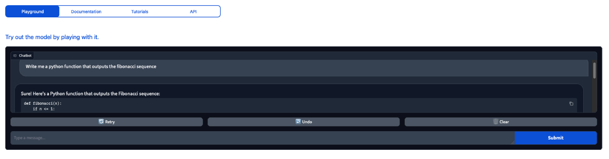
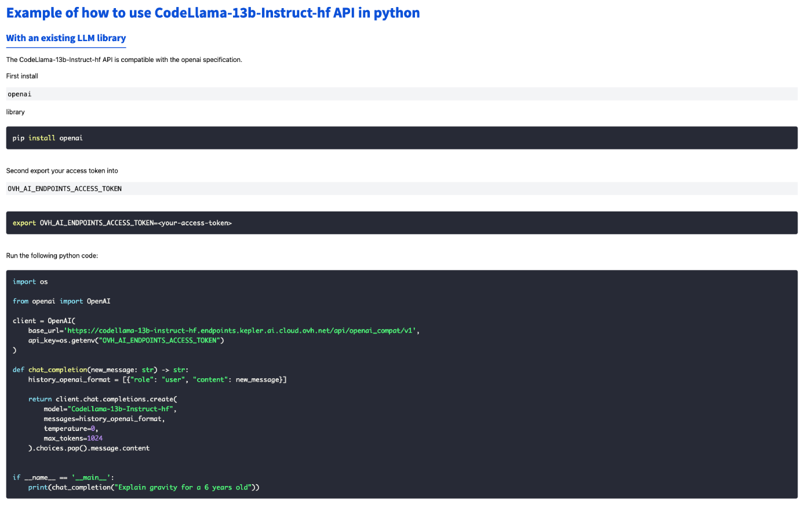
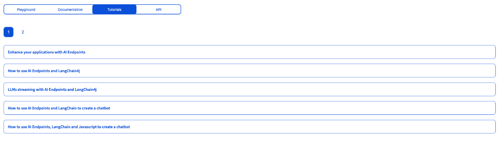
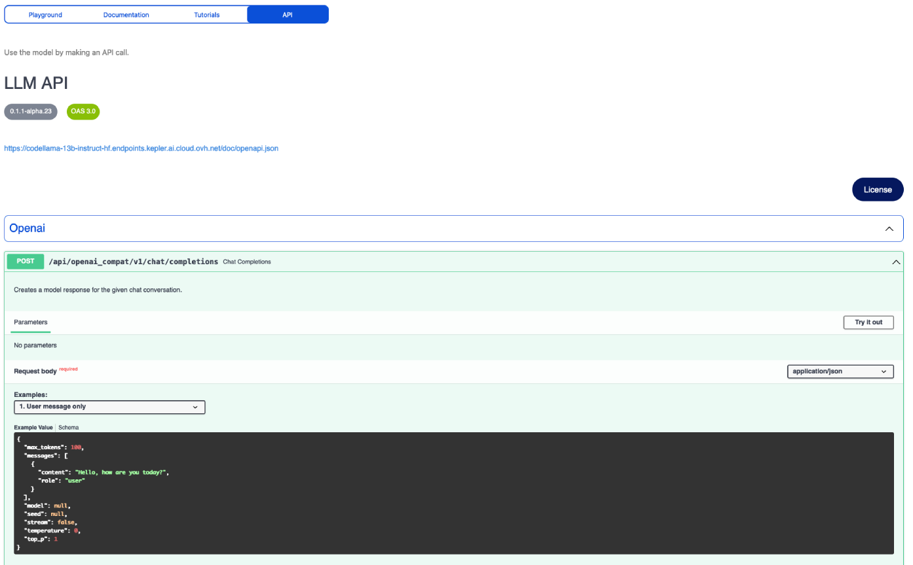

> [!primary]
>
> AI Endpoints is currently in **Beta**. Although we aim to offer a production-ready product even in this testing phase, service availability may not be guaranteed. Please be careful if you use endpoints for production, as the Beta phase is not yet complete.
>
> AI Endpoints is covered by the **[OVHcloud AI Endpoints Conditions](https://storage.gra.cloud.ovh.net/v1/AUTH_325716a587c64897acbef9a4a4726e38/contracts/48743bf-AI_Endpoints-ALL-1.1.pdf)** and the **[OVHcloud Public Cloud Special Conditions](https://storage.gra.cloud.ovh.net/v1/AUTH_325716a587c64897acbef9a4a4726e38/contracts/d2a208c-Conditions_particulieres_OVH_Stack-WE-9.0.pdf)**.
>

## Introduction

[AI Endpoints](https://endpoints.ai.cloud.ovh.net/) is a serverless platform provided by OVHcloud that offers easy access to a selection of world-renowned, pre-trained AI models. The platform is designed to be simple, secure, and intuitive, with **data privacy as a top priority**. Indeed, we do not store user data, making it an ideal solution for developers who want to enhance their applications with AI capabilities while keeping data private and secure. 

With no extensive AI expertise required, AI Endpoints is an ideal choice for developers seeking a convenient and secure way to integrate AI into their applications.

## Objective

The objective of this guide is to help developers interested in AI quickly and easily get started with [AI Endpoints](https://endpoints.ai.cloud.ovh.net/).

It explains how to obtain an access token, access AI models, and interact with AI APIs on the [AI Endpoints](https://endpoints.ai.cloud.ovh.net/) platform. By following this guide, you will learn how to integrate AI capabilities into your applications with ease.

## Requirements

- A [Public Cloud project](/links/public-cloud/public-cloud) in your OVHcloud account

## Instructions

### Getting an access token

Getting a token enables you to use the models available in our [catalog](https://endpoints.ai.cloud.ovh.net/catalog) and test their integration into your solutions. To obtain an access token, please follow the following steps:

**1) Visit the AI Endpoints access token page**

Click [here](https://endpoints.ai.cloud.ovh.net/) to access AI Endpoints. You can also find the product from the [OVHcloud Control Panel](/links/manager), in the `AI & Machine Learning` category, from the left-hand vertical menu.

**2) Generate an access token**

Once on the site page, click on the `Get it`{.action} button. You will be asked to confirm that you accept the [terms of service](https://storage.gra.cloud.ovh.net/v1/AUTH_325716a587c64897acbef9a4a4726e38/contracts/48743bf-AI_Endpoints-ALL-1.1.pdf) of the product.

{.thumbnail}

**3) Scope created token to one of your Public Cloud Projects**

This will redirect you to the **Public Cloud**. If you haven't already done so, log in to your account, and confirm the following AI OVH OAUTH authorization:

{.thumbnail}

You will then need to choose the lifetime of your token, and also select one of the Public Cloud projects of your account to which you want to attach the token. If you don't have any projects created in your Public Cloud account, you will receive an error message telling you to create one, with a link to follow.

Once the authorization process is completed, confirm the token creation by clicking the `Generate token`{.button} button.

*Note that this token can be [revoked](#revoke-your-token) at any time.*

{.thumbnail}

**4) Save created token**

This will redirect you to the AI Endpoints site, where you will find your new token in the token field. You will be reminded of the expiry date of your token, and you will be able to copy it.

{.thumbnail}

> [!primary]
>
> It is essential that you **keep your API token private and confidential**.
>
> Moreover, the token displayed will not be stored in the website's memory, so please **make sure to save it securely on your side** for future usage.
>

With your access token in hand, you are now ready to access the AI models and their easy-to-use APIs.

### Accessing AI models

Once your token has been generated, you can navigate to the [Catalog page](https://endpoints.ai.cloud.ovh.net/catalog) to choose the AI model you want to interact with.

AI Endpoints offers a variety of world-renowned AI models to choose from, including:

- **Assistant**: Use models like CodeLlama, Mistral, Mathstral, and Codestral for tasks like code generation, language translation, and more.
- **Audio analysis**: Automatic Speech Recognition and Text to Speech using NVIDIA's models.
- **Embeddings**: Generate embeddings for use in machine learning applications (BGE base, Multilingual E5).
- **Natural language Processing**: Use models like RoBERTa, Bert, and T5 for NLP tasks like sentiment analysis, entity recognition, and text summarization.
- **Translation**: Translate text using NVIDIA Neural Machine Translation or T5 large.
- **Image Generation**: Generate images using Stable Diffusion XL.

*Additional models will be added in the coming months, including multimodal models and object detection models.*

Once you have selected the category of model you want to use, you will be presented with a list of models to choose from.

For example, if you select the `Assistant` category, you will see a list of available assistant models.

To access one of them, simply click on the name of the model you want to use. Let's take the `CodeLlama-13b-Instruct-hf` code assistant as our example.

This will take you to a dedicated page with several options for interacting with the chosen model, including the ability to view its specifications. Here is an overview of the available options:

> [!tabs]
> **Playground**
>>
>> This option allows you to quickly try out the model by playing with it to see if it meets your needs. This is a great way to get a feel for the model without having to use some codes.
>>
>> {.thumbnail}
>>
> **Documentation**
>>
>> The section provides detailed documentation for the model, including example Python code that demonstrates how to interact with the model using its API. The documentation also includes the OpenAI specification codes, as our **LLM APIs are compatible with the OpenAI specifications**.
>>
>> To ensure that these code examples work as intended, you should replace the placeholder value `(os.getenv('OVH_AI_ENDPOINTS_ACCESS_TOKEN'))` with your own API token and set it as an environment variable.
>>
>> {.thumbnail}
>>
> **Tutorials**:
>>
>> There, you will find blog articles related to AI Endpoints that you may find helpful in learning how to use the model more effectively. Whether you're building a chatbot with Langchain and JavaScript or creating a video translator app, we provide step-by-step guidance to support your AI projects.
>>
>> {.thumbnail}
>>
> **API**:
>>
>> The API section provides access to POST routes that you can use to send a request to the model and receive an output.
>>
>> {.thumbnail}
>>
>> For Assistants (LLMs), two POST routes are available: `Chat Completions` and `Completions`. Here's an example of how to use the `Chat Completions` API:
>>
>> Click the `Chat Completions`{.button} endpoint in the API section. Once there, select one of the available input schemas.
>>
>> Here you can also find information on how to send a correct request to the model (existing parameters). Examples of usage are provided. You will also find there the output schema example. Click `Try it out`{.button} to prepare the request. There, you can modify the input schema if needed to customize the request you are sending. When you are ready, click `Execute`{.button} to send your modified request.
>>
>> Upon executing the request, a cURL command will be displayed, representing the request you just sent. This can be useful for re-sending the command using a terminal. Additionally, the server's response body will also be provided, displaying the output of the model.
>>
>> You can follow similar steps for using the `Completions` API.

### Revoke your token

To revoke one of your API tokens, you can use the following commands in your terminal:

Set a shell variable with the token you want to revoke:

```bash
TOKEN=<YOUR_TOKEN_HERE>
```

Then, can use the following command to call the API Token revoke endpoint:

```bash
curl -vvv 'https://kepler.ai.cloud.ovh.net/v1/oauth/ovh/revoke' -H 'Content-Type: application/json' -X POST --data "{\"oauth2Token\": \"${TOKEN}\"}"
```

This will revoke the specified token.

Alternatively, you can also revoke your API token using the `Revoke API token`{.action} button from the [AI Endpoints](https://endpoints.ai.cloud.ovh.net/) website. However, please note that this button will only allow you to revoke the most recently created token.

Once done, you can confirm its deletion by trying to send a request using your revoked token.

### Billing and usage

AI Endpoints remains **free** during its beta phase.

However, in the interest of transparency towards our customers, you you can monitor your estimated consumption and resource usage via the [OVHcloud Control Panel](/links/manager), in the `AI Endpoints`{.action} section of the `AI & Machine Learning` category, in the left-hand vertical menu.

This will give you an idea of your potential charges, once the billing system is enabled (future General Availability (GA) phase).

## Going further

To discover how to build complete and powerful applications using AI Endpoints, explore our dedicated [AI Endpoints blog page](https://blog.ovhcloud.com/tag/ai-endpoints/). This blog offers a wealth of knowledge and inspiration, including the following articles:

- [Create your own Audio Summarizer assistant with AI Endpoints](https://blog.ovhcloud.com/create-audio-summarizer-assistant-with-ai-endpoints/)
- [Implement chatbot memory management with LangChain and AI Endpoints](https://blog.ovhcloud.com/chatbot-memory-management-with-langchain-and-ai-endpoints/)
- [Discover how to create a Retrieval Augmented Generation (RAG) system](https://blog.ovhcloud.com/reference-architecture-retrieval-augmented-generation-rag/)
- [Discover more about AI Endpoints features and limitations](/pages/public_cloud/ai_machine_learning/endpoints_guide_02_capabilities)

If you need training or technical assistance to implement our solutions, contact your sales representative or click on [this link](/links/professional-services) to get a quote and ask our Professional Services experts for a custom analysis of your project.

## Feedback

Please feel free to send us your questions, feedback, and suggestions regarding AI Endpoints and its features:

- In the #ai-endpoints channel of the OVHcloud [Discord server](https://discord.gg/ovhcloud), where you can engage with the community and OVHcloud team members.