## Introduction

A **Notebook** is a document that integrates code, rich text elements, and multimedia, making it a convenient tool for data analysis, visualization, and machine learning tasks.

**OVHcloud AI Notebooks** is our managed solution for Jupyter and VSCode Notebooks. You can easily launch Notebooks with the required CPU and GPU resources while enjoying benefits like pre-installed dependencies and AI frameworks (e.g., TensorFlow, PyTorch, Hugging Face, Scikit-learn, ...), secure user access, and simplified data management. 

The advantage compared to doing your own setup is that everything is already installed for you, and that you pay only for your AI Notebooks while they are running.

## Objective

The objective of this guide is to demonstrate how to create, configure, access, stop, restart, and delete AI Notebooks.

## Requirements

- A [Public Cloud project](/links/public-cloud/public-cloud) in your OVHcloud account
- Access to the [OVHcloud Control Panel](/links/manager)
- A Public Cloud user with the **Administrator** or **AI Training Operator** role

## Instructions

For the creation of your first AI Notebook, we highly recommend using the **OVHcloud Control Panel (UI)**. This method is user-friendly and ideal for beginners.

However, you can also choose to utilize one of the three alternative methods: 
- The **ovhai** command-line interface (CLI)
- The **AI API** 
- The **ovhai** Python SDK. 

Each method offers its distinct advantages, depending on your expertise and preferred workflow.

### OVHcloud AI Solutions Authorization Process 

> [!tabs]
> **Using the Control Panel (UI)**
>>
>> If you are using the UI, this step is not required. You can directly go to the next step which is the [Notebook creation](#launch-your-first-ai-notebook).
>>
> **Using CLI / AI API / SDK**
>>
>> If you already have used the AI products, you can directly go to the next step ("Launch your first AI Notebook"). 
>>
>> However, if this is the first time you are using the AI Products, you will need to complete an authorization process before using the AI API, ovhai CLI, or Python SDK. To do so, please follow these steps:
>>
>> Log in to the [OVHcloud Control Panel](/links/manager), and navigate to the `Public Cloud`{.action} section, in the horizontal menu at the top of the website. Select the Public Cloud project you want to use. Then, click on the `AI & Machine Learning`{.action} category in the left-hand vertical menu to access the `AI Notebooks`{.action} section.
>>
>> From there, click the `Create a notebook`{.action} button. The authorization process will take place silently in the background.
>>
>> {.thumbnail}
>>
>> Once the authorization process is complete, you can continue creating your Notebook using the API, SDK, or CLI as desired. You do not need to complete the entire Notebook creation process in the Control Panel. Clicking the `Create a notebook`{.action} button is sufficient.

### Launch your first AI Notebook

In the following table, we will walk you through the AI Notebook creation process for each of the available methods:

> [!tabs]
> **Using the Control Panel (UI)**
>>
>> The manager is the more intuitive way to launch an AI Notebook. To get started, follow these steps:
>>
>> First, navigate to the `Public Cloud`{.action} section of the [OVHcloud Control Panel](/links/manager) by clicking on it in the horizontal menu at the top of the website.
>>
>> From there, click on the `AI & Machine Learning`{.action} category in the left-hand vertical menu to access the `AI Notebooks`{.action} section.
>>
>> Once there, you can create your first Notebook by clicking the `Create a Notebook`{.action} button.
>>
>> {.thumbnail}
>>
>> Give a name to your Notebook. 
>>
>> After that, you have the option to set labels. This allows to specify one of yours AI Tokens and apply it to your AI Notebook. This token can then be shared with anyone who should have access to the notebook, allowing them to access it without requiring your own credentials. This is useful if you want to provide access to the notebook outside your public cloud project. More information [here](/pages/public_cloud/ai_machine_learning/cli_13_howto_app_token_cli).
>>
>> Then, click on the `Next`{.action} button.
>>
>> 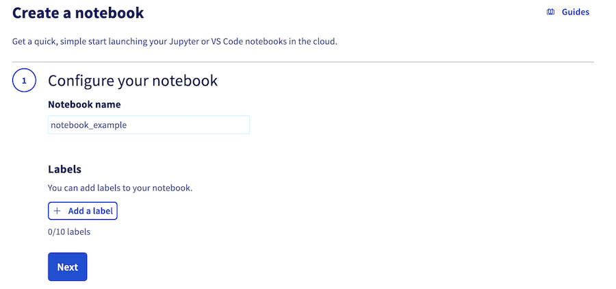{.thumbnail}
>>
>> Choose the code editor you want.
>> In this example, it's _JupyterLab_, but you can choose _Visual Studio Code_.
>>
>> Both of them have their own pros and cons. Jupyter Notebook is generally considered easier to use for beginners.
>>
>> Select _JupyterLab_, then click on the `Next`{.action} button.
>>
>> 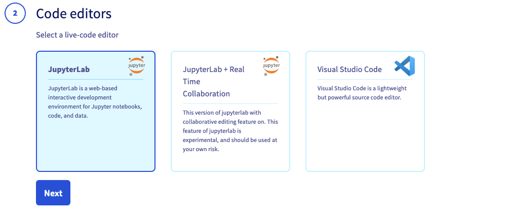{.thumbnail}
>>
>> Choose the AI framework you want to use, which will be pre-installed and ready to use when your AI Notebook is launched. A wide range of Machine Learning frameworks are available, in different versions. Select the version that suits your needs. Then, click on the `Next`{.action} button to continue. This guide will use _PyTorch_ as an example.
>>
>> 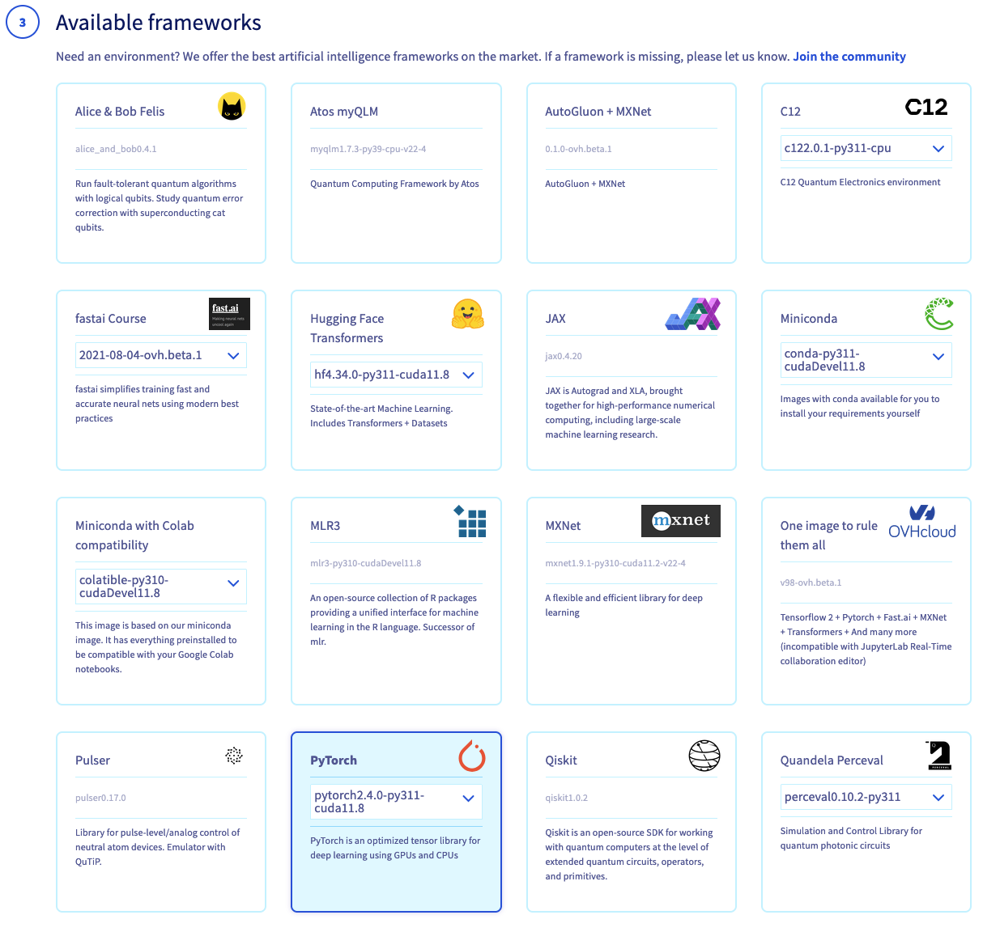{.thumbnail}
>>
>> Next, select your privacy settings and click on the `Next`{.action} button.
>>
>> 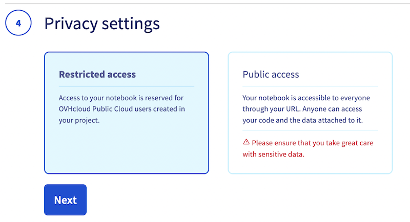{.thumbnail}
>>
>> > [!warning]
>> >
>> > _Public access_ will expose your data and code to anyone getting the AI Notebook link. Be careful and don't use it with sensitive data.
>> >
>> 
>> Next, select a location for your new cluster.
>>
>> 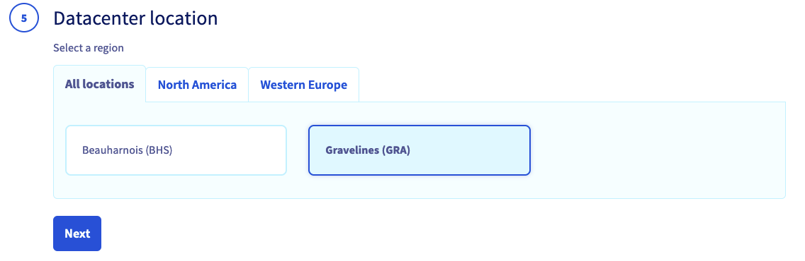{.thumbnail}
>>
>> Next, select and adjust the amount of computing resources (CPU / GPU) for your AI Notebook. Use the `+`{.action} and `-`{.action} buttons to increase or decrease the number of CPUs and GPUs, depending on your needs.
>> 
>> Click on the `Next`{.action} button.
>>
>> 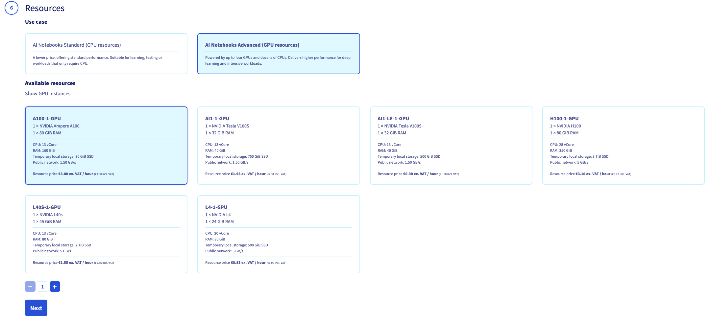{.thumbnail}
>>
>> Next step is about **Storage Options**.
>>
>> By default, your AI Notebook comes with ephemeral storage (local storage). But in this step, you can also link Object Storage containers and Git repositories to your AI Notebook, to easily access your data. 
>>
>> If you want to learn more about configuring containers and git repositories in the Notebook, you can refer to this [documentation](/pages/public_cloud/ai_machine_learning/notebook_guide_data_ui). For now, we will launch a classic Notebook without any external volumes added to it.
>>
>> Click on the `Next`{.action} button.
>>
>> 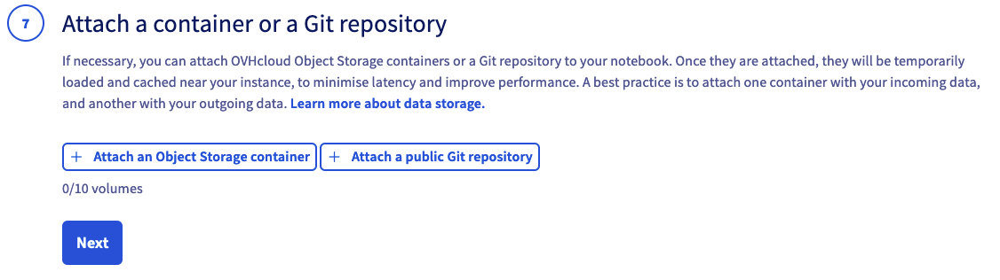{.thumbnail}
>>
>> SSH public keys allow you to access your Notebook remotely. This section is optional, click on the `Next`{.action} button.
>>
>> 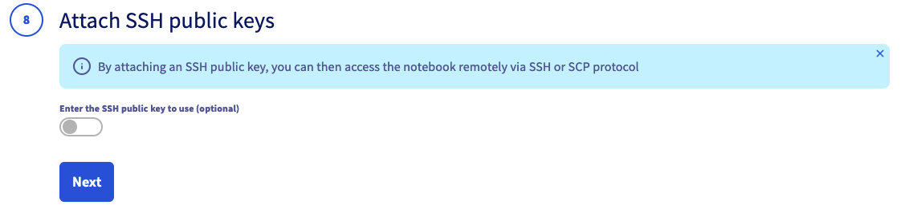{.thumbnail}
>>
>> At the end of the process, review your settings and click on the `Create a Notebook`{.action} button to confirm and launch the creation of your Notebook.
>> 
>> 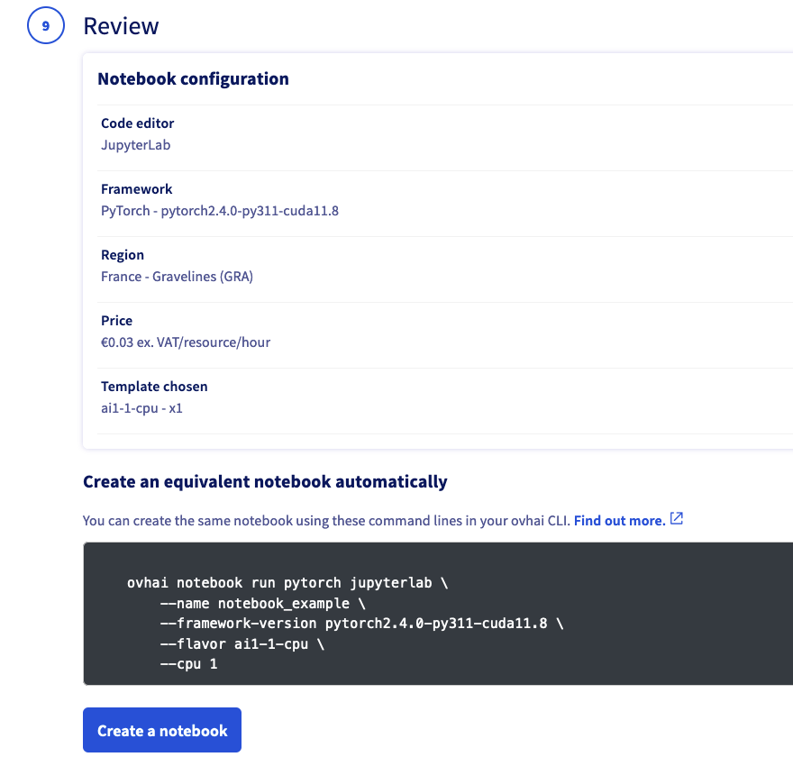{.thumbnail}
>>
>> > [!primary]
>> >
>> > Note at the bottom of the screen the equivalent *ovhai* CLI command. This command allows you to run the exact same Notebook using the CLI.
>> >
>> > Discover how to [install the ovhai CLI](/pages/public_cloud/ai_machine_learning/cli_10_howto_install_cli).
>> >
>>
>> When your Notebook is created, it will appear on your AI Notebooks board.
>>
>> 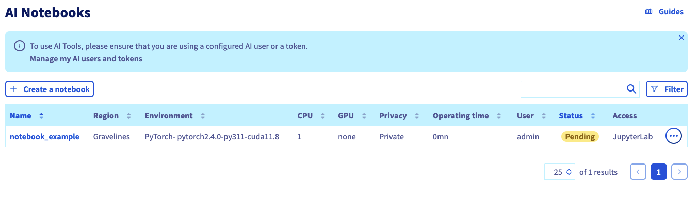{.thumbnail}
>>
> **Using ovhai CLI**
>>
>> If you prefer to use the command line interface to launch your AI Notebook, please follow these steps:
>>
>> First, you will need to install the *ovhai* CLI and log into it. Please follow [this documentation](/pages/public_cloud/ai_machine_learning/cli_10_howto_install_cli).
>>
>> After installation and successful login, visit this [second documentation](/pages/public_cloud/ai_machine_learning/cli_11_howto_run_notebook_cli) to learn how to create your AI Notebook using commands.
>>
>> 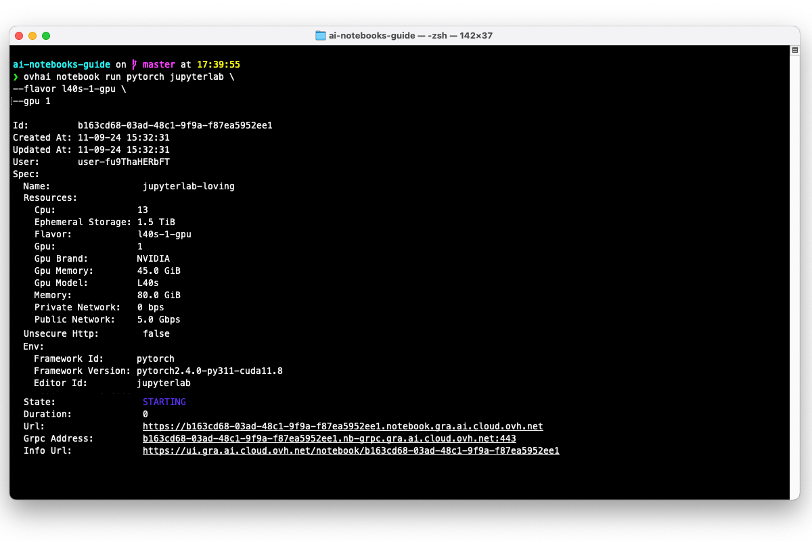{.thumbnail}
>>
> **Using the AI API**
>>
>> To create an AI Notebook using the OVHcloud AI API, follow these steps:
>>
>> First, navigate to the AI API for the desired region among the ones that are available for the AI Products usage:
>>
>> - GRA (Gravelines, France): https://gra.training.ai.cloud.ovh.net/#/
>> - BHS (Beauharnois, Canada): https://bhs.training.ai.cloud.ovh.net/#/
>> 
>> Upon visiting the API URL, you will notice various endpoint categories on the left side of the screen. Click `Notebook`{.action} category to display the endpoints related to AI Notebooks. 
>>
>> 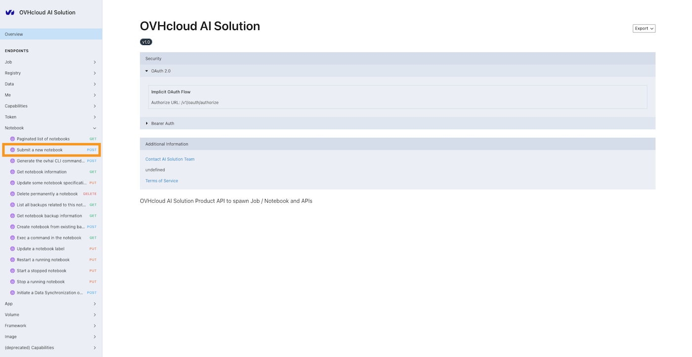{.thumbnail}
>>
>> Among them, you will find a `POST Submit a new notebook`{.action} method. This is the endpoint for submitting a new Notebook. 
>>
>> *The exact link for this endpoint on GRA region is as follows: https://gra.training.ai.cloud.ovh.net/#/operations/notebookNew*
>>
>> In the `Submit a new notebook` endpoint page, you will find the detailed schema for the `Notebook Specification` and its various possible parameters. Examples of responses (`200`, `400`, `401`, `402`, `403`) are also provided in case of success or different error scenarios.
>> 
>> Before using this method to create an AI Notebook, you will need to authenticate. This can be done by providing a bearer token, which you can create through the [AI Dashboard](/pages/public_cloud/ai_machine_learning/gi_06_dashboard_getting_started) or by using the *ovhai* CLI. For more detailed instructions on creating a token, please consult the [Manage access tokens](/pages/public_cloud/ai_machine_learning/cli_13_howto_app_token_cli) documentation.
>>
>> Once you have created your token, provide your token in the 'Auth' panel, on the right-hand corner of the API page. Make sure to select `Bearer Auth` instead of `OAuth 2.0`, which is selected by default.
>>
>> 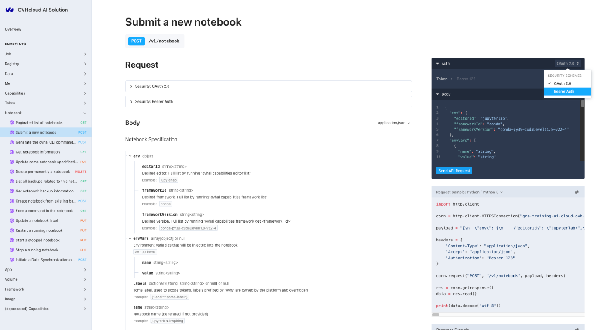{.thumbnail}
>>
>> After logging in, you may specify the body (Notebook specifications) for the Notebook you wish to create. A default example is provided. Feel free to adjust it.
>>
>> Once your body is filled, click the `Send API request`{.action} button. If your body is correctly written, the Notebook will be created. You will receive all the necessary information about the created Notebook (`ID`, `access URL`, etc.) in the `Responses` field.
>>
>> 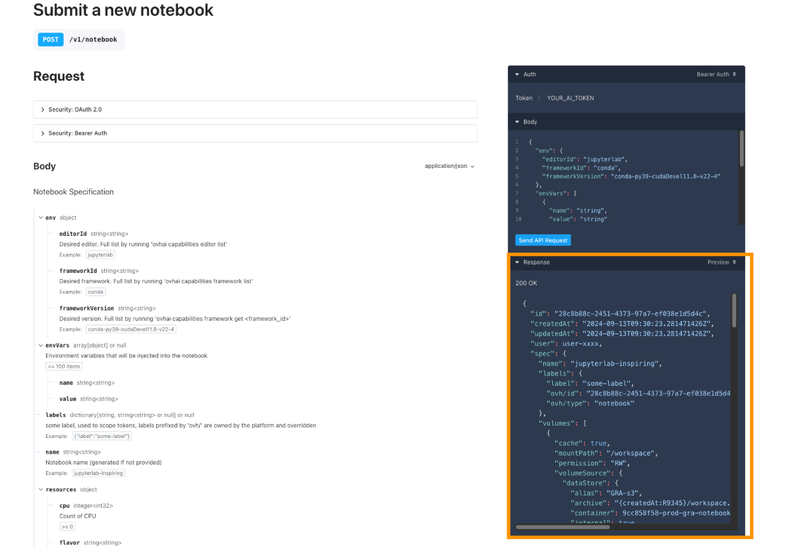{.thumbnail} 
>>
>> In addition to the API interface, the API provides Python code examples to help you use the endpoint and reproduce the same result programmatically. However, for an efficient Python experience, we recommend using the *ovhai* Python SDK.
>>
> **Using the Python SDK**
>>
>> The *ovhai* library is a Python client that allows developers to easily use the OVHcloud AI API. With this SDK, you can run, manage, automate your AI Notebooks.
>>
>> > [!warning]
>> > 
>> > **Alpha Warning**: This package is currently in the **alpha phase** of development. The APIs and functionalities of the package may not be fully tested.
>>
>> To launch an AI Notebook using the [ovhai Python SDK](https://pypi.org/project/ovhai/), you first need to install the *ovhai* library. You can do this using `pip`. Open your terminal and run the following command:
>>
>> ```bash
>> pip install ovhai
>> ```
>> 
>> Once installed, we invite you to follow the instructions provided in the [ovhai PyPI](https://pypi.org/project/ovhai/) page to learn how to create a token for authentication, understand the SDK's functionality, and launch an AI Notebook using the *ovhai* Python SDK. Here is a basic example of how to do it, making it easy for you to get started:
>>
>>
>> ```python
>> from ovhai import AuthenticatedClient
>> from ovhai.api.notebook import notebook_new
>> from ovhai.models import NotebookSpec, Notebook
>> from ovhai.ovhai_types import Response
>>
>> client = AuthenticatedClient(
>>     base_url="https://gra.training.ai.cloud.ovh.net",
>>     token="YOUR_AI_TOKEN",
>> )
>> 
>> # Define notebook parameters
>> editor_id = "jupyterlab"
>> framework_id = "conda"
>> framework_version = "conda-py311-cudaDevel11.8"
>> nb_cpu = 2
>> 
>> # Create the notebook creation request
>> notebook_specs = {
>>     "env": {"editorId": editor_id, "frameworkId": framework_id, "frameworkVersion": framework_version},
>>     "resources": {"cpu": nb_cpu},
>> }
>> 
>> with client as client:
>>     response: Response[Notebook] = notebook_new.sync_detailed(
>>         client=client, body=NotebookSpec.from_dict(notebook_specs)
>>     )
>>     import json
>>    # Assuming `response` is your Response object
>>    response_content = response.content.decode('utf-8')  # Decode bytes to a string
>>    response_dict = json.loads(response_content)
>>
>>    status_code = response.status_code
>>    id_ = response_dict['id']
>>    spec = response_dict['spec']
>>    status = response_dict['status']
>>    state = status['state']
>>    info = status['info']
>>    url = response_dict['status']['url']
>>
>>    print(f"Status code: {status_code}")
>>    print(f"ID: {id_}")
>>    print(f"Spec: {spec}")
>>    print(f"State: {state}")
>>    print(f"Info: {info}")
>>    print(f"URL: {url}")
>> ```
>>
>> Please make sure to replace `YOUR_AI_TOKEN` with a bearer token. Bearer tokens can be created through the [AI Dashboard](/pages/public_cloud/ai_machine_learning/gi_06_dashboard_getting_started) or by using the *ovhai* CLI. For more detailed instructions on creating a token, please consult the [Manage access tokens](/pages/public_cloud/ai_machine_learning/cli_13_howto_app_token_cli) documentation.
>>
>> Running this code will launch a new AI Notebook based on the specifications you provided. Feel free to adjust the specifications based on the notebook you want to create.
>>

### Accessing your AI Notebook

At this point your AI Notebook is created. You will need to wait a few seconds for the Notebook to start and reach the `RUNNING` status. Once it has, the Notebook URL will be accessible.

> [!tabs]
> **Using the Control Panel (UI)**
>>
>> {.thumbnail}
>>
>> You can access your Notebook by clicking the `JupyterLab`{.action} link, from the AI Notebooks board, in the `Access` column:
>>
>> {.thumbnail}
>>
>> This `JupyterLab`{.action} button can also be accessed from the dedicated Notebook page, which can be reached by clicking the Notebook name in the AI Notebooks board page. 
>>
>> On this page, you will find a lot of information about your Notebook (specifications, billing, Attached data, ...). There is also a monitoring URL, which allows you to view real-time metrics for your notebook, such as the GPU average usage for example.
>>
>> {.thumbnail}
>>
> **Using ovhai CLI**
>>
>> In the previous step, you ordered the creation of your Notebook. This should have displayed the `URL` of your Notebook in your terminal, allowing you to access it:
>>
>> 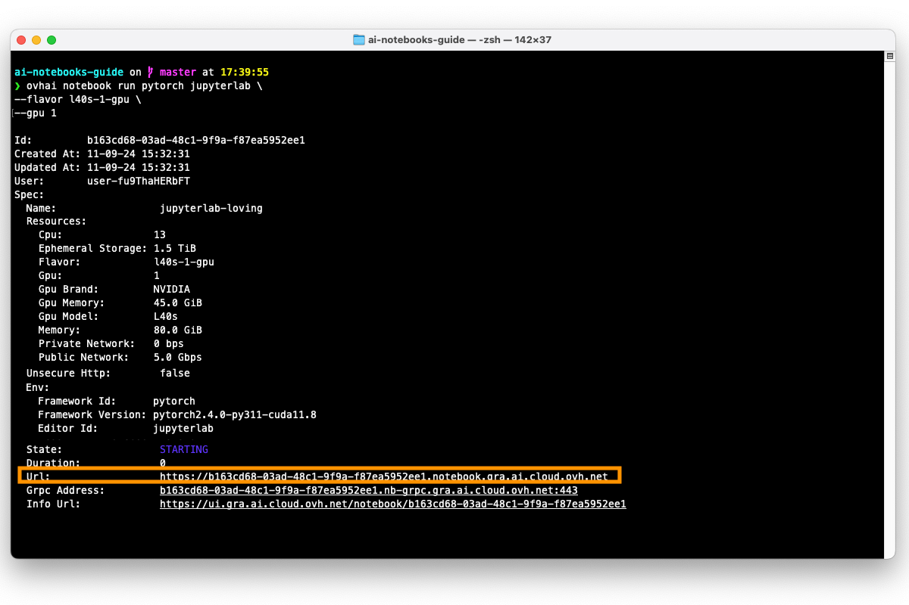{.thumbnail}
>>
>> If you no longer have the Notebook `UUID` and `URL` displayed in your terminal, you can easily list all your existing AI Notebooks by running:
>>
>> ```bash
>> ovhai notebook list
>> ```
>>
>> This will allow you to retrieve the `URL` of the Notebook you want to access.
>>
>> You can also get all the information related to a Notebook (Specifications, Access Url, Monitoring URL, ...) by running:
>>
>> ```bash
>> ovhai notebook get <NOTEBOOK_UUID>
>> ```
>>
>> Just make sure to replace the `<NOTEBOOK_UUID>` with the actual `UUID` of the notebook you want to retrieve the information for.
>>
> **Using the AI API**
>>
>> In the previous step, you ordered the creation of your Notebook. This should have displayed the `URL` of your Notebook in the 'Response' panel, allowing you to access it:
>>
>> 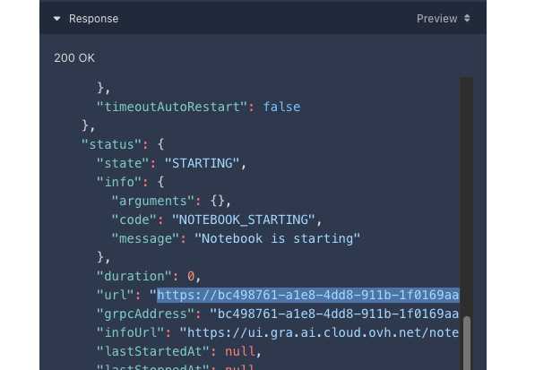{.thumbnail}
>>
>> If you no longer have the Notebook `UUID` and `URL` displayed in the API page, you can list all your AI Notebooks by using the `Paginated list of notebooks`{.action} GET endpoint method, in the `Notebook`{.action} category.
>>
>> This will allow you to retrieve the `URL` of the Notebook you want to access.
>>
>> You can also get all the information related to a Notebook (Specifications, Access Url, Monitoring URL, ...) by using the `Get notebook information` {.action} GET endpoint method.
>>
> **Using the Python SDK**
>>
>> If you no longer have the Notebook `UUID` and `URL` displayed in your Python IDE, you can easily list all your AI Notebooks by running:
>>
>> ```python
>> from ovhai.api.notebook import notebook_get_all
>> from ovhai.models import NotebookList
>> from ovhai.ovhai_types import Response
>>
>> from ovhai import AuthenticatedClient
>>
>> client = AuthenticatedClient(
>>     base_url="https://gra.training.ai.cloud.ovh.net",
>>     token="YOUR_AI_TOKEN",
>> )
>>
>> with client as client:
>>    response: Response[NotebookList] = notebook_get_all.sync_detailed(client=client)
>>    import json
>>    response = json.loads(response.content.decode())
>>    for notebook_info in response["items"]:
>>        print(f"ID: {notebook_info['id']}")
>>        print(f"Name: {notebook_info['spec']['name']}")
>>        print(f"Status: {notebook_info['status']['state']}")
>>        print(f"Framework: {notebook_info['spec']['env']['frameworkId']}")
>>        print(f"Framework version: {notebook_info['spec']['env']['frameworkVersion']}")
>>        print(f"Editor: {notebook_info['spec']['env']['editorId']}")
>>        print(f"Access link: {notebook_info['status']['url']}")
>>        print("---------------")
>> ```
>>
>> This will allow you to retrieve the `URL` of the Notebook you want to access. Just make sure you are using the right API url, and replace `YOUR_AI_TOKEN` with your actual AI token. 
>>
>>
>> You can also get all the information related to a Notebook (Specifications, Access Url, Monitoring URL, ...) by running the following code:
>>
>> ```python
>> from ovhai.api.notebook import notebook_get
>> from ovhai import AuthenticatedClient
>> import json
>> 
>> client = AuthenticatedClient(
>>     base_url="https://gra.training.ai.cloud.ovh.net",
>>     token="YOUR_AI_TOKEN",
>> )
>> id = "YOUR_NOTEBOOK_UUID"
>> 
>> with client as client:
>>     response = notebook_get.sync_detailed(
>>         id=id, client=client
>>     )
>>
>> print(json.loads(response.content.decode()))
>>

### Connecting to your AI Notebook

Once you have clicked on the Notebook `URL` you want to access, you will be redirected to the Notebook page where you will need to authenticate to ensure you have the necessary rights to access it. 

There are two ways to authenticate: using a **username and password** combination or using an **access token**.

> [!tabs]
> **Using a Username and Password**
>>
>> To authenticate using a username and password, please follow these steps:
>>
>> Enter one of your Public Cloud project Openstack user's username and password in the respective fields, as shown in the screenshot below. The user needs to belong to the same Public Cloud Project you used to create the Notebook and must have sufficient permissions.
>>
>> If you have not yet created a Public Cloud Openstack user for your project, or require more information on how to do so, please refer to the following [guide](/pages/public_cloud/ai_machine_learning/gi_01_manage_users).
>>
>> Once you have entered your username and password, click the `Connect`{.action} button to log in to your AI Notebook.
>>
>> {.thumbnail}
>>
> **Using an Access Token**
>>
>> Using a token is an effective way to share the AI Notebook with anyone, without requiring them to have your own Openstack credentials. This is useful when you want to provide access to the notebook outside your Public Cloud project.
>>
>> To authenticate using an access token, please follow these steps:
>>
>> Click the `Login with token`{.action} button, located below the user and password fields. This will switch the access mode to use a token-based authentication method instead.
>>
>> Make sure to use a token that you have created either from the AI Dashboard or from the ovhai CLI, API, or SDK. You can use tokens that were created without a label selector. If you specified a label selector during the notebook creation, you can also use the token that matches the label selector specified. For more information on how to create an access token, please refer to this [documentation](/pages/public_cloud/ai_machine_learning/cli_13_howto_app_token_cli).
>>
>> Enter the access token in the "Access Token" field, as shown in the screenshot below.
>> Click the `Connect`{.action} button to log in to your AI Notebook.
>>
>> {.thumbnail}
>>

Once you have successfully reached JupyterLab, you can create your first Notebook by clicking on the `Python 3 (ipykernel)`{.action} button (or a similar button name depending on the framework you have selected).

{.thumbnail}

With your new Notebook open, enter some Python code in the code section. We can test it with a simple _Hello World_ :

```python
print("Hello World")
```

To execute the code, simply press the `▶️`{.action} located in the toolbar above the code section. You should then see the output:

```bash
Hello World
```

Alternatively, you can use the keyboard shortcut `Ctrl+Enter`, or `CMD+Enter`, to save the Notebook quickly.

Your code is executed in your browser and will consume the CPU and GPU resources linked to your AI Notebook.

{.thumbnail}

To save your Notebook, click on the sub-menu `Save`{.action} of the `File` menu. Alternatively, you can use the keyboard shortcut `Ctrl+S`, or `CMD+S`, to save the Notebook quickly.

### Stopping the AI Notebook

You can stop your AI Notebook at any time. It will release its compute resources but will keep your Notebook data. Therefore, you will not incur any further charges for compute unless you restart the Notebook. However, attached storage will be billed at the price of OVHcloud Object Storage.

Indeed, when you stop a Notebook, it will be unavailable for a certain period while your data is synchronized to the Object Storage, so that you can retrieve your work later. Once the synchronization is complete, the Notebook will reach the `STOPPED` state, at which point you can either start it again or delete it.

> [!tabs]
> **Using the Control Panel (UI)**
>>
>> Go back to the `AI Notebooks`{.action} board, from the `Public Cloud`{.action} section of the [OVHcloud Control Panel](/links/manager).
>>
>> Then, select the Notebook you want to stop by clicking on its `Name`. 
>> 
>> From there, you will be able to click the `...`{.action} button, and stop your AI Notebook by clicking `Stop`{.action}.
>>
>> 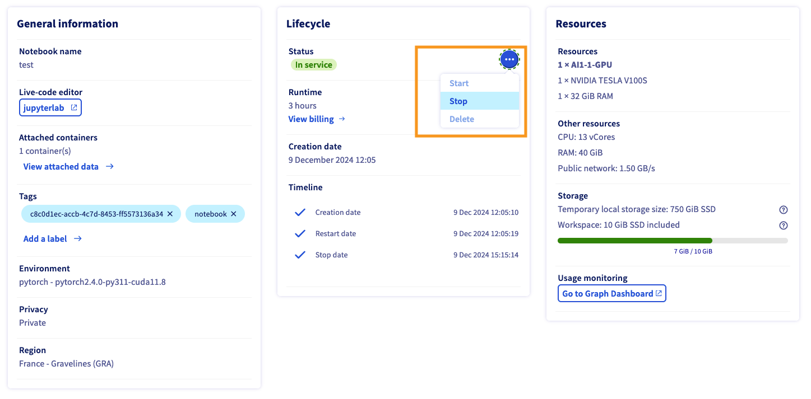{.thumbnail}
>>
> **Using ovhai CLI**
>>
>> You can easily stop your Notebook using the following command:
>>
>> ```bash
>> ovhai notebook stop <NOTEBOOK_UUID>
>> ```
>>
>> Make sure to replace `<NOTEBOOK_UUID>` with the Notebook UUID you want to stop.
>>
> **Using the AI API**
>>
>> Select the `Stop a running notebook`{.action} endpoint, which is a PUT method. Provide the UUID of the Notebook you wish to stop as an input parameter. Then, click the `Send API request`{.action} button to send the request.
>>
>>If the request is successful, the Notebook will be stopped and a "No content" message will be displayed in the "Response" panel. If the request is unsuccessful, an error message will be displayed there.
>>
>> 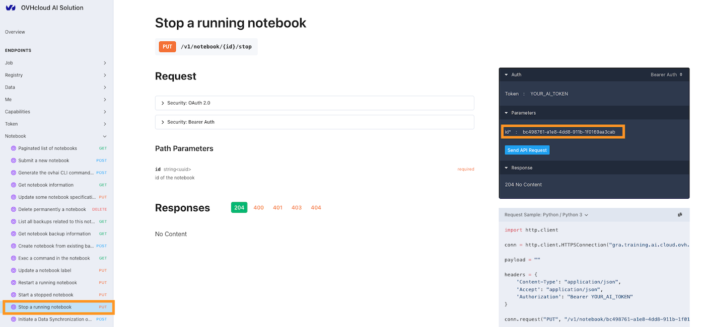{.thumbnail}
>>
> **Using the Python SDK**
>>
>> Here is an example of how to stop a running Notebook using the Python SDK:
>>
>> ```python
>> from ovhai.api.notebook import notebook_stop
>> from ovhai import AuthenticatedClient
>> client = AuthenticatedClient(
>>     base_url="https://gra.training.ai.cloud.ovh.net",
>>     token="YOUR_AI_TOKEN",
>> )
>> id = "YOUR_NOTEBOOK_UUID"
>> 
>> with client as client:
>>     response = notebook_stop.sync_detailed(client=client, id=id)
>> ```
>>
>> Please replace `YOUR_AI_TOKEN` with your actual AI token and `YOUR_NOTEBOOK_UUID` with the `UUID` of the Notebook you want to stop.
>>

### Restarting a stopped Notebook

Once the Notebook has reached the `Stopped` state, you may be interested in restarting it in order to continue your work.

> [!tabs]
> **Using the Control Panel (UI)**
>>
>> Go back to the `AI Notebooks`{.action} board, from the `Public Cloud`{.action} section of the [OVHcloud Control Panel](/links/manager).
>>
>> Then, select the Notebook you want to restart by clicking on its `Name`. 
>> 
>> From there, you will be able to click the `...`{.action} button, and stop your AI Notebook by clicking `Start`{.action}.
>>
>> 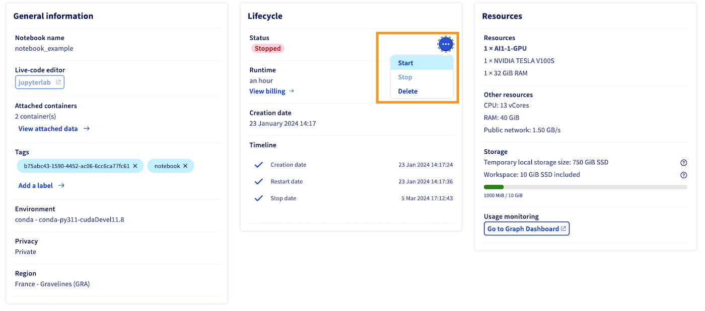{.thumbnail}
>>
> **Using ovhai CLI**
>>
>> Use the following command and replace `<NOTEBOOK_UUID>` with your Notebook UUID to restart your stopped Notebook:
>>
>> ```bash
>> ovhai notebook start <NOTEBOOK_UUID>
>> ```
>>
> **Using the AI API**
>>
>> Select the `Start a stopped notebook`{.action} endpoint, which is a PUT method. Provide the UUID of the Notebook you wish to restart as an input parameter. Then, click the `Send API request`{.action} button to send the request.
>>
>>If the request is successful, the Notebook will be restarted and a "No content" message will be displayed in the "Response" panel. If the request is unsuccessful, an error message will be displayed there.
>>
>> 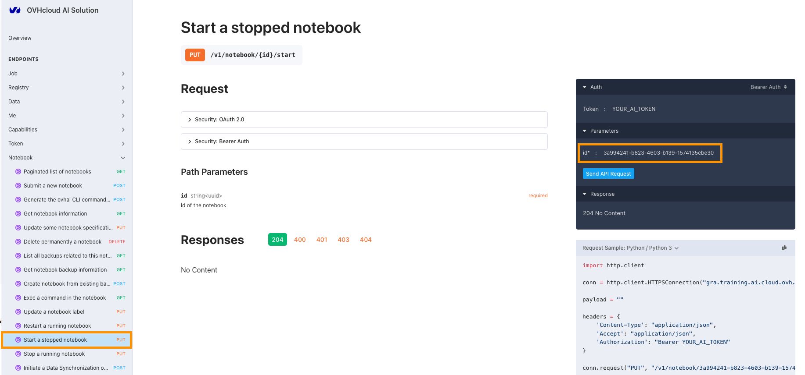{.thumbnail}
>>
> **Using the Python SDK**
>>
>> Here is an example of how to stop a running Notebook using the Python SDK:
>>
>> ```python
>> from ovhai.api.notebook import notebook_start
>> from ovhai import AuthenticatedClient
>> client = AuthenticatedClient(
>>     base_url="https://gra.training.ai.cloud.ovh.net",
>>     token="YOUR_AI_TOKEN",
>> )
>> id = "YOUR_NOTEBOOK_UUID"
>>
>> with client as client:
>>     response = notebook_start.sync_detailed(
>>         id=id, client=client
>>     )
>> ```
>>
>> Please replace `YOUR_AI_TOKEN` with your actual AI token and `YOUR_NOTEBOOK_UUID` with the `UUID` of the Notebook you want to stop.
>>

The state should change to `RUNNING` once the Notebook is started.

### Deleting a Notebook

If you no longer need your Notebook, you can delete it. 

Deleting a Notebook also means that you will delete the Notebook's local storage. This data cannot be recovered once the Notebook has been deleted. However, any Object Storage that was mounted on the AI Notebook during its creation will not be deleted.

> [!tabs]
> **Using the Control Panel (UI)**
>>
>> If you want to completely **delete** your AI Notebook, just click on the `...`{.action} button, and then select `delete`{.action} action.
>>
>> {.thumbnail}
>>
> **Using ovhai CLI**
>>
>> If you want to completely **delete** your AI Notebook, just run the following command:
>>
>> ```bash
>> ovhai notebook delete <NOTEBOOK_UUID>
>> ```
>> 
>> If the Notebook is still `RUNNING`, a confirmation message will appear, asking you to confirm the action. Confirm if you're sure you want to delete the Notebook.
>>
> **Using the AI API**
>>
>> Select the `Delete permanently a notebook`{.action} endpoint, which is a DELETE method. Provide the UUID of the Notebook you wish to delete. Use the `force` parameter if your Notebook is not `STOPPED` and still `RUNNING`. Then, click the `Send API request`{.action} button to send the request.
>>
>>If the request is successful, the Notebook will be restarted and a "No content" message will be displayed in the "Response" panel. If the request is unsuccessful, an error message will be displayed there.
>>
>> 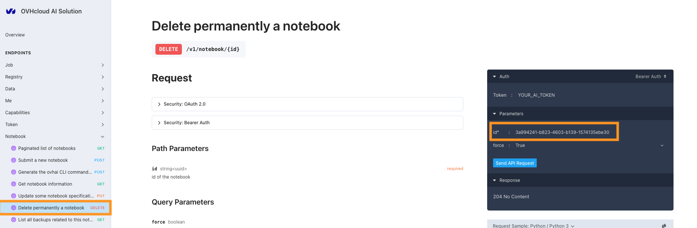{.thumbnail}
>>
> **Using the Python SDK**
>>
>> Here is an example of how to delete a Notebook using the Python SDK:
>>
>> ```python
>> from ovhai.api.notebook import notebook_delete
>> from ovhai import AuthenticatedClient
>> client = AuthenticatedClient(
>>     base_url="https://gra.training.ai.cloud.ovh.net",
>>     token="YOUR_AI_TOKEN",
>> )
>> id = "YOUR_NOTEBOOK_UUID"
>>
>> with client as client:
>>     response = notebook_start.sync_detailed(
>>         id=id, client=client, force=False
>>     )
>> ```
>>
>> Please replace `YOUR_AI_TOKEN` with your actual AI token and `YOUR_NOTEBOOK_UUID` with the `UUID` of the Notebook you want to delete. If the Notebook is still `RUNNING`, you will need to set the `force` parameter to `True` to delete the Notebook.
>>

## Going further

- Discover how to access your Object Storage data and Git repositories from your Notebooks using the UI [here](/pages/public_cloud/ai_machine_learning/notebook_guide_data_ui)

- To learn about the technical features, capabilities, and limitations of the Public Cloud AI Notebooks offer, explore [this guide](/pages/public_cloud/ai_machine_learning/notebook_guide_capabilities)

- To get some hints on how to debug your Notebooks if things go wrong, see the [Troubleshooting documentation](/pages/public_cloud/ai_machine_learning/notebook_guide_troubleshooting)

- To discover the AI Notebooks lifecycle and billing, explore this [guide](pages/public_cloud/ai_machine_learning/notebook_guide_capabilities).

If you need training or technical assistance to implement our solutions, contact your sales representative or click on [this link](links/professional-services) to get a quote and ask our Professional Services experts for a custom analysis of your project.

## Feedback

Please feel free to send us your questions, feedback, and suggestions regarding AI Notebooks:

- In the #ai-notebooks channel of the OVHcloud [Discord server](https://discord.com/invite/vXVurFfwe9), where you can engage with the community and OVHcloud team members.