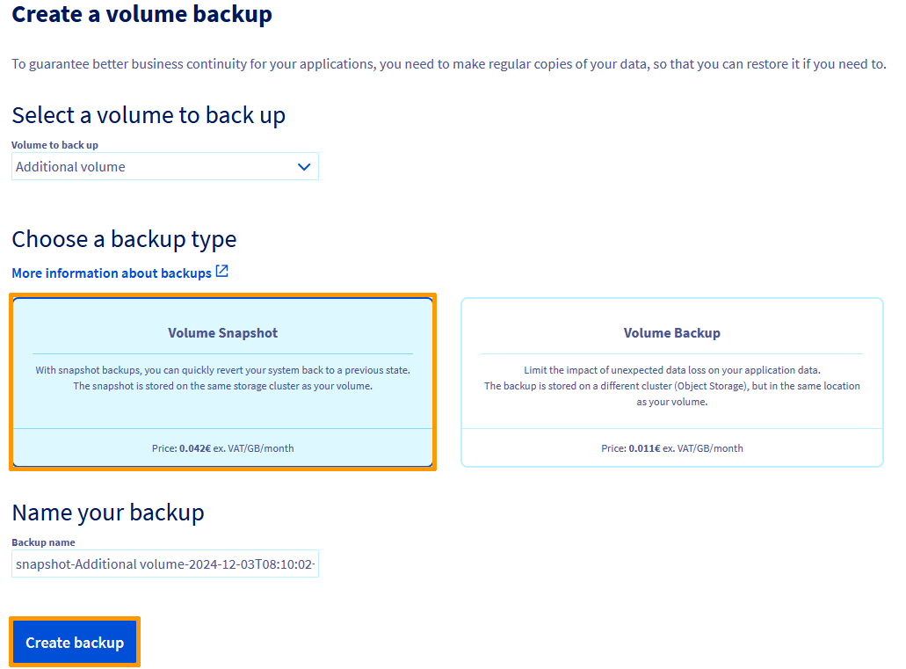

## Objetivo

Un **volumen Snapshot** es un punto de recuperación almacenado en el mismo cluster de almacenamiento que el volumen original. Las operaciones de creación y restauración son rápidas, pero en caso de incidencia en el cluster, el volumen y volumen Snapshot pueden no estar disponibles. 
No es necesario desvincular el volumen de la instancia para crear un volumen Snapshot.

Esto no debe confundirse con un **volumen Backup** es una imagen creada a partir de su volumen, que se almacena en el cluster Object Storage de la localización del volumen original.
Este nivel de resiliencia es ideal para reaccionar rápidamente ante cualquier incidencia en su volumen, creando otro volumen a partir del backup. 
Para crear una copia de seguridad, el volumen debe desvincularse de la instancia. Para más información sobre esta opción, consulte esta [guía](/pages/public_cloud/compute/volume-backup).

Crear un snapshot con un volumen adicional suele tener dos objetivos:

- realizar copias de seguridad en pocos clics y conservarlas en el tiempo necesario;
- utilizar el snapshot como modelo para volúmenes idénticos.

**Esta guía explica cómo crear un snapshot de un volumen desde el área de cliente de OVHcloud.**

## Requisitos

- Tienes acceso a tu [Panel de configuración de OVHcloud](/links/manager).
- Un volumen de [Block Storage](/pages/public_cloud/compute/create_and_configure_an_additional_disk_on_an_instance) creado en su proyecto de [Public Cloud](/pages/public_cloud/compute/create_a_public_cloud_project).

## Procedimiento

Conéctese al [Panel de configuración de OVHcloud](/links/manager), acceda a la sección `Public Cloud`{.action} y seleccione el proyecto de Public Cloud correspondiente. En la barra de navegación izquierda, haga clic en `Block Storage`{.action} y seleccione **Storage**.

{.thumbnail}

A la derecha del volumen en cuestión, haga clic en el botón `...`{.action} y luego en `Crear una copia de seguridad`{.action} (no es necesario desvincular primero el volumen de su instancia). No obstante, si desea desvincular el volumen, consulte la sección "Desvincular un volumen" de [esta guía](/pages/public_cloud/compute/create_and_configure_an_additional_disk_on_an_instance).

A continuación, seleccione `Volume Snapshot`{.action}, asígnele un nombre y haga clic en `Crear la copia de seguridad`{.action}.

{.thumbnail}

Se abrirá una ventana en la que podrá introducir un nombre diferente para el snapshot. Lea la información sobre los precios y haga clic en `Crear un snapshot`{.action}.

El tiempo de creación del snapshot depende de la cantidad de datos presentes en el volumen, del uso de los recursos de la instancia en el momento del snapshot y de otros factores específicos del host.

Le recomendamos que realice los snapshots fuera de su horario de producción.

Estas son algunas de las buenas prácticas:

- Evite crear snapshots en las horas punta (entre las 04:00 y las 22:00, hora de París).
- instale el agente qemu-guest si no lo ha hecho o intente desactivarlo si es necesario;
- intente no "solicitar" demasiado al servidor durante la fase de creación del snapshot (limitación de I/O, consumo de RAM, etc.).

Como un snapshot de volumen es un clon del conjunto del disco, tendrá el tamaño máximo del volumen original, independientemente de la asignación real del espacio en disco.

{.thumbnail}

Abra la sección `Volumen Snapshot`{.action} en la columna izquierda. Una vez creado el snapshot, este se añadirá a la tabla.

Haga clic en el botón `...`{.action} para eliminar o `Crear un volumen`{.action} a partir del snapshot correspondiente. Para más información, consulte [esta guía](/pages/public_cloud/compute/create-volume-from-snapshot).

## Más información

[Crear una copia de seguridad de un volumen](/pages/public_cloud/compute/volume-backup)

[Crear un volumen a partir de un snapshot](/pages/public_cloud/compute/create-volume-from-snapshot)

[Crear y configurar un disco adicional en una instancia](/pages/public_cloud/compute/create_and_configure_an_additional_disk_on_an_instance)

[Aumentar el tamaño de un disco adicional](/pages/public_cloud/compute/increase_the_size_of_an_additional_disk)

Interactúe con nuestra [comunidad de usuarios](/links/community).