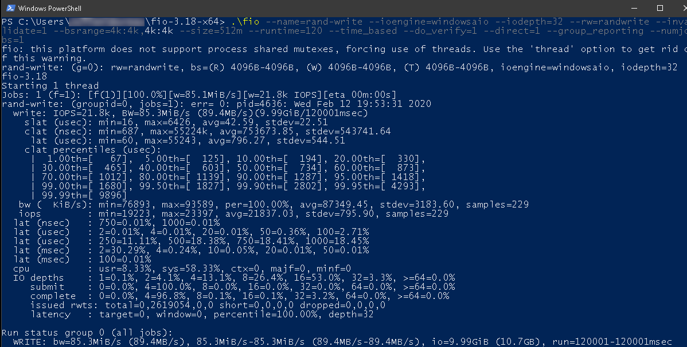

## Objectif

Lors de vos tests, vous serez probablement amené à vérifier la vitesse de vos disques. Que ce soit pour comparer leurs performances ou, simplement, pour vérifier qu'ils répondent à vos attentes.

**Apprenez à tester le nombre d'opérations d'entrée-sortie par seconde (IOPS) que vos disques sont en mesure d'effectuer, pour vos instances ou disques supplémentaires.**

## Prérequis

- Posséder une [instance Public Cloud](https://www.ovh.com/fr/public-cloud/instances/){.external}.
- Disposer d’un accès administratif (sudo) à cette instance via SSH (pour Linux uniquement).

## En pratique

### Installer la commande de test

La commande dont vous avez besoin pour vérifier la vitesse de votre disque s'appelle `fio`. Elle n'est pas présente par défaut sur votre serveur.

Pour installer `fio`, établissez une connexion SSH à votre instance puis exécutez la commande suivante :

```bash
apt install fio
```

### Tester la vitesse de votre disque

Pour tester la vitesse de votre disque, exécutez la commande suivante :

```bash
fio --name=rand-write --ioengine=libaio --iodepth=32 --rw=randwrite --invalidate=1 --bsrange=4k:4k,4k:4k --size=512m --runtime=120 --time_based --do_verify=1 --direct=1 --group_reporting --numjobs=1
```

> [!primary]
>
> Notez que vous devrez modifier l'argument `--numjobs` pour refléter le nombre de CPU de votre instance.
>
> Vous pouvez récupérer une liste d'arguments et leurs fonctions directement à partir du [guide](https://github.com/axboe/fio/blob/master/HOWTO.rst) de fio.
>

Pour tester la vitesse d'un disque supplémentaire, vous devez monter celui-ci à l'aide de la commande suivante : 

```bash
root@serveur:~$ cd /mnt/disk
```

### Analyser les données

Une fois le test terminé, vous obtenez un résultat semblable à ce qui suit :

```console
fio-2.1.11
Démarrage d'un processus
test: Mise en page des fichiers d'E/S (1 fichier(s) / 1 024 Mo)
Emplois 1 (f=1): [w(1)] [40.9% done] [0KB/3580KB/0KB /s] [0/895/0 iops] [eta 02m:55s]
test: (groupid=0, jobs=1): err= 0: 
pid=12376: Thu Oct 29 14:46:37 2015
write: io=428032KB, bw=3566.2KB/s, 
iops=891, runt=120031msec
slat (usec): min=4, max=4640, avg=22.57, stdev=62.14
clat (usec): min=299, max=181699, avg=34778.45, stdev=7857.92
lat (usec): min=324, max=181769, 
avg=34801.55, stdev=7843.84
clat percentiles (usec):
| 1.00th=[ 708], 5.00th=[30848], 10.00th=[33536], 20.00th=[34560],
| 30.00th=[35072], 40.00th=[35072], 50.00th=[35072], 60.00th=[35584],
| 70.00th=[36096], 80.00th=[36608], 90.00th=[37632], 95.00th=[39680],
| 99.00th=[47360], 99.50th=[51968], 99.90th=[125440], 99.95th=[146432],
| 99.99th=[181248]
bw (KB /s): min= 2646, max= 4232, 
per=100.00%, avg=3567.77, stdev=136.56
lat (usec) : 500=0.23%, 750=1.26%, 
1000=1.22%
lat (msec) : 2=0.37%, 4=0.03%, 10=0.01%, 20=0.11%, 50=96.05%
lat (msec) : 100=0.58%, 250=0.14%
cpu : usr=0.34%, sys=1.80%, ctx=9281, 
majf=0, minf=8
IO depths : 1=0.1%, 2=0.1%, 4=0.1%, 
8=0.1%, 16=0.1%, 32=100.0%, >=64=0.0%
submit : 0=0.0%, 4=100.0%, 8=0.0%, 
16=0.0%, 32=0.0%, 64=0.0%, >=64=0.0%
21% complete 0=0.0%, 4=100.0%, 8=0.0%, 
16=0.0%, 32=0.1%, 64=0.0%, >=64=0.0%
issued : total=r=0/w=107008/d=0, 
short=r=0/w=0/d=0
latency : target=0, window=0, percentile=100.00%, depth=32

Run status group 0 (all jobs):
WRITE: io=428032KB, aggrb=3566KB/s, minb=3566KB/s, maxb=3566KB/s, 
mint=120031msec, maxt=120031msec

Disk stats (read/write):
vda: ios=0/300294, merge=0/1455, ticks=0/7431952, in_queue=7433124, 
util=99.05%
```

La ligne qui nous intéresse est la sixième, qui contient le nombre d'opérations d'entrée-sortie par seconde (IOPS) :

```console
write: io=428032KB, bw=3566.2KB/s, iops=891, runt=120031msec
```

Les performances des disques sont ici d'environ 891 IOPS.

### Sur Windows

### Installer la commande de test

La commande dont vous avez besoin pour vérifier la vitesse de votre disque s'appelle `fio`. Elle n'est pas présente par défaut sur votre serveur.

Pour installer `fio`, connectez-vous à votre instance via RDP et téléchargez ce binaire : [Microsoft Windows binaries for fio](https://bsdio.com/fio/).

### Tester la vitesse de votre disque

Pour tester la vitesse de votre disque, exécutez la commande suivante :

```powershell
fio --name=rand-write --ioengine=windowsaio --iodepth=32 --rw=randwrite --invalidate=1 --bsrange=4k:4k,4k:4k --size=512m --runtime=120 --time_based --do_verify=1 --direct=1 --group_reporting --numjobs=1
```

> [!primary]
>
> Notez que vous devrez modifier l'argument `--numjobs` pour refléter le nombre de CPU de votre instance.
>
> Vous pouvez récupérer une liste d'arguments et leurs fonctions directement à partir du [guide de fio](https://github.com/axboe/fio/blob/master/HOWTO.rst).
>

### Analyser les données

Une fois le test terminé, vous obtenez un résultat semblable à ce qui suit :

{.thumbnail}

### Disques supplémentaires

Les disques supplémentaires ne pouvent pas être montés en mode rescue, la seule façon de tester leur vitesse est de le faire lorsque l'instance est active.

Dans le cas de Windows et des systèmes de fichiers NTFS, nous avons remarqué que certains pilotes récents peuvent créer des goulots d'étranglement. Dans ce cas, vous risquez d'obtenir des résultats insatisfaisants.

Au lieu d'avoir des IOPS autour de 3 000 pour les disques supplémentaires, ils plafonnent à environ 500.

Dans ce cas, vous pouvez faire les tests de vitesse sur un disque supplémentaire formaté avec un système de fichiers Linux (ext3-ext4 par exemple) pour faire la comparaison :

1. Recréez un disque vierge supplémentaire de la même taille que celui qui est affecté.
2. Migrez-le vers l'instance Windows, formatez-le en NTFS et refaites les tests.
3. Créez une instance Linux du même type que l'instance d'origine.
4. Attachez le disque supplémentaire, formatez-le en tant que système Linux et exécutez les tests demandés suivants.

**préallocation du volume**

```bash
fio --group_reporting --name=test-1 --ioengine=libaio --filesize=1G --filename=test-image-1 --rw=write --bs=1M --iodepth=32 --direct=1 --numjobs=1 
```

**écritures aléatoires**

```bash
fio --runtime=90 --time_based --group_reporting --name=test-1 --ioengine=libaio --filesize=1G --filename=test-image-1 --rw=randwrite --bs=4k --iodepth=32 --direct=1 --numjobs=1
```

**lecture aléatoire**

```bash
fio --runtime=90 --time_based --group_reporting --name=test-1 --ioengine=libaio --filesize=1G --filename=test-image-1 --rw=randread --bs=4k --iodepth=32 --direct=1 --numjobs=1 
```

## Aller plus loin

[Créer et configurer un disque supplémentaire sur une instance](/pages/public_cloud/compute/create_and_configure_an_additional_disk_on_an_instance){.external}.

Échangez avec notre [communauté d'utilisateurs](/links/community).
