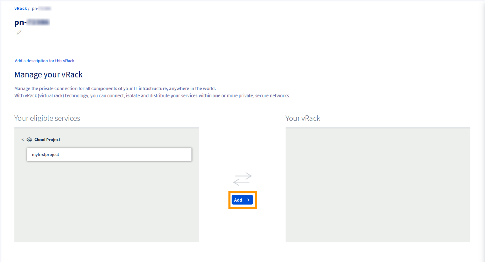
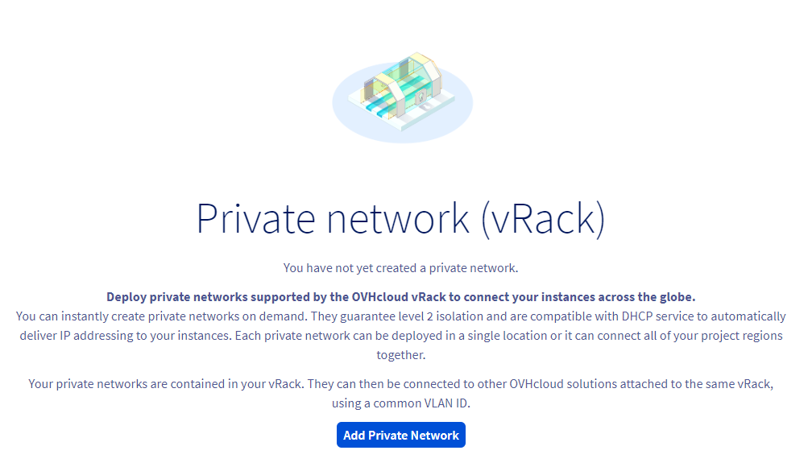
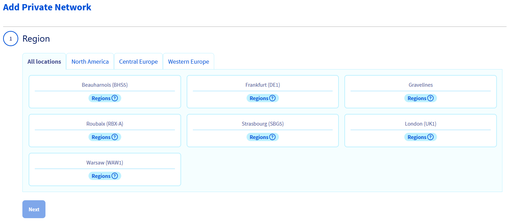
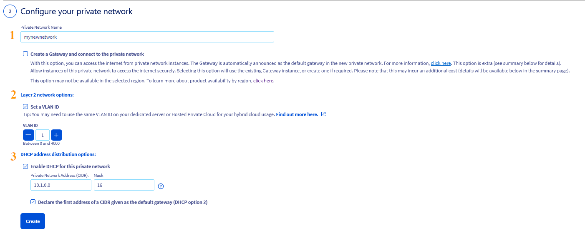
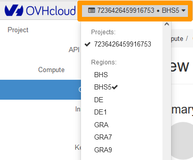
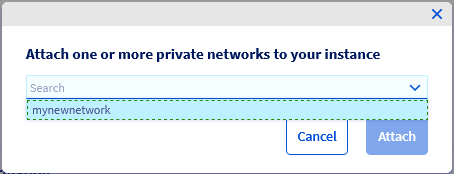

## Objective

As well as private IP addressing, the [vRack](/links/network/vrack){.external} also allows you to route public IP traffic through your server's [vRack](/links/network/vrack){.external} port using a public IP address block.

**This guide will show you how to configure a block of public IP addresses for use with the vRack on a Public cloud instance.**

## Requirements

- A public block of IP addresses in your account, with a minimum of four addresses
- Your chosen private IP address range
- An [OVHcloud Public Cloud instance](/pages/public_cloud/compute/public-cloud-first-steps)
- A [vRack](/links/network/vrack) service activated in your account
- Access to the OVHcloud [Control Panel](/links/manager)
- Access to the Horizon interface or the Openstack API.

## Instructions

### Add the Public Cloud project to the vRack

> [!primary]
> This does not apply to newly created projects, which are automatically delivered with a vRack. To view the vRack once the project has been created, go the `Bare Metal Cloud`{.action} menu and click on `Network`{.action} in the left tab. Click on `vRack private network`{.action} to view the vRack(s).
>
> You can also remove the project from its allocated vRack and attach it to another vRack if you wish.

For older projects, once you have ordered your [vRack](/links/network/vrack), go to the `Bare Metal Cloud`{.action} menu, click on `Network`{.action} in the left tab, then on `vRack private network`{.action}. Select your vRack from the list.

From the list of eligible services, select the project you want to add to the vRack and click the `Add`{.action} button.

{.thumbnail}

### Add the IP block to the vRack

> [!warning]
>
> Once an IP block is added to the vRack, it is no longer attached to a physical server.
>
> This setup allows you to configure IPs of the same block on multiple servers, provided that these servers are all in the same vRack as the IP block. The IP block must have at least 2 usable IPs or more for this to be possible.
>

In your [OVHcloud Control Panel](/links/manager), go to the `Bare Metal Cloud`{.action} section and click on `Network`{.action}. Next, open the `vRack`{.action} menu.

Select your vRack from the list to display the list of eligible services. Click the IP block you wish to add to the vRack and click on the `Add`{.action} button.

{.thumbnail}

### Create a Private Network

Once your project has been added to the vRack, the next step is to create a Private Network.

This private network will be attached to the Public cloud instance.

In the Public cloud tab, click on `Private Network`{.action} in the left-hand menu under **Network**.

Click on the button `Add Private Network`{.action}.

{.thumbnail}

The following page allows you to customise multiple settings.

In step 1, select the region in which you want the private network to be located (this should be the same as the location of the instance).

{.thumbnail}

Next select a VLAN ID, for this configuration to work, you must tag your private network with VLAN ID 0.

This can be configured in step 2.

{.thumbnail}

This step offers several configuration options. For the purpose of this guide, we will focus on the necessary ones. Click on the tabs below to view the details:

> [!tabs]
> **Private Network Name**
>>
>> Enter a name for your private network. 
>>
> **Layer 2 network options**
>>
>> Tick the **Set a VLAN ID** box and select VLAN ID **0**.
>>
>> If you do not tick the box, the system will assign a random VLAN ID number to your private network.
>>

### Add the Public IP block CIDR in the private network subnet

For the configuration to work, you need to add the public CIDR of your block in the subnet 

> [!warning]
> This action can only be performed from the Horizon interface or the Openstack client API
>

#### From the Horizon interface

Log into the [Horizon interface](https://horizon.cloud.ovh.net/auth/login/), and ensure that you are in the correct region. You can verify this on the top left corner.

{.thumbnail}

Click on `Network`{.action} in the left-hand tab, then on `Networks`{.action}.

Click on the drop-down arrow next to the private network and select `Create Subnet`{.action}.

{.thumbnail}

In the pop-up window, fill in the fields:

**Subnet Name**: Enter a name of your choice.
**Network address**: Enter the complete CIDR of your Public IP block (in this example: 203.0.113.0/29).
**Gateway IP**: The penultimate IP of the IP block (in this example 203.0.113.6).

Click on `Next`, then on `Create`.

Once the subnet has beenc created, your private network will appear as follows:

{.thumbnail}

#### From the Openstack API

Before continuing, we recommend reading these guides:

- [Preparing an environment for using the OpenStack API](/pages/public_cloud/compute/prepare_the_environment_for_using_the_openstack_api). 
- [Setting OpenStack environment variables](/pages/public_cloud/compute/loading_openstack_environment_variables).

### Integrating an instance into the vRack

Two situations may arise:

- The instance does not exist yet.
- The instance already exists and you must attach a private network to it.

#### In case of a new instance

If you need assistance, follow this guide first: [Creating your first Public Cloud instance](/pages/public_cloud/compute/public-cloud-first-steps). 

In Step 5, choose the private network previously created.

#### In case of an existing instance

If you have already the instance, you can attach a private network to it.

{.thumbnail}

In the corresponding instance dashboard, click on the `...`{.action} button in the box "Networks", next to "Private networks", and select `Attach a network`{.action}.

{.thumbnail}

In the popup window that appears, select the private network(s) to attach to your instance and click on `Attach`{.action}.

{.thumbnail}