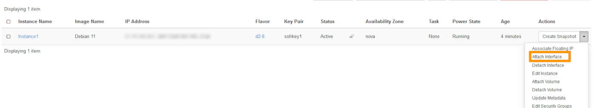

## Objective

As well as private IP addressing, the [vRack](/links/network/vrack){.external} also allows you to route public IP traffic through your server's [vRack](/links/network/vrack){.external} port using a public IP address block.

**This guide will show you how to configure a block of public IP addresses for use with the vRack on a Public cloud instance.**

## Requirements

- A public block of IP addresses in your account, with a minimum of four addresses
- Your chosen private IP address range
- An [OVHcloud Public Cloud instance](/pages/public_cloud/compute/public-cloud-first-steps)
- A [vRack](/links/network/vrack) service activated in your account
- Access to the OVHcloud [Control Panel](/links/manager)
- Access to the Horizon interface

## Instructions

### Add the Public Cloud project to the vRack

> [!primary]
> This does not apply to newly created projects, which are automatically delivered with a vRack. To view the vRack once the project has been created, go the `Bare Metal Cloud`{.action} menu and click on `Network`{.action} in the left tab. Click on `vRack private network`{.action} to view the vRack(s).
>
> You can also remove the project from its allocated vRack and attach it to another vRack if you wish.

For older projects, once you have ordered your [vRack](/links/network/vrack), go to the `Bare Metal Cloud`{.action} menu, click on `Network`{.action} in the left tab, then on `vRack private network`{.action}. Select your vRack from the list.

From the list of eligible services, select the project you want to add to the vRack and click the `Add`{.action} button.

{.thumbnail}


### Add the IP block to the vRack

> [!warning]
>
> Once an IP block is added to the vRack, it is no longer attached to a physical server.
>
> This setup allows you to configure IPs of the same block on multiple servers, provided that these servers are all in the same vRack as the IP block. The IP block must have at least 2 usable IPs or more for this to be possible.
>

In your [OVHcloud Control Panel](/links/manager), go to the `Bare Metal Cloud`{.action} section and click on `Network`{.action}. Next, open the `vRack`{.action} menu.

Select your vRack from the list to display the list of eligible services. Click the IP block you wish to add to the vRack and click on the `Add`{.action} button.

{.thumbnail}

### Create a Private Network

Once your project has been added to the vRack, the next step is to create a Private Network.

This private network will be attached to the Public cloud instance.

In the Public cloud tab, click on `Private Network`{.action} in the left-hand menu under **Network**.

Click on the button `Add Private Network`{.action}.

{.thumbnail}

The following page allows you to customise multiple settings.

In step 1, select the region in which you want the private network to be located (this should be the same as the location of the instance).

{.thumbnail}

Next select a VLAN ID, for this configuration to work, you must tag your private network with VLAN ID 0.

This can be configured in step 2.

{.thumbnail}

This step offers several configuration options. For the purpose of this guide, we will focus on the necessary ones. Click on the tabs below to view the details:

> [!tabs]
> **Private Network Name**
>>
>> Enter a name for your private network.<br>
>>
> **Layer 2 network options**
>>
>> Tick the **Set a VLAN ID** box and select VLAN ID **0**.
>>
>> If you do not tick the box, the system will assign a random VLAN ID number to your private network.
>>

### Add the Public IP block CIDR in the private network subnet

For the configuration to work, you need to add the public CIDR of your block in the subnet of the private network previously created.

> [!warning]
> This action can only be performed from the Horizon interface or the Openstack client API
>

#### From the Horizon interface

Log into the [Horizon interface](https://horizon.cloud.ovh.net/auth/login/), and ensure that you are in the correct region. You can verify this on the top left corner.

{.thumbnail}

Click on `Network`{.action} in the left-hand tab, then on `Networks`{.action}.

{.thumbnail}

Click on the drop-down arrow next to the private network and select `Create Subnet`{.action}.

{.thumbnail}

In the pop-up window, fill in the fields:

**Subnet Name**: Enter a name of your choice.<br>
**Network address**: Enter the complete CIDR of your Public IP block (in this example: 203.0.113.0/29).<br>
**Gateway IP**: The penultimate IP of the IP block (in this example 203.0.113.6).

Click on `Next`, then on `Create`.

Once the subnet has been created, your private network will appear as follows:

{.thumbnail}

To add the private interface to the instance, click on `Compute`, then on `Instances`.

{.thumbnail}

Click on the arrow in the "Actions" column to access the possible actions on the instance. Select `Attach Interface`{.action}.

{.thumbnail}

Select the network with the public IP block and indicate the available IP you wish to use (if you don't, it might just attach another private IP).

{.thumbnail}

### Attach the network interface to the Instance

Since this is a specific configuration, this step should be done via Horizon or the Openstack CLI.
Additionally, you must attach the network to the Instance only after it has been created.

If you have not yet created an instance, we recommend you to consult the following guides:[How to create a Public Cloud instance and connect to it](/pages/public_cloud/compute/public-cloud-first-steps/) and [Creating an Instance via the Horizon interface](/pages/public_cloud/compute/create_instance_in_horizon/).

#### From the Horizon Interface

Once you are connected, make sure you choose the proper work zone.

{.thumbnail}

Next, select `Compute`{.action} and then `Instances`{.action} from the menu.

{.thumbnail}


Select `Attach Interface`{.action} in the drop list for the corresponding instance.

{.thumbnail}

In the pop-up menu, select the appropriate options:

{.thumbnail}

**Network***: Select the private network created<br>
**Fixed IP Address**: Specify the Public IP address you wish to use from the block (if you don't, the system will automatically assigned a private IP).

> [!warning]


**Configure a usable IP address**

For vRack purposes, the first, penultimate, and last addresses in any given IP block are always reserved for the network address, network gateway, and network broadcast respectively. This means that the first useable address is the second address in the block, as shown below:

```sh
203.0.113.0   Reserved: Network address
203.0.113.1   First usable IP
203.0.113.2
203.0.113.3
203.0.113.4
203.0.113.5   Last usable IP
203.0.113.6   Reserved: Network gateway
203.0.113.7   Reserved: Network broadcast 
```

To configure the first usable IP address, we need to edit the network configuration file, as shown below. In this example, we need to use a subnet mask of **255.255.255.248**.

> [!primary]
>
The subnet mask we've used in our example is appropriate for our IP block. Your subnet mask may differ depending on the size of your block. When you purchase your IP block, you'll receive an email that will tell you which subnet mask to use.
>

```sh
/etc/network/interfaces

auto eth1
iface eth1 inet static
address 203.0.113.3
netmask 255.255.255.248
broadcast 203.0.113.7
```

### Create a new IP routing table

First, we need to download and install iproute2, which is a package that will enable us to manually configure IP routing on the server.

Establish an SSH connection to your server and run the following command from the command line. This will download and install iproute2.

```sh
# apt-get install iproute2
```

Next, we need to create a new IP route for the vRack. We'll be adding a new traffic rule by amending the file, as shown below:

```sh
/etc/iproute2/rt_tables

#
# reserved values
#
255	local
254	main
253	default
0	unspec
#
# local
#
#1	inr.ruhep
1 vrack
```

### Amend the network configuration file

Finally, we need to amend the network configuration file to account for the new traffic rule and route the vRack traffic through the network gateway address of **203.0.113.2**.

```sh
/etc/network/interfaces

auto eth1
iface eth1 inet static
address 203.0.113.3
netmask 255.255.255.248
broadcast 203.0.113.7
post-up ip route add 203.0.113.0/29 dev eth1 table vrack
post-up ip route add default via 203.0.113.6 dev eth1 table vrack
post-up ip rule add from 203.0.113.0/29 table vrack
post-up ip rule add to 203.0.113.0/29 table vrack
```

Now reboot your server to apply the changes.

## Go further

Join our [community of users](/links/community).