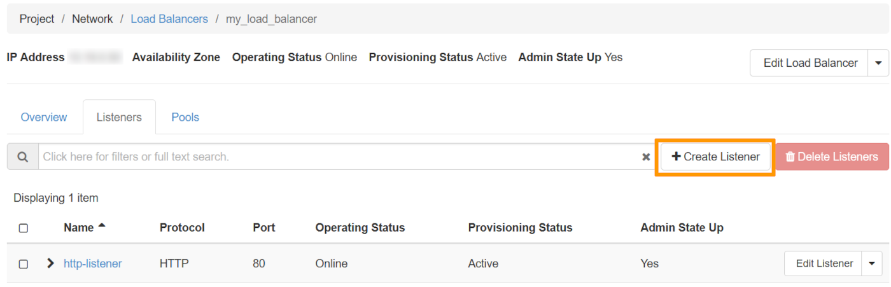
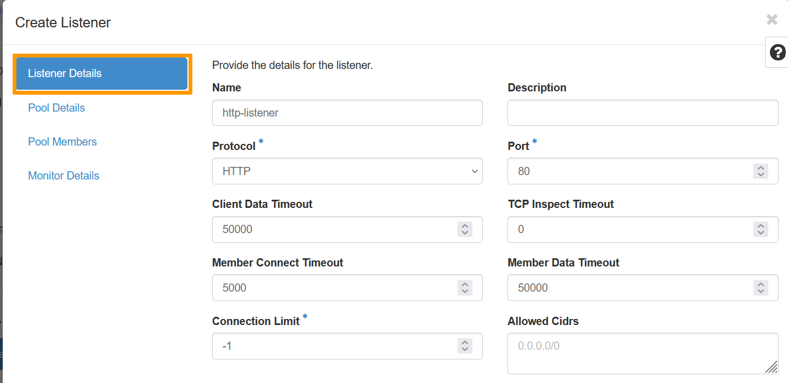
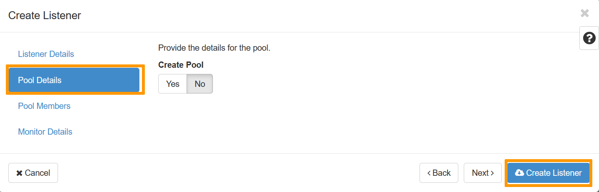
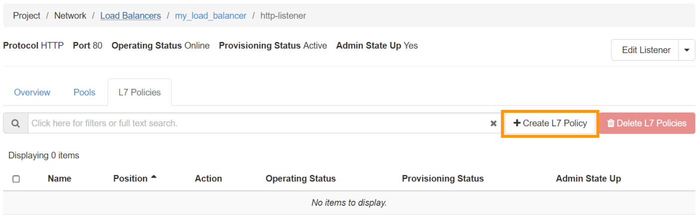
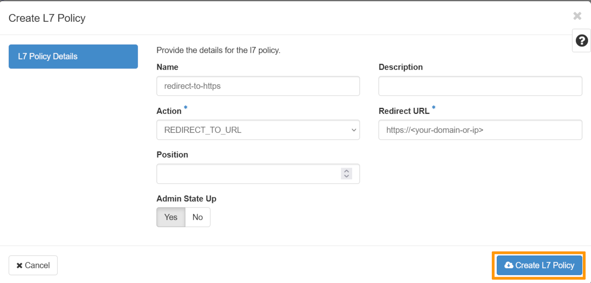
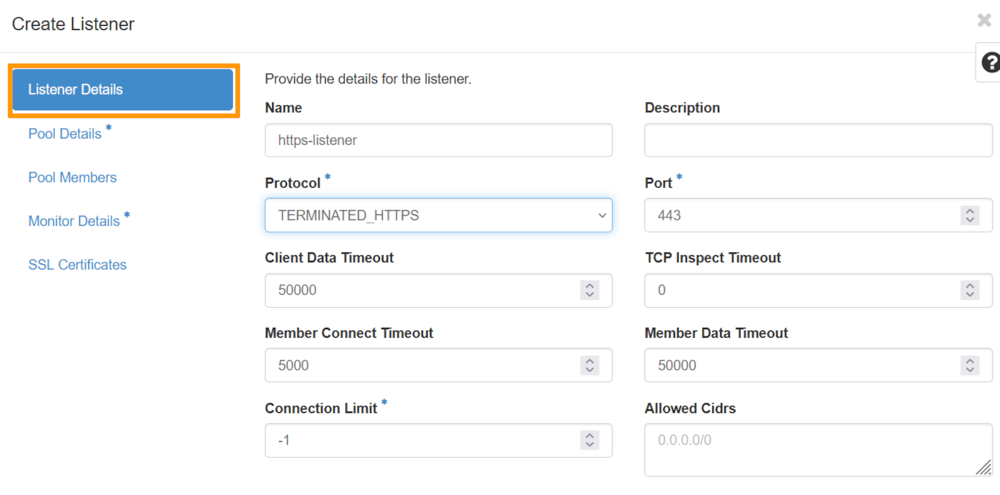
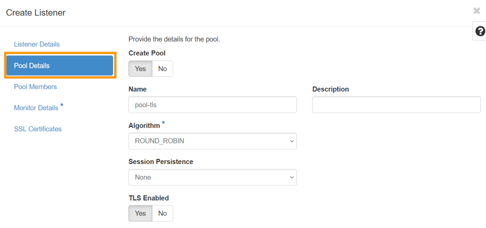
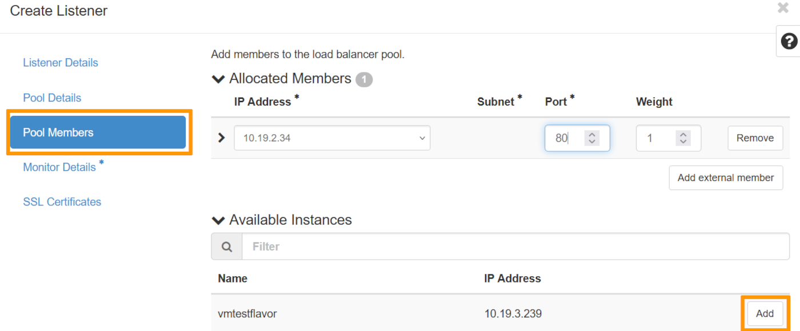
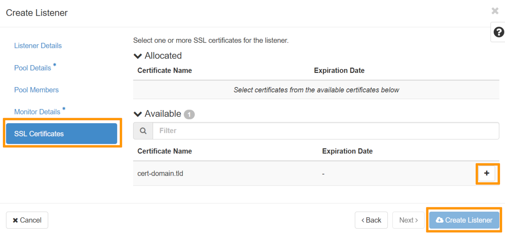

<style>
details>summary {
    color:rgb(33, 153, 232) !important;
    cursor: pointer;
}
details>summary::before {
    content:'\25B6';
    padding-right:1ch;
}
details[open]>summary::before {
    content:'\25BC';
}
</style>

## Objectif

Notre Load Balancer Public Cloud est basé sur le service [Openstack Octavia](https://wiki.openstack.org/wiki/Octavia){.external} et est entièrement intégré dans l'univers Public Cloud.

Une fois votre Load Balancer mis en place, vous pouvez le configurer avec un certificat afin de traiter les connexions HTTPS.

**Découvrez comment configurer un Load Balancer Public Cloud sécurisé**

## Prérequis

- Un [projet Public Cloud](https://www.ovhcloud.com/fr/public-cloud/)
- Utiliser l'environnement de commande d'Openstack ([Tutoriel](/pages/public_cloud/compute/prepare_the_environment_for_using_the_openstack_api))
- Avoir installé le [client Openstack Octavia](https://docs.openstack.org/python-octaviaclient/latest/install/index.html) et [Openstack Barbican](https://docs.openstack.org/python-barbicanclient/latest/install/index.html)
- Un Load Balancer actif dans votre projet
- Un certificat provenant d'un fournisseur tiers.

Si vous n'êtes pas encore familier avec la création du Load Balancer, veuillez consulter notre guide « [Premiers pas avec le service Load Balancer Public Cloud](/pages/public_cloud/public_cloud_network_services/getting-started-01-create-lb-service) » avant de poursuivre la lecture de ce guide.

## En pratique

### Attacher une adresse Floating IP à un Load Balancer

Voici comment attacher une adresse Floating IP à un Load Balancer :

```bash
openstack floating ip create Ext-Net
openstack floating ip set --port <my_load_balancer_vip_port_id> <floating_ip>
```

> [!primary]
>
> Pour récupérer l'ID du port VIP de votre Load Balancer, utilisez `openstack loadbalancer show my_load_balancer`.

Veuillez noter que vous devez ajouter un champ A dans la Zone DNS de votre domaine tld qui pointe vers l'adresse Floating IP. 

Si vos serveurs DNS sont gérés par OVHcloud, consultez [ce guide](/pages/web_cloud/domains/dns_zone_edit).

### Préparation du certificat <a name="preparingcertificate"></a>

Nous aurons pour cette étape besoin de votre certificat, généré au préalable. 

Lors de la génération de votre certificat auprès de votre fournisseur, vous recevez généralement 2 ou 3 fichiers, décrits comme suit :
- Certificat principal (fichier au format .crt ou .pem).
- Clé privée (fichier .key) générée lors de la requête CSR.
- Certificat intermédiaire ou chaîne complète (fichier .crt), si fourni. Certains fournisseurs intègrent déjà la chaîne intermédiaire au certificat principal, auquel cas vous ne recevrez que 2 fichiers.

> [!warning]
>
> Si vous avez obtenu 3 fichiers, il vous faudra fusionner le certificat principal avec le certificat intermédiaire pour créer un certificat complet. Si votre fournisseur fournit déjà un certificat complet intégrant la chaîne intermédiaire, cette étape de fusion doit être omise.
>

```bash
sudo cat <certificate.crt> <intermediate_chain.crt> > main_certificate.pem
```

Vous devez créer un package PKCS#12 avec votre certificat à l'intérieur :

```bash
sudo openssl pkcs12 -export -inkey <private_key.key> -in <main_certificate.pem> -out domain.tld.p12
```

Vous devez télécharger ce fichier directement sur votre ordinateur afin de pouvoir l'envoyer dans Openstack Barbican ("Secret as a Service").

```bash
openstack secret store --name='cert-domain.tld' -t 'application/octet-stream' -e 'base64' --payload="$(base64 < domain.tld.p12)"
```

### Configurer le Load Balancer

/// details | Depuis l'interface Horizon

Dans l'interface d'Horizon, `ouvrir la section Network`{.action} puis cliquer sur `Load Balancers.`{.action}

Sélectionnez votre Load Balancer en cliquant sur `le nom de votre Load Balancer.`{.action}

Vous pouvez désormais cliquer sur la section `Listerners`{.action}, puis sur `Create Listener` comme suit : 

{.thumbnail}

Dans la première section nommée 'Listener Details', il faut nommer le listener, choisir le protocol `HTTP`{.action} ainsi que le port `80`{.action}.

{.thumbnail}

Dans la seconde nommée 'Pool détails', sous 'Create Pool' cliquez sur `No`{.action}, puis en bas, cliquez sur `Create Listener.`{.action}

{.thumbnail}

Une fois celui-ci crée, vous pouvez cliquer sur `le nom du listener`{.action}, puis sur `L7 policies.`{.action} et `Create L7 Policy.`{.action}

{.thumbnail}

Dans cette fenêtre, il faut nommer la L7 Policy, choisir dans le champs 'Action' `la valeur REDIRECT_TO_URL`{.action} puis `écrire son nom de domaine`{.action} dans le champs 'Redirect URL'. Vous pouvez cliquer sur le bouton `Create L7 policy`{.action} en bas de la fenêtre pour créer votre L7 Policy.

{.thumbnail}

///

/// details | Depuis l'API OpenStack

Il faut commencer par ajouter un listener HTTP au Load Balancer :

```bash
openstack loadbalancer listener create --protocol-port 80 --protocol HTTP --name http-listener my_load_balancer
```

Puis configurer la redirection des requêtes HTTP vers HTTPS :

```bash
openstack loadbalancer l7policy create --action REDIRECT_TO_URL --redirect-url https://<your-domain-or-ip> --name redirect-to-https http-listener
```

///

### Configurer le Listener sécurisé sur le Load Balancer

Maintenant que vous avez géré votre certificat, vous pouvez ajouter un Listener sécurisé et y associer un pool et ses membres :

/// details | Depuis l'interface Horizon

Dans l'interface d'Horizon, `ouvrir la section Network`{.action} puis cliquer sur `Load Balancers.`{.action}

Sélectionnez votre Load Balancer en cliquant sur `le nom de votre Load Balancer.`{.action}

Vous pouvez désormais cliquer sur la section `Listerners`{.action}, puis sur `Create Listener` comme suit : 

{.thumbnail}

Dans la première section nommée 'Listener Details', il faut nommer le listener, choisir le protocol `TERMINATED_HTTPS`{.action} ainsi que le port `443`{.action}.

{.thumbnail}

Dans la seconde section nommée 'Pool Details', il faut nommer son Pool, choisir dans le champs 'Algortihm' `la valeur 'ROUND_ROBIN`{.action} et appuyer sur `Yes`{.action} sous le champs 'TLS Enabled'.

{.thumbnail}

Dans la troisème section nommée 'Pool Members', il faut choisir l'instance correspondante et appuyer sur le bouton `Add`{.action} se trouvant en fin de ligne, puis lorsque ceci est fait, il faut sélectionner comme 'Port' le port `80.`{.action}

{.thumbnail}

Concernant la section 'Monitor Details', nous allons cliquer sur `No`{.action} car nous ne feront pas la démonstration de cette partie dans ce guide.

Rendez-vous maintenant dans la section nommée `SSL Certificates`{.action} et sélectionnez le certificat qui à été ajouté préalablement sur Openstack Barbican, [dans cette partie](#preparingcertificate).
Vous pouvez cliquer sur le bouton `Create L7 policy`{.action} en bas de la fenêtre pour créer votre Load Balancer configuré.

{.thumbnail}

///

/// details | Depuis l'API OpenStack

```bash
openstack loadbalancer listener create --protocol-port 443 --protocol TERMINATED_HTTPS --name https-listener --default-tls-container=$(openstack secret list | awk '/ cert-domain.tld / {print $2}') my_load_balancer

openstack loadbalancer pool create --name pool-tls --lb-algorithm ROUND_ROBIN --listener https-listener --protocol HTTP

openstack loadbalancer member create --subnet-id my_subnet --address <private_ip_instance> --protocol-port 80 pool-tls
```

///

Vous pouvez maintenant accéder à votre Load Balancer de manière sécurisée. Attention toutefois, il faudra renouveler le certificat. Vérifiez la politique de renouvellement auprès de votre fournisseur de certificat.

## Aller plus loin

[Premiers pas avec le service Load Balancer pour Public Cloud](/pages/public_cloud/public_cloud_network_services/getting-started-01-create-lb-service)

[Documentation officielle d'Openstack Octavia](https://docs.openstack.org/octavia/latest/)

[Cookbook Openstack Octavia](https://docs.openstack.org/octavia/latest/user/guides/basic-cookbook.html)

Si vous avez besoin d'une formation ou d'une assistance technique pour la mise en oeuvre de nos solutions, contactez votre commercial ou cliquez sur [ce lien](https://www.ovhcloud.com/fr/professional-services/) pour obtenir un devis et demander une analyse personnalisée de votre projet à nos experts de l’équipe Professional Services. 

Échangez avec notre [communauté d'utilisateurs](/links/community).
