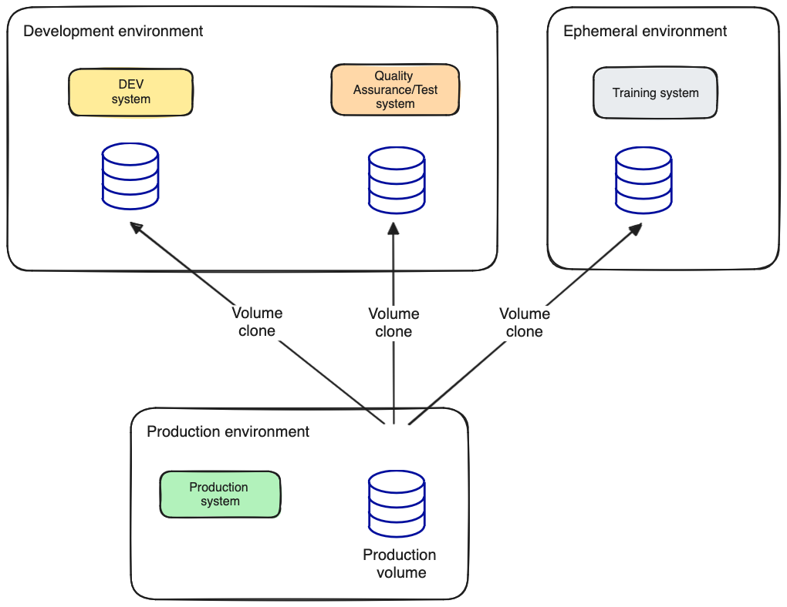
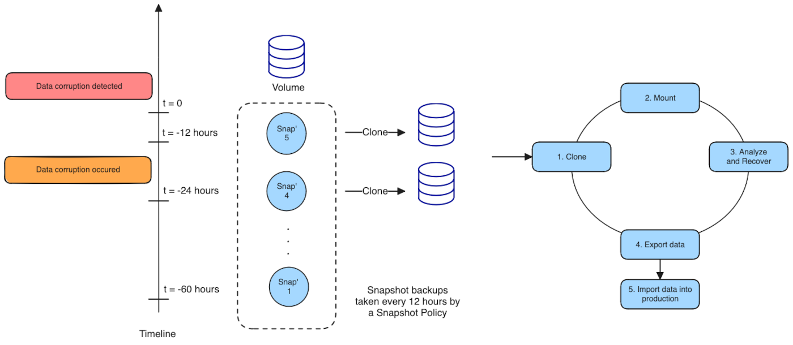
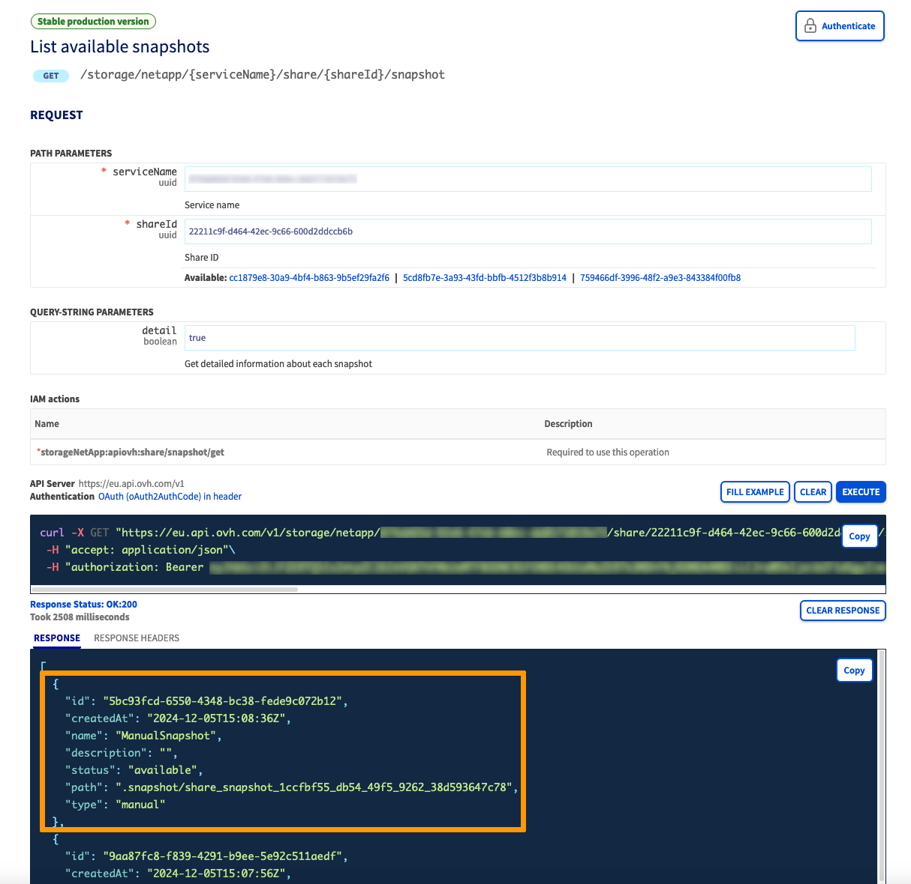
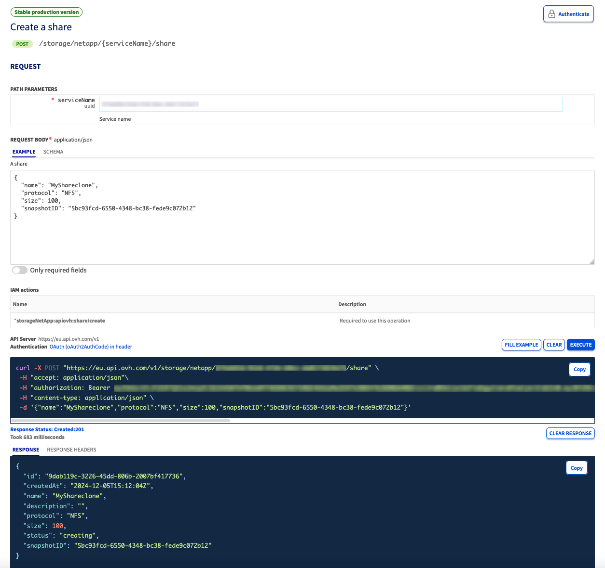

## Objetivo

Un volumen clonado contiene todos los datos del volumen primario en un momento dado. Tiene todas las funcionalidades de un volumen y, por tanto, puede utilizarse como un volumen convencional. 

Un volumen clonado se crea a partir de un snapshot (instantánea) de un volumen activo. Una vez creado, los cambios realizados en su volumen principal no se reflejarán en el clon.

> [!primary]
> En esta guía, un volumen también recibe el nombre de «*share*», como en la API de OVHcloud.

**Descubra la funcionalidad de clonación de volúmenes y aprenda a clonar un volumen de su solución Enterprise File Storage a través de la API OVHcloud.**

## Casos de uso

Existen varios escenarios de uso de un volumen clonado. A continuación se muestran algunos ejemplos.

### Permitir el acceso a los datos con fines de calidad, prueba o formación

Es posible que los sistemas de formación, calidad y prueba necesiten actualizarse periódicamente con datos procedentes del entorno de producción. 

Con la clonación de volúmenes, se pueden implementar operaciones de automatización para crear conjuntos de datos basados en los datos actualizados rápidamente y sin dar acceso a los datos de producción.

{.thumbnail}

### Luchar contra la corrupción de datos

La corrupción lógica de los datos puede deberse a un error de software, a un error humano o incluso a un acto malicioso. 

Mediante la creación de puntos de copia de seguridad regulares con la ayuda de una [Política de Snapshots](/pages/storage_and_backup/file_storage/enterprise_file_storage/netapp_snapshot_policy) y utilizando la funcionalidad de clonación de volúmenes, podrá analizar fácilmente las causas de la corrupción de datos creando un nuevo volumen a partir de los datos existentes.

{.thumbnail}

## Requisitos

- Tener contratado un servicio de OVHcloud [Enterprise File Storage](/links/storage/enterprise-file-storage)
- Estar conectado a la [API de OVHcloud](/links/api)
- Disponer de un volumen Enterprise File Storage con un snapshot `manual`

> [!primary]
>
> Puede crear un volumen y un snapshot de tipo «manual» gracias a la [API OVHcloud](/links/api) o desde su [área de cliente OVHcloud](/links/manager).

> [!success]
> Si no está familiarizado con el uso de la API de OVHcloud, consulte nuestra guía «[Primeros pasos con las API de OVHcloud](/pages/manage_and_operate/api/first-steps)».

## Límites de la funcionalidad

- Solo los snapshots de tipo `manual` pueden utilizarse para clonar un volumen.
Sin embargo, si desea clonar un volumen utilizando un snapshot de tipo `automatic`, puede conservar dicho snapshot para transformarlo en un snapshot de tipo `manual`.
Consulte la [guía de conservación de snapshots automáticos](/pages/storage_and_backup/file_storage/enterprise_file_storage/netapp_hold_automatic_snapshot) para obtener más información.

- No es posible crear un volumen clonado desde un snapshot de tipo `system`.

- El tamaño del volumen clonado debe ser **mayor o igual** al tamaño del snapshot utilizado para la operación de clonación.

## En la práctica

1\. Identifique el`id` del snapshot que desea utilizar con la siguiente llamada a la API:

> [!api]
>
> @api {GET} /storage/netapp/{serviceName}/share/{shareId}/snapshot
>
 
**Parámetros:**

- `serviceName`: es el identificador único del servicio
- `shareId`: es el identificador del volumen al que pertenece el snapshot

{.thumbnail}

2\. Cree el volumen a partir del snapshot utilizando la siguiente llamada a la API:

> [!api]
>
> @api {POST} /storage/netapp/{serviceName}/share
>

**Parámetros:**

- `serviceName`: es el identificador único del servicio
- `size`: es el tamaño del volumen. Debe ser superior o igual al tamaño del snapshot.
- `protocol`: es el protocolo del volumen. Solo se admite NFS.
- `snapshotID`: es el identificador del snapshot que debe utilizarse para crear el volumen
- `name`: (Opcional) es el nombre del volumen
- `description`: (Opcional) es la descripción del volumen

{.thumbnail}

La API OVHcloud devolverá un código HTTP 201, así como la información correspondiente al volumen creado. 

El estado del volumen se cambiará a `creating_from_snapshot` y, una vez creado el volumen, se convertirá en `available`. 
Dependiendo del tamaño del snapshot utilizado, la operación de creación del volumen podría tardar un tiempo.

**Se crea un nuevo volumen desde el snapshot de su volumen padre.**

## Más información 

Si necesita formación o asistencia técnica para implementar nuestras soluciones, póngase en contacto con su representante de ventas o haga clic en [este enlace](/links/professional-services) para obtener un presupuesto y solicitar un análisis personalizado de su proyecto a nuestros expertos del equipo de Professional Services.

Interactúe con nuestra [comunidad de usuarios](/links/community).
