## Objective

Enterprise File Storage services can be managed [via the OVHcloud API](/pages/storage_and_backup/file_storage/enterprise_file_storage/netapp_quick_start) or in the [OVHcloud Control Panel](/links/manager).

**This guide explains how to manage Enterprise File Storage volumes and snapshots in the OVHcloud Control Panel.**

## Requirements

- An Enterprise File Storage service in your OVHcloud account. The service can be ordered from the [product page](https://www.ovhcloud.com/en-ie/storage-solutions/enterprise-file-storage/) or from the [OVHcloud Control Panel](https://www.ovh.com/manager/#/dedicated/netapp/new).
- Access to the [OVHcloud Control Panel](/links/manager).

## Instructions 

Log in to your [OVHcloud Control Panel](/links/manager) and switch to `Bare Metal Cloud`{.action} in the top navigation bar. Open `Storage and backups`{.action} and `Enterprise File Storage`{.action} in the left-hand menu, then select your service from the list.

{.thumbnail}

The `General information`{.action} tab displays some technical information, general subscription details and a shortcut to [create a volume](#create_volume).

> [!primary]
> Please visit the [concepts page](/pages/storage_and_backup/file_storage/enterprise_file_storage/netapp_concepts) for detailed information on the technical properties of Enterprise File Storage.
>

### Managing volumes 

Switch to the `Volumes`{.action} tab. The table lists all volumes you have created for the selected service. Click on a volume ID to open its [management page](#modify_volume).

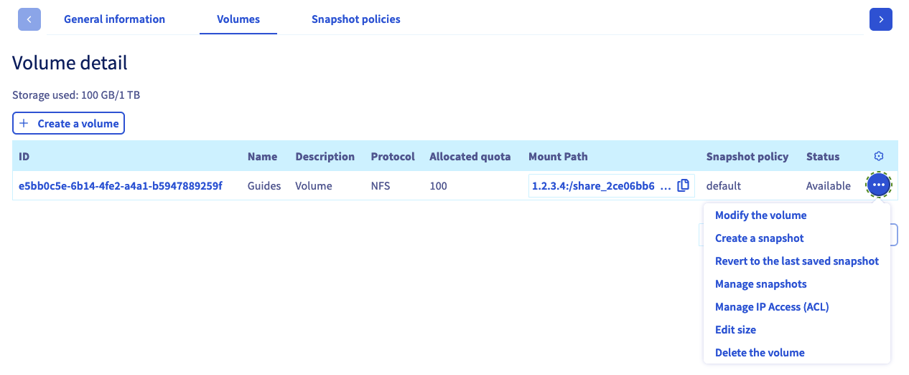{.thumbnail}

You can perform actions by clicking on the `...`{.action} button in each row of the table.

- **Modify the volume**: Opens the ["General information" section](#modify_volume) of the volume.
- **Create a snapshot**: Opens the ["Snapshots" section](#snapshots) and a popup window to take a manual snapshot.
- **Revert to the last saved snapshot**: Opens the ["Snapshots" section](#snapshots) and a popup window to restore the volume.
- **Manage snapshots**: Opens the ["Snapshots" section](#snapshots) of the volume.
- **Manage IP access (ACL)**: Opens the ["Access control list (ACL)" section](#access_control) where you can manage access control for the volume.
- **Edit size**: Opens a popup window to modify volume size.
- **Delete the volume**: Delete this volume after confirming the action in the popup window.

#### Creating a volume 

Click on the button `Create a volume`{.action}. In the new window, enter a name and description for the volume. Determine the size in GB and click on `Create a volume`{.action} to confirm.

{.thumbnail}

#### Modifying a volume 

Click on a volume ID in the table to open the management page of this volume.

The `General information`{.action} tab displays your volume’s details and step-by-step instructions for connecting to it, including the individual parameters.

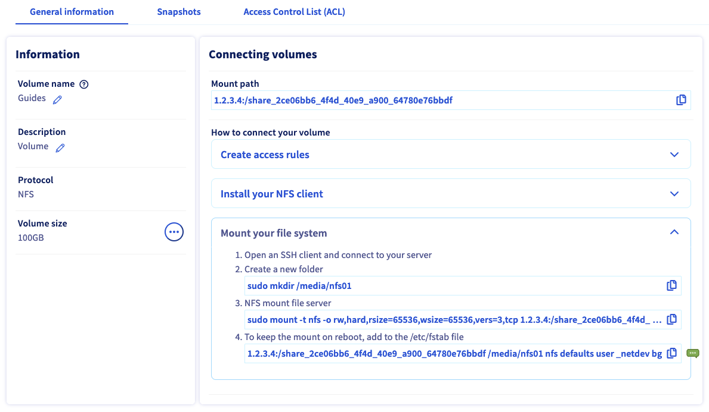{.thumbnail}

You can also change the volume's name and description on this tab.

#### Deleting a volume 

You can delete a volume by clicking the `...`{.action} button in its row within the `Volumes`{.action} tab, then selecting `Delete the volume`{.action}.

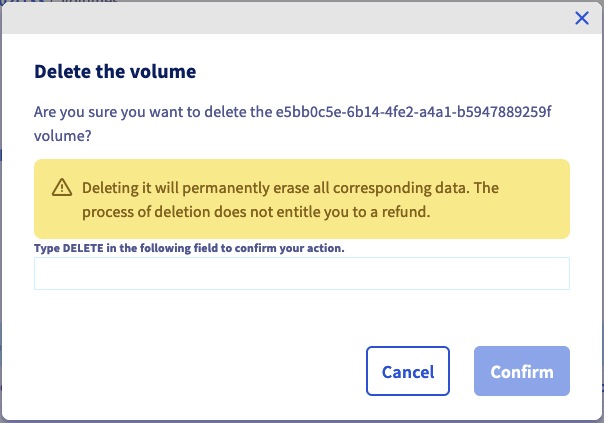{.thumbnail}

Confirm deletion operation by typing `DELETE` inside the confirmation field and then clicking the `Confirm`{.action} button.

### Managing volume snapshots 

> [!primary]
>
> Volume snapshots use storage capacity from your your Enterprise File Storage offer. By default, 5% of a volume storage capacity is reserved for snapshots.
>

The `Snapshots`{.action} tab lists all the snapshots that have been created for the selected volume.

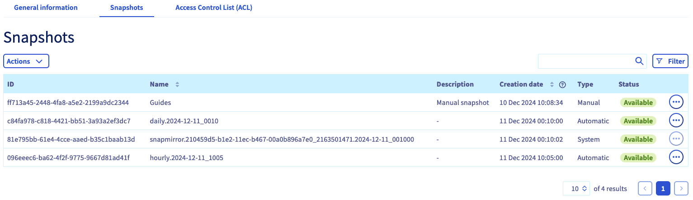{.thumbnail}

> [!primary]
>
> You can also access snapshot from you mount point using the commands provided in the [NetApp documentation](https://library.netapp.com/ecmdocs/ECMP1196991/html/GUID-36DC110C-C0FE-4313-BF53-1C12838F7BBD.html){.external}.
>

On this tab you can also view all of the [Snapshot Policies](#snapshot_policy) created for the service and apply them to this volume.

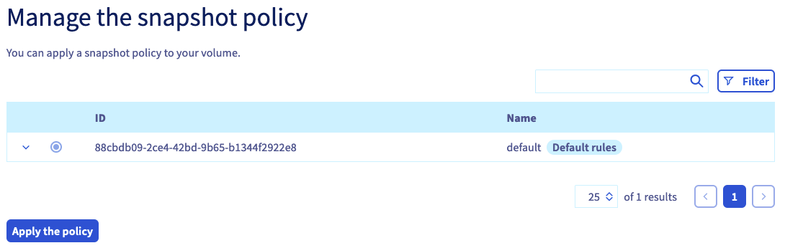{.thumbnail}

Click on the policy row to review the snapshot schedules details. Select a policy using the circular selector button, and then click the `Apply the policy`{.action} button below the table.

In order to configure your [Snapshot Policies](#snapshot_policy), navigate back to the [volume management section](#instructions) of your service and open the tab `Snapshot policies`{.action}.

#### Creating a snapshot 

To create a new `manual` snapshot of the volume's current state, click the `Actions`{.action} button and select `Create a snapshot`{.action}.

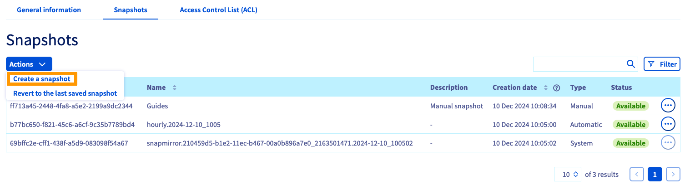{.thumbnail}

Inside the the popup window that will open, you can enter a name and a description for the snapshot. Click the `Create a snapshot`{.action} button to start snapshot creation.

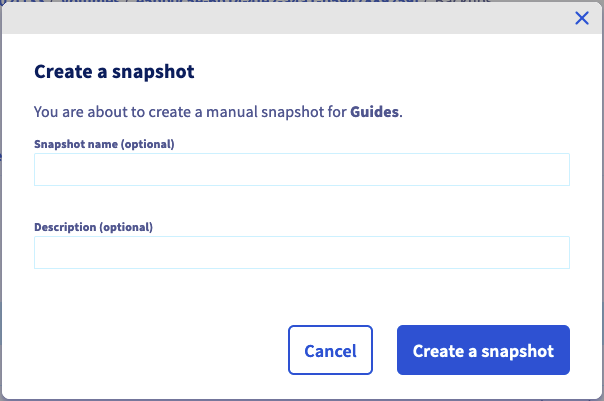{.thumbnail}

#### Modifying a snapshot 

To change the name or description of the snapshot, click on the `..`{.action} button in its row, then click on `Edit`{.action}. Inside the popup window that opens you can choose a new name and/or description.

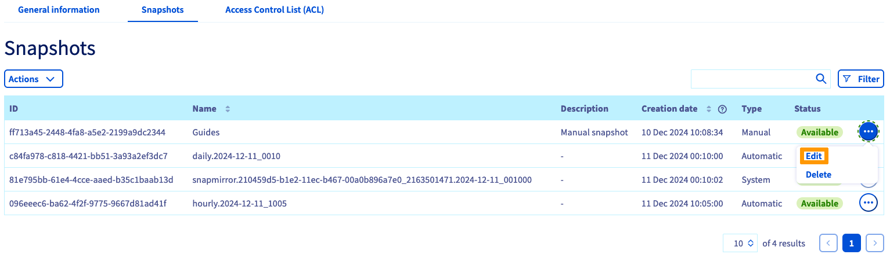{.thumbnail}

Click on `Confirm`{.action} button to apply your modifications.

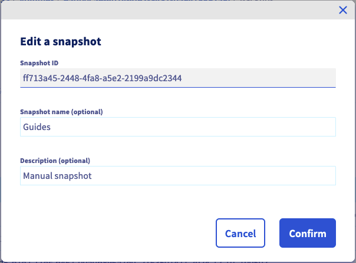{.thumbnail}

#### Deleting a snapshot 

> [!warning]
>
> `System` snapshots can not be deleted.
> Snapshots with type `system` are essential for the proper function of your Enterprise File Storage service.
>

A snapshot can be deleted by clicking the `...`{.action} button on its row inside the `Snapshot`{.action} tab, then selecting `Delete`{.action}.

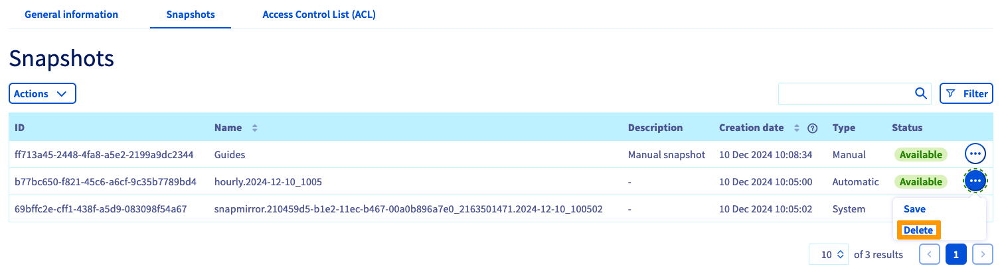{.thumbnail}

Inside the popup window that will open, click on `Delete a snapshot`{.action} to start snapshot deletion operation.

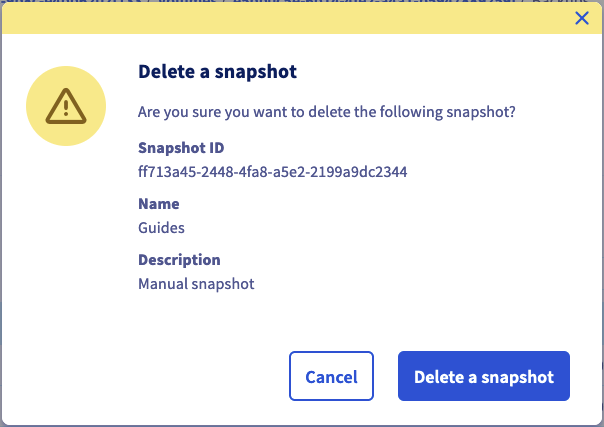{.thumbnail}

#### Restore a volume using one of its snapshots 

> [!warning]
>
> Please note that once a volume is restored using a snapshot copy, any subsequent files or snapshots will be lost.
> When a volume is restored, all data in the volume is replaced with the snapshot’s data. The action is irreversible.
>

You can restore a volume using its latest `manual` snapshot by clicking on the `Actions`{.action} button and then on `Revert to the last saved snapshot.`{.action}.

> [!primary]
>
> To restore a volume using a snapshot from before the latest snapshot, you must delete snapshots until the desired snapshot becomes the latest one.
>

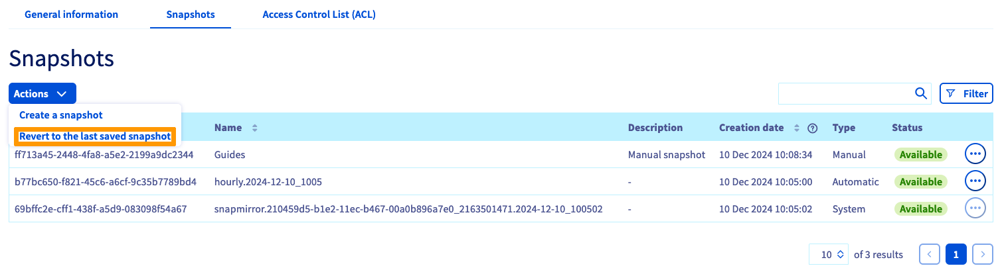{.thumbnail}

#### Holding automatic snapshots 

An `Automatic` snapshot, created by a [Snapshot Policy](#snapshot_policy) can be held by clicking the `...`{.action} button on its row in the `Snapshots`{.action} tab and then selecting `Save`{.action}.

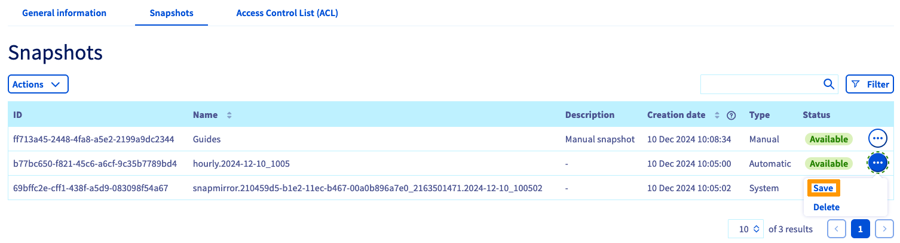{.thumbnail}

After the holding operation is complete, the snapshot type will change to `manual` and it will no longer be rotated by a Snapshot Policy.

#### Managing volume ACLs 

Access control to volumes works via IP address restrictions. Since none are configured by default, the first step with new volumes is to define IP addresses or ranges from which access will be authorized.

Click on the button `Add a new access`{.action}.

{.thumbnail}

This creates a new row in the table in which you can enter an IP address or an address block (CIDR). Select `Read-only` or `Read and write` as the access type in the drop-down menu and click on the check mark button to add this entry to the ACL.

To remove a volume access, click on the respective trash can icon in the table.

### Managing snapshot policies 

> [!primary]
>
> By default, every volume is protected by the `default` Snapshot Policy
> which will create Snapshots of the volume at regular intervals.
>

Adding policies allows you to schedule the creation of snapshots for all of your volumes.

Switch to the tab `Snapshot policies`{.action}. The table lists all policies created for the selected service.

A default policy is already in place which cannot be altered. To add your own, click on the button `Create a new snapshot policy`{.action}.

{.thumbnail}

In this view, you can enter a name and a description for the policy. Then use the button `Add a new rule`{.action} to add one or more rules to the policy.

{.thumbnail}

Fill in the fields to specify the time of day, days of a month, week days and months for the snapshot creation. You also have to enter a prefix for the snapshots, needed for naming them.

You can find more detailed information for each value by clicking on the question mark icon. By expanding the `Example`{.action} section you can view two sets of policy rules with an explanation of their outcome.

Click on the check mark button to add the new rule. Once all rules are added, click on `Create a new snapshot policy`{.action}.

[Select a volume](#manage_volume) and go to the `Snapshots`{.action} tab in order to [apply your policies](#snapshots).

To remove a policy, click on the respective trash can icon in the table.

### First steps 

If you are new to using Enterprise File Storage, you can follow this sequence of steps to get started:

- [Create a volume](#create_volume)
- [Configure access control](#access_control)
- [Configure snapshot policies](#snapshot_policy) (optional)
- [Apply snapshot policies to the volume](#snapshots) (optional)
- [Access snapshots](#access_snapshots) (optional)
- [Connect to your volume by following the instructions in the "General information" section](#modify_volume)
- [Learn how to use Enterprise File Storage via API by consulting our guides](#gofurther) (optional)

## Go further 

[API Quickstart](/pages/storage_and_backup/file_storage/enterprise_file_storage/netapp_quick_start)

[Managing volumes via API](/pages/storage_and_backup/file_storage/enterprise_file_storage/netapp_volumes)

[Managing volume ACLs via API](/pages/storage_and_backup/file_storage/enterprise_file_storage/netapp_volume_acl)

[Managing volume snapshots via API](/pages/storage_and_backup/file_storage/enterprise_file_storage/netapp_volume_snapshots)

[Enterprise File Storage - FAQ](/pages/storage_and_backup/file_storage/enterprise_file_storage/netapp_faq/)

If you need training or technical assistance to implement our solutions, contact your sales representative or click on [this link](/links/professional-services) to get a quote and ask our Professional Services experts for assisting you on your specific use case of your project.

Join our [community of users](/links/community).
