

## Objectif

Vous souhaitez sauvegarder vos comptes e-mail hébergés sur une plateforme Private Exchange OVHcloud ? Utilisez le logiciel Veeam Backup for Microsoft 365. Ce guide vous détaille tous les éléments nécessaires pour installer, configurer et utiliser Veeam Backup pour vos comptes e-mail.

**Découvrez comment sauvegarder les comptes e-mail de votre plateforme Private Exchange avec Veeam Backup for Microsoft 365.**

## Prérequis

- Avoir souscrit à une [offre Private Exchange OVHcloud](/links/web/emails-private-exchange) et créé des comptes e-mails sur celle-ci.
- Être connecté à [l'espace client OVHcloud](/links/manager).
- [Télécharger Veeam Backup for Microsoft 365](https://www.veeam.com/products/free/backup-microsoft-office-365.html) sur un ordinateur sous Microsoft Windows 10 minimum.

## En pratique

### Installer Veeam Backup 

Téléchargez la dernière version de [Veeam Backup for Microsoft 365](https://www.veeam.com/products/free/backup-microsoft-office-365.html) depuis le site de Veeam.

Suivez les étapes d'installation en cliquant successivement sur les 8 onglets ci-dessous :

> [!tabs]
> **Etape 1**
>>
>> - Lancez le fichier téléchargé au format `.iso` pour monter le DVD virtuel.
>> - Ouvrez le DVD virtuel `Veeam Backup for Microsoft 365` monté sur votre ordinateur, puis exécutez le fichier d'installation `Veem.Setup.exe`.
>>
>> 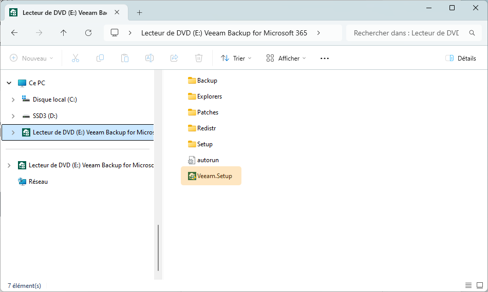{.thumbnail .h-600}
>>
> **Etape 2**
>>
>> Cliquez sur `Install`{.action}, puis sélectionnez le premier élément de la liste `Veeam Backup for Microsoft 365` pour installer l'ensemble des composants.
>>
>> 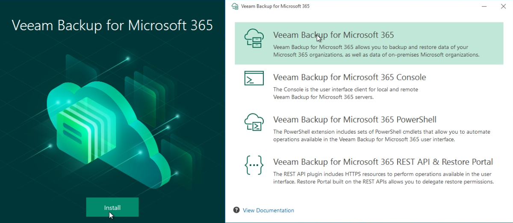{.thumbnail .h-600}
>>
> **Etape 3**
>>
>> Lisez et validez les conditions générales d'utilisation de Veeam Backup en cliquant sur `I Accept`{.action}.
>>
>> 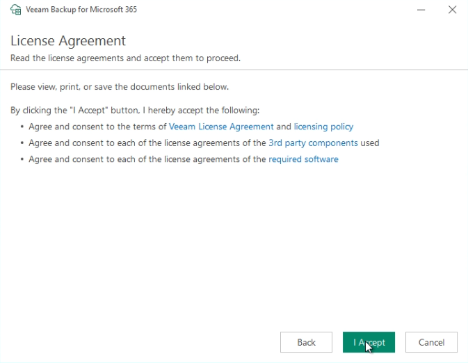{.thumbnail .h-600}
>>
> **Etape 4**
>>
>> - Si vous possédez une licence Veeam Backup, vous pouvez la charger depuis votre ordinateur en cliquant sur le bouton `Browse...`{.action}.
>> - Laissez la case `Update license automatically` cochée.
>> - Cliquez sur `Next`{.action} pour passer à l'étape suivante.
>>
>> > [!primary]
>> >
>> > Sans licence, l'utilisation de Veeam Backup est **limitée à 10 comptes e-mail**.
>>
>> 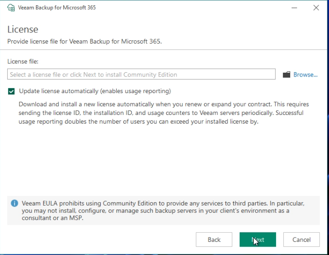{.thumbnail .h-600}
>>
> **Etape 5**
>>
>> - Le tunnel d'installation définit automatiquement les identifiants de l'instance de base de données et du serveur NATS. Récupérez les éléments indiqués sur la fenêtre ci-dessous ou cliquez sur `Customize Settings`{.action} pour définir vous-même les paramètres.
>> - Lancez l'installation en cliquant sur `Install`{.action}.
>> - À l'issue de cette installation, vous pouvez passer au chapitre [Configurer Veeam Backup](#configure-veeam).
>>
>> > [!warning]
>> >
>> > Si Veeam Backup a déjà été installé sur votre ordinateur et/ou que vous n'obtenez pas la même fenêtre que ci-dessous, **passez à l'étape 6**.
>>
>> 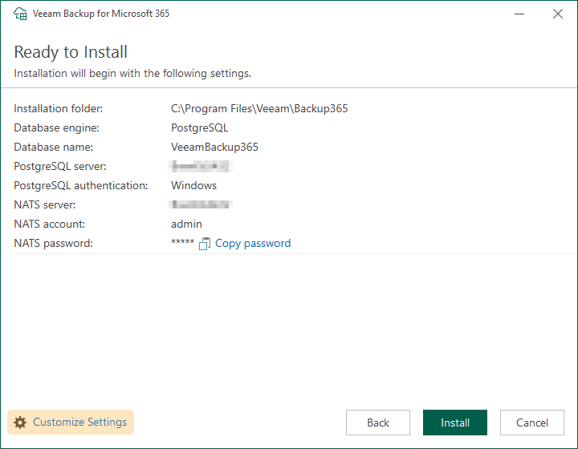{.thumbnail .h-600}
>>
> **Etape 6**
>>
>> - Si vous n'avez pas d'instance de base de données Veeam Backup, vous pouvez en créer une en cliquant directement sur `Next`{.action}.
>> - **OU** vous pouvez vous connecter à une instance existante en sélectionnant `Use existing instance` et `Native authentication with the following credentials`, puis en remplissant les informations de connexion.
>>
>> 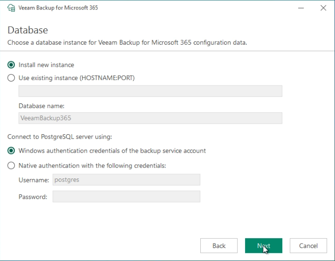{.thumbnail .h-600}
>>
> **Etape 7**
>>
>> - Pour une nouvelle instance, saisissez un nom d'utilisateur (`Username`) et un mot de passe (`Password`) fort. Si vous avez déjà une instance existante, sélectionnez `Use existing instance` et saisissez les informations correspondantes.
>> - Cliquez sur `Next`{.action} pour passer à l'étape suivante.
>>
>> 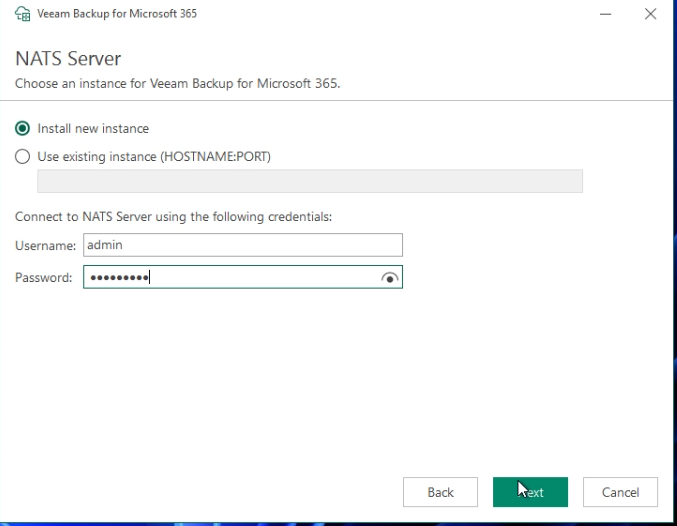{.thumbnail .h-600}
>>
> **Etape 8**
>>
>> Lancez l'installation en cliquant sur `Install`{.action}.
>>
>> 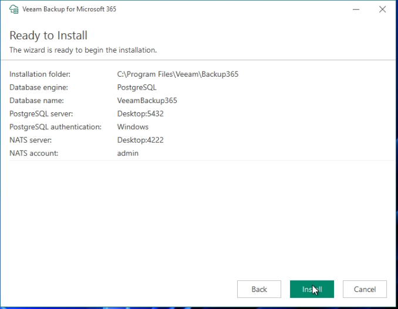{.thumbnail .h-600}

### Configurer Veeam Backup 

#### Connecter Veeam Backup à votre plateforme Exchange

Découvrez comment ajouter votre plateforme Exchange à Veeam Backup avant de pouvoir créer des opérations de sauvegarde sur vos comptes e-mail.

Suivez les étapes de configuration en cliquant successivement sur les 10 onglets ci-dessous :

> [!tabs]
> **Etape 1**
>>
>> Lancez l'application `Veeam Backup for Microsoft 365` depuis le menu Windows ou sur votre bureau.
>>
>> 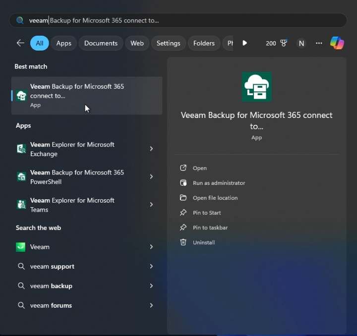{.thumbnail .h-600}
>>
> **Etape 2**
>>
>> Par défaut, Veeam Backup vous propose de vous connecter en local sur votre ordinateur. Cliquez sur `Connect`{.action}.
>>
>>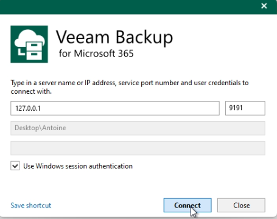{.thumbnail .h-600}
>>
> **Etape 3**
>>
>> Si vous n'avez pas renseigné de licence, un message vous rappelle que vous êtes limité à 10 utilisateurs (10 comptes e-mail). Cliquez sur `No`{.action} pour continuer ou sur `Yes`{.action} si vous souhaitez associer une licence à votre installation.
>>
>>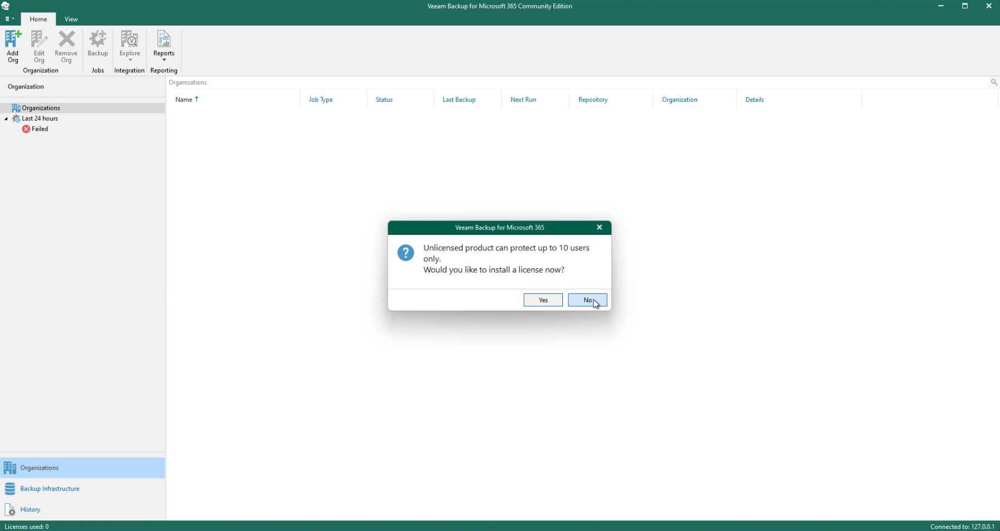{.thumbnail .h-600}
>>
> **Étape 4**
>>
>> Cliquez sur `Add Org`{.action} en haut à gauche de votre fenêtre.
>>
>> 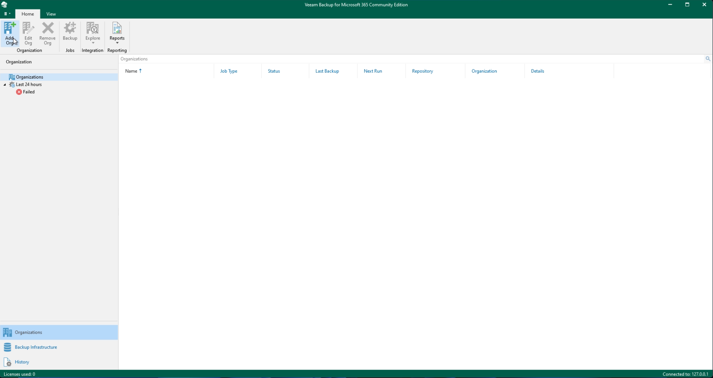{.thumbnail .h-600}
>>
> **Étape 5**
>>
>> Dans le menu déroulant `Select organization deployment type`, sélectionnez `On-premise`{.action}, puis désélectionnez `Sharepoint Server`.
>>
>> 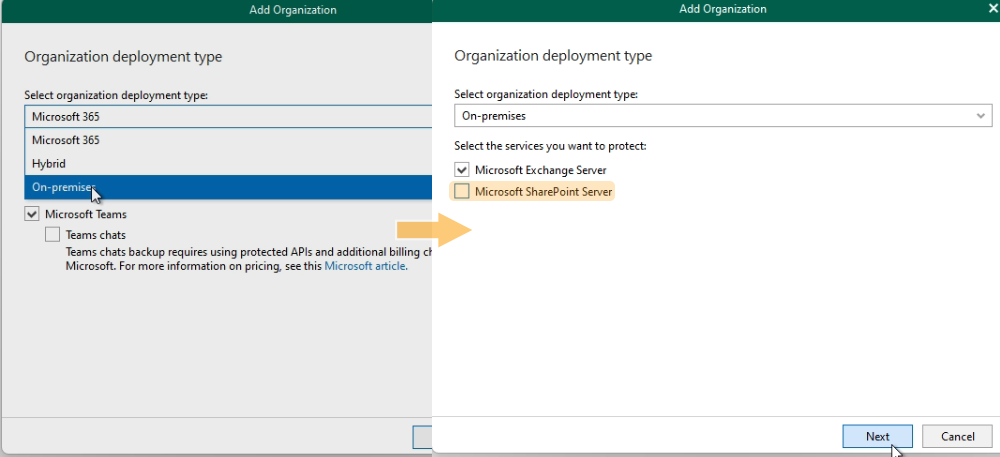{.thumbnail .h-600}
>>
> **Étape 6**
>>
>> Avant de poursuivre, vous devez créer un utilisateur appelé « Impersonate User » sur votre plateforme Exchange. Pour créer ce type d'utilisateur, connectez-vous aux [API OVHcloud](/links/api) et utilisez l'appel API suivant:
>>
>> > [!api]
>> >
>> > @api {v1} /email/exchange POST /email/exchange/{organizationName}/service/{exchangeService}/impersonatedUser
>>
>> - Dans les cases `exchangeService` et `organizationName` , renseignez la référence de votre plateforme Exchange, visible depuis votre [espace client OVHcloud](/links/manager) dans la rubrique `Web Cloud`{.action} > `Microsoft`{.action} > `Exchange`{.action}, en sélectionnant la plateforme concernée.
>>
>> - Saisissez un mot de passe de 15 caractères minimum entre les guillemets, à côté de `"password": `.
>>
>> - Cliquez sur `Execute`{.action} plus bas pour lancer la création de votre « Impersonate User ».
>>
>> 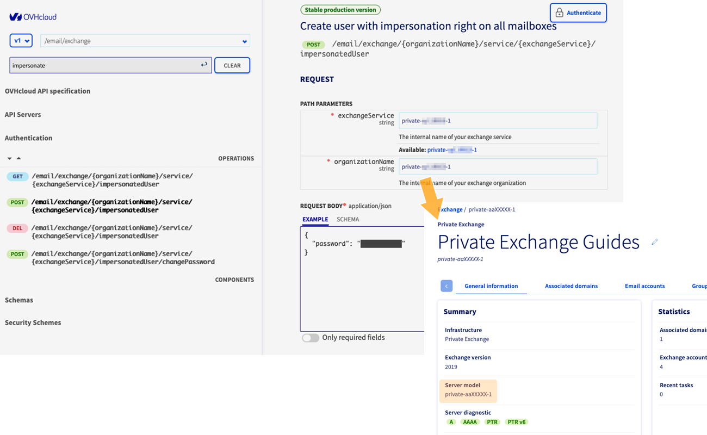{.thumbnail .h-600}
>>
> **Étape 7**
>>
>> Récupérez le nom de votre « Impersonate User » avec l'appel API suivant :
>>
>> > [!api]
>> >
>> > @api {v1} /email/exchange GET /email/exchange/{organizationName}/service/{exchangeService}/impersonatedUser
>>
>> - Dans les cases `exchangeService` et `organizationName` , renseignez la référence de votre plateforme Exchange que vous avez récupérée à l'étape précédente.
>>
>> - Cliquez sur `Execute`{.action} plus bas.
>>
>> - Le nom du « Impersonate User » correspond à la valeur `"upn": ` visible dans la `REPONSE` de l'appel API.
>>
>> 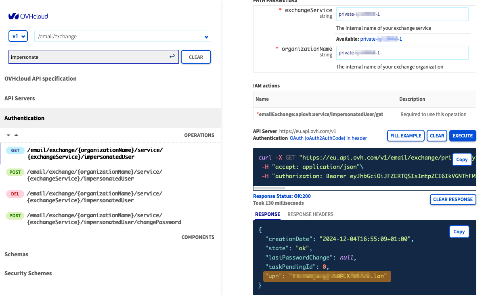{.thumbnail .h-600}
>>
> **Étape 8**
>>
>> - Relevez le nom d'hôte de votre plateforme Exchange, celle-ci est visible depuis votre [espace client OVHcloud](/links/manager) dans la rubrique `Web Cloud`{.action} > `Microsoft`{.action} > `Exchange`{.action}, en sélectionnant la plateforme concernée.
>>
>> - Le nom d'hôte correspond à la valeur mentionnée pour accéder au webmail.
>>
>> 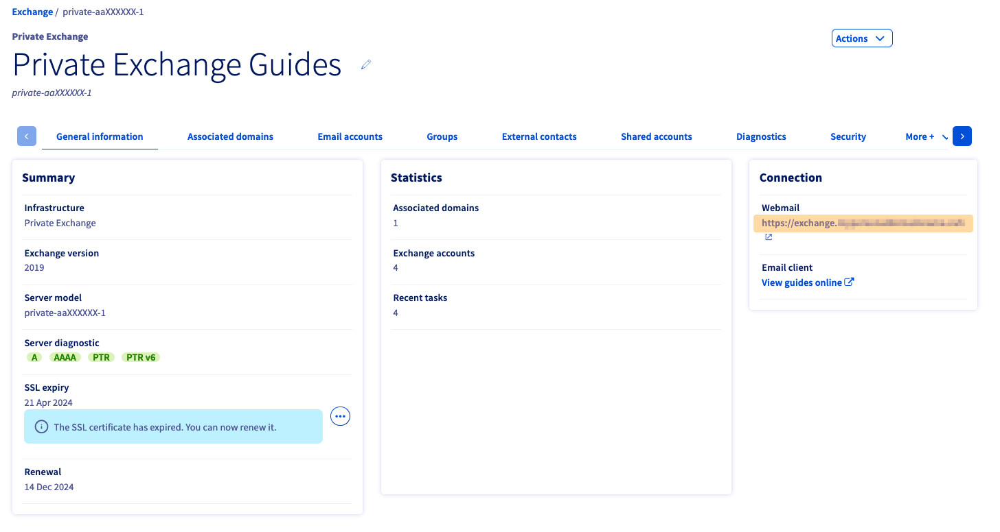{.thumbnail .h-600}
>>
> **Étape 9**
>>
>> Depuis l'interface Veeam Backup, saisissez les informations suivantes :
>>
>> - `Server name` : Nom d'hôte de la plateforme Exchange relevé à l'étape 8, renseignez-le sans le `https://`.
>> - `Username` : Nom d'utilisateur relevé à l'étape 7 correspondant a l'« Impersonate User ».
>> - `Password` : Mot de passe de l' « Impersonate User » défini à l'étape 6.
>>
>> 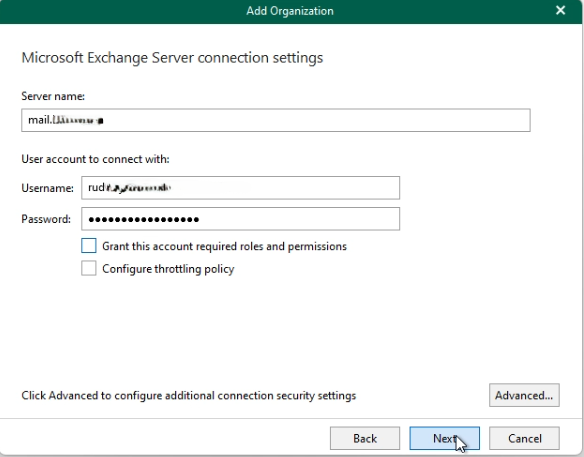{.thumbnail .h-600}
>>
> **Étape 10**
>>
>> - Vous devriez obtenir les mêmes résultats que sur la capture d'écran ci-dessous (ne tenez pas compte de l'avertissement `Check ApplicationImpersanation role`).
>> - Cliquez sur `Finish`{.action} pour terminer la connexion avec la plateforme Exchange.
>>
>> 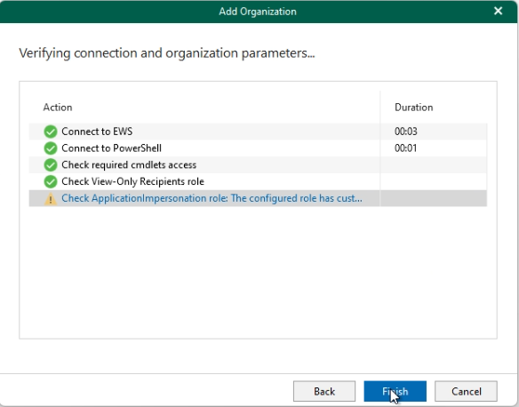{.thumbnail .h-600}

#### Créer des opérations de sauvegarde de comptes e-mail

Une fois que votre plateforme Exchange a été ajoutée à Veeam backup, découvrez comment créer une opération de sauvegarde pour vos comptes e-mail.

Suivez les étapes de création en cliquant successivement sur les 9 onglets ci-dessous :

> [!tabs]
> **Étape 1**
>>
>> Votre serveur Exchange est visible dans la colonne `Organization` à gauche. Sélectionnez-le.
>>
>> {.thumbnail .h-600}
>>
> **Étape 2**
>>
>> Faites un clic droit dans la fenêtre au centre et cliquez sur `Add to backup job...`{.action}.
>>
>> 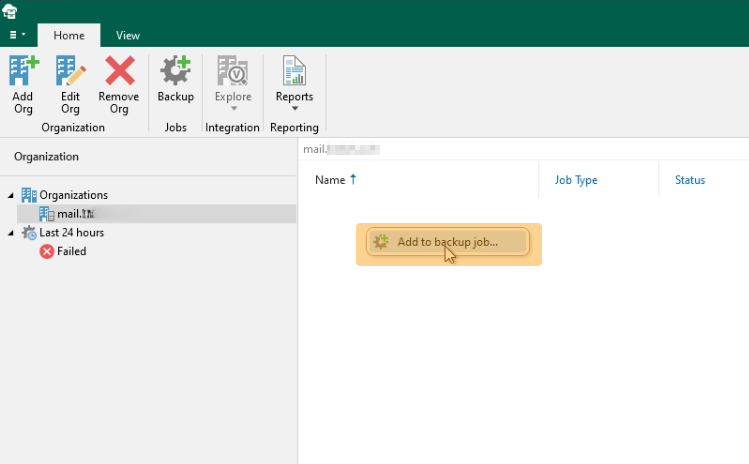{.thumbnail .h-600}
>>
> **Étape 3**
>> Saisissez un nom et une description pour votre opération de sauvegarde, puis cliquez sur `Next`{.action}.
>>
>>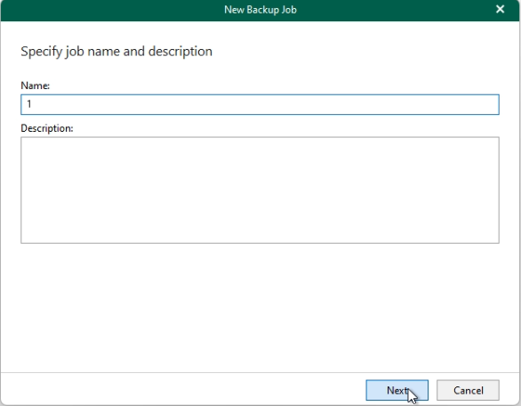{.thumbnail .h-600}
>>
> **Étape 4**
>>
>> - Sélectionnez `Back up the following object`{.action}.
>> - Cliquez sur `Add`{.action}, puis sur `Users`{.action}.
>>
>> 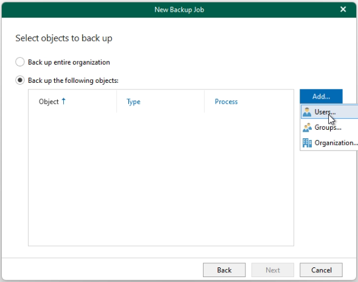{.thumbnail .h-600}
>>
> **Étape 5**
>>
>> Depuis cette fenêtre, déterminez si votre opération de sauvegarde agit sur un ou plusieurs comptes à la fois.
>>
>> - Sélectionnez le ou les comptes e-mail que vous souhaitez attribuer à votre opération de sauvegarde.
>> - Cliquez sur `Add`{.action} lorsque vous avez terminé votre sélection.
>>
>> 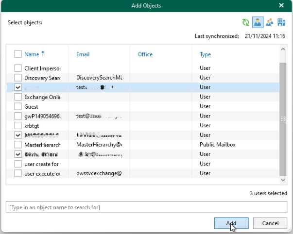{.thumbnail .h-600}
>>
> **Étape 6**
>>
>> - Les éléments sélectionnés apparaissent dans la fenêtre.
>> - Cliquez sur `Next`{.action} pour passer à l'étape suivante.
>>
>> 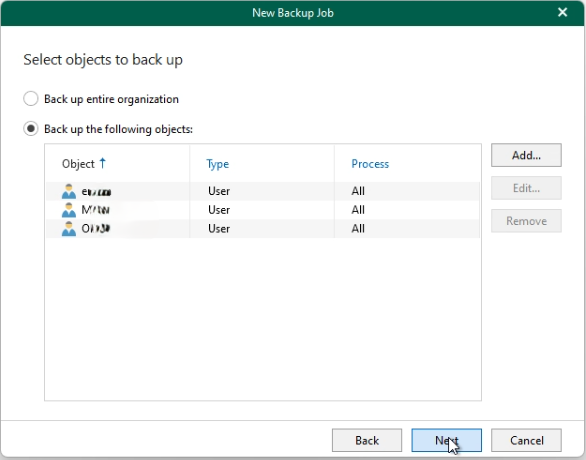{.thumbnail .h-600}
>>
> **Étape 7**
>> Depuis cette fenêtre, vous pouvez ajouter des règles d'exclusion avec le bouton `Add`{.action}. Celles-ci seront appliquées sur les comptes e-mail sélectionnez précédemment. Vous pouvez par exemple exclure un calendrier ou un dossier spécifique.
>>
>> > [!warning]
>> >
>> > Si vous souhaitez des règles d'exclusion spécifiques pour chacun des comptes e-mail, il sera nécessaire de créer plusieurs opérations de sauvegarde pour chaque compte e-mail.
>>
>> - Cliquez sur `Next`{.action} pour passer à l'étape suivante.
>>
>> 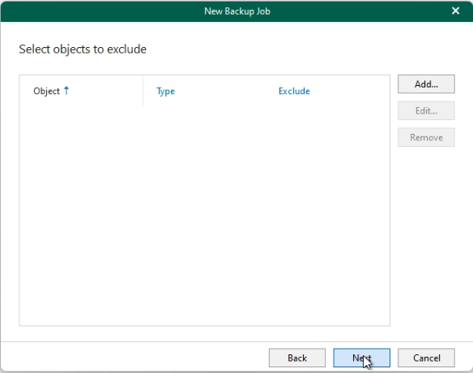{.thumbnail .h-600}
>>
> **Étape 8**
>> Sélectionnez le dépôt de sauvegarde qui se situe, par défaut, sur votre ordinateur.
>>
>> 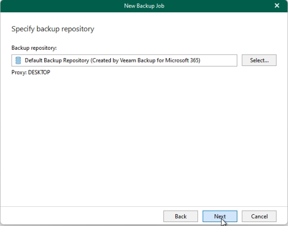{.thumbnail .h-600}
>>
> **Étape 9**
>>
>> - Depuis cette fenêtre, définissez les options de planification de sauvegarde si vous le souhaitez.
>> - Cochez `Start the job` si vous souhaitez lancer l'opération de sauvegarde immédiatement.
>> - Cliquez sur `Create`{.action} pour terminer la création de l'opération de sauvegarde.
>>
>> 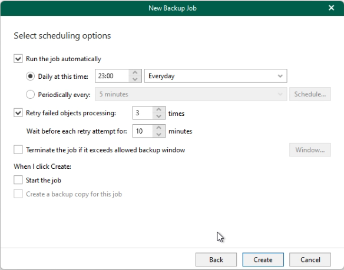{.thumbnail .h-600}

#### Lancer une opération de sauvegardes de comptes e-mail

Lorsqu'une opération de sauvegarde est créée, découvrez comment la lancer et récupérer la sauvegarde.

Suivez les étapes de lancement en cliquant successivement sur les 4 onglets ci-dessous :

> [!tabs]
> **Étape 1**
>>
>> Dans la liste des opérations de sauvegarde, sélectionnez celle que vous souhaitez lancer, faites un clic droit dessus puis cliquez sur `Start`{.action}.
>>
>> 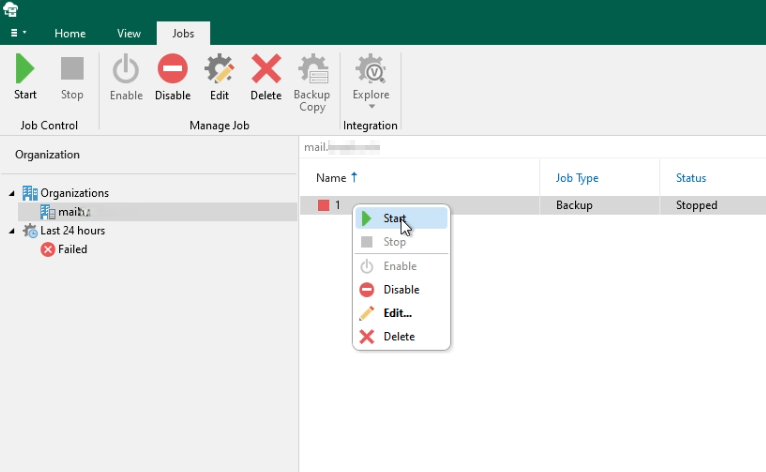{.thumbnail .h-600}
>>
> **Étape 2**
>>
>> Une fois l'opération terminée, dans la partie inférieure de votre interface Veeam Backup, vous retrouverez le rapport de sauvegarde.
>>
>> 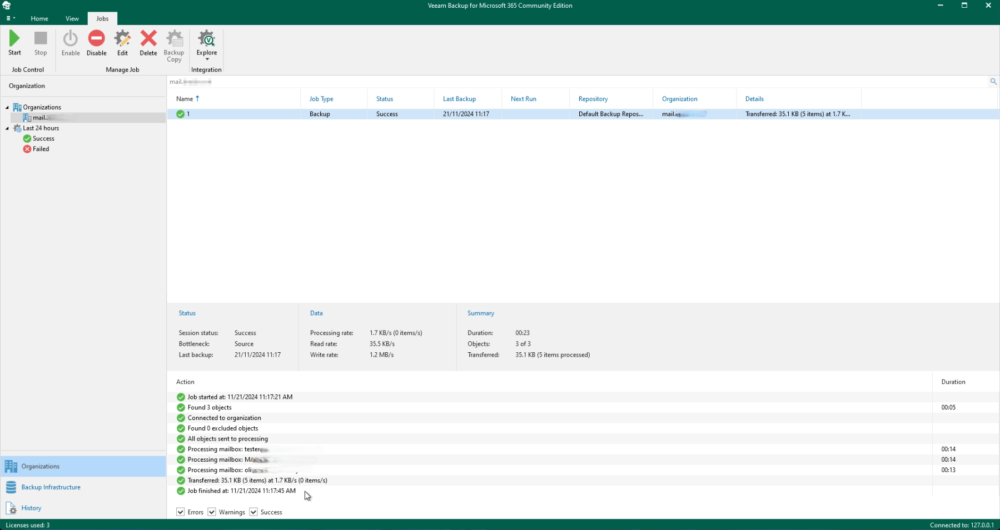{.thumbnail .h-600}
>>
> **Étape 3**
>>
>> - Cliquez sur `Explore`{.action} dans la barre de menu horizontale supérieure.
>> - Choisissez la dernière sauvegarde avec le bouton `Explore lastest Exchange state of...`{.action} **ou** choisissez d'autres sauvegardes via `Explore Exchange point-in-time state...`{.action}.
>>
>> 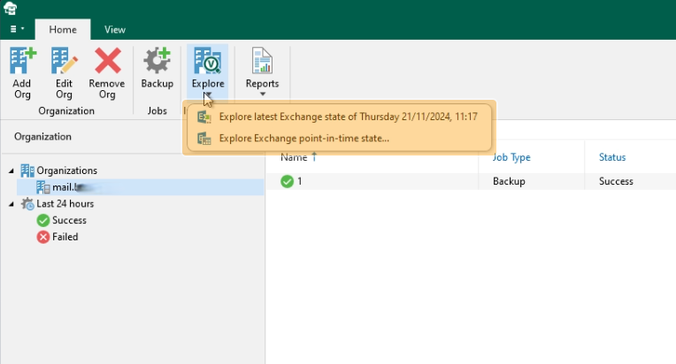{.thumbnail .h-600}
>>
> **Étape 4**
>>
>> Dans la colonne de gauche, vous obtenez la liste de vos comptes e-mail sauvegardés. Faites un clic droit sur le compte e-mail de votre choix. Deux choix vous sont alors proposés  :
>>
>> - Exporter une sauvegarde dans un fichier `.pst` à l'aide des boutons `Export to...`{.action}
>> - Restaurer directement une sauvegarde sur un compte e-mail à l'aide des boutons `Restore to...`{.action}
>>
>> 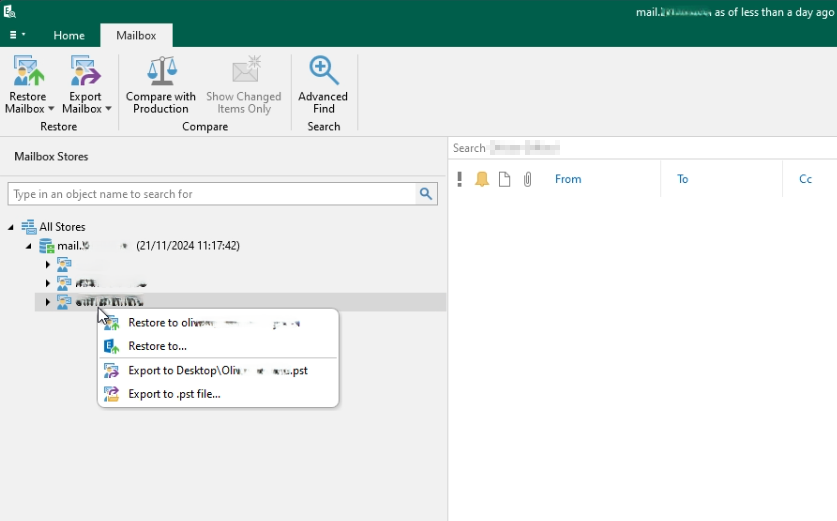{.thumbnail .h-600}

## Aller plus loin 

[Premiers pas avec le service Private Exchange](/pages/web_cloud/email_and_collaborative_solutions/microsoft_exchange/exchange_veeam_backup)

Pour des prestations spécialisées (référencement, développement, etc), contactez les [partenaires OVHcloud](/links/partner).

Si vous souhaitez bénéficier d'une assistance à l'usage et à la configuration de vos solutions OVHcloud, nous vous proposons de consulter nos différentes [offres de support](/links/support).

Échangez avec notre [communauté d'utilisateurs](/links/community).