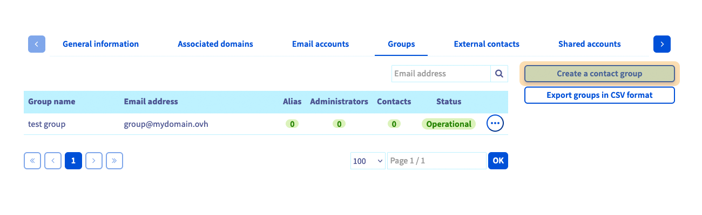
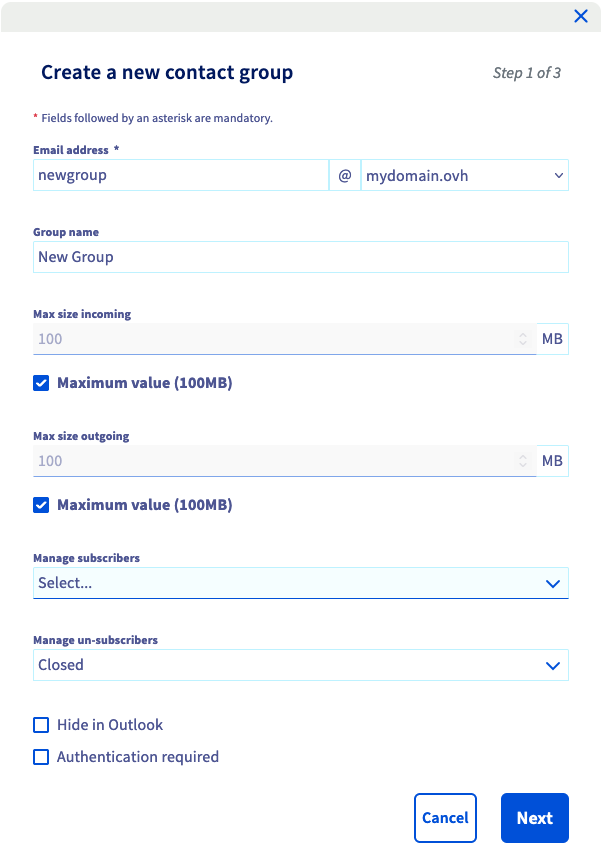
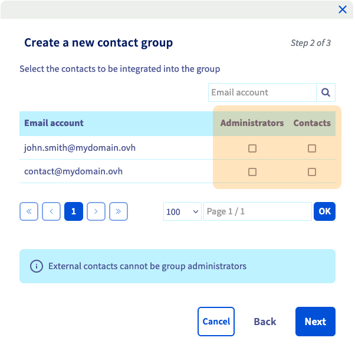
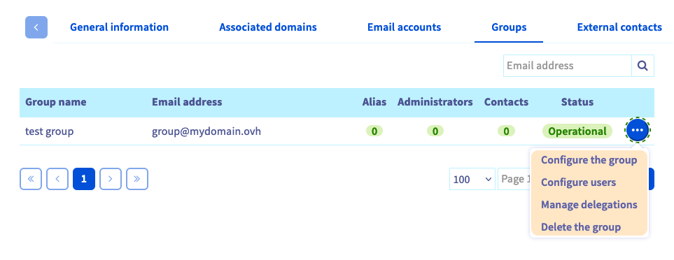
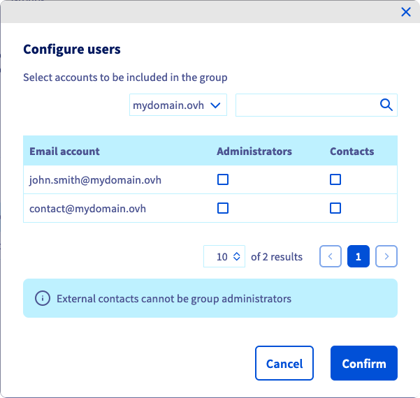
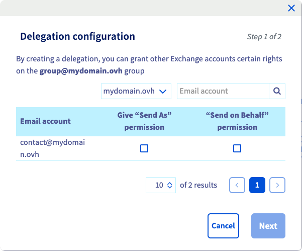

## Sumário

Os grupos Exchange permitem que vários participantes comuniquem ao enviarem emails para um endereço coletivo único. Graças a esta característica colaborativa, é possível criar e gerir grupos de difusão (mailing lists) que incluem tanto utilizadores Exchange quanto contactos externos.

**Este guia explica como usar os grupos Exchange através da Área de Cliente OVHcloud e do Outlook Web App (OWA).**

## Requisitos

- Ter acesso à [Área de Cliente OVHcloud](/links/manager)
- Dispor de uma [solução Exchange OVHcloud](/links/web/emails-hosted-exchange).

## Instruções

### Passo 1: Criar um novo grupo

Antes de mais, aceda à [Área de Cliente OVHcloud](/links/manager), clique na secção `Webcloud`{.action} e selecione o serviço Exchange na coluna sob `Microsoft`{.action} `Exchange`{.action} à esquerda. De seguida clique em `Grupos`{.action}, no menu horizontal.

{.thumbnail .w-600 .h-600}

Ao clicar em `Criar um grupo de contacto`{.action}, aparecerá uma janela onde poderá definir as características do grupo:

{.thumbnail .w-600 .h-600}

- **Endereço de correio eletrónico**: Defina um novo endereço para enviar mensagens para a lista de correio. Tenha cuidado para não usar um endereço já funcional.
- **Nome do Grupo** : Utilize o nome que aparecer na sua [Área de Cliente OVHcloud](/links/manager) e no seu [e-mail Web OVHcloud](/links/web/email) (OWA).
- **Tamanho máximo de entrada ou saída**: Pode especificar o tamanho máximo dos e-mails de entrada e dos e-mails de saída.
- **Ocultar no Outlook** : Quando esta opção está selecionada, o endereço do grupo não será apresentado na lista de endereços do serviço Exchange.
- **Authentication required** : Quando esta opção está selecionada, apenas os utilizadores da mesma plataforma poderão enviar mensagens com o endereço do grupo.

Clique em `Seguinte`{.action} para continuar.

Na segunda página, selecione os **Contactos** do grupo e designe os **Administradores**. Estas escolhas apenas serão feitas a partir dos endereços de e-mail e dos contactos externos já listados no serviço.

- **Administradores**: Contas de e-mail autorizadas a enviar um e-mail a todos os contactos do grupo.
- **Contactos**: Contas de correio eletrónico a receber os e-mails enviados para o grupo pelos administradores.

> [!primary]
>
> Tenha em atenção que os administradores devem estar configurados como **Contactos** para receber correio eletrónico do grupo.

{.thumbnail .w-600 .h-600}

Clique em `Seguinte`{.action} para continuar e clique em `Confirmar`{.action} para finalizar as suas escolhas.

### Gerir os grupos

Depois de criar o grupo, pode alterar as definições que definiu. Para isso, clique em `...`{.action} à direita do grupo na tabela.

{.thumbnail .w-600 .h-600}

#### Gerir os utilizadores de um grupo

Para adicionar `Contacts` ao seu grupo ou definir os `Administradores`, clique no botão `...`{.action} e depois em `Configurar os utilizadores`{.action}. Selecione os atributos que deseja associar aos endereços de e-mail da coluna `Conta de e-mail`.

> [!primary]
>
> Existe a opção de máximo de 10.000 contactos num grupo.

{.thumbnail .w-600 .h-600}

#### Gerir as delegações de um grupo

Será apresentada a opção `Configurar as delegações`{.action} do menu. Esta opção permite delegar o acesso da mesma forma que delegamos o acesso a uma conta Exchange. Consultar todos os detalhes em [este guia](/pages/web_cloud/email_and_colaborative_solutions/microsoft_exchange/feature_delegation).

{.thumbnail .w-600 .h-600}

> [!primary]
>
> Tenha em conta que qualquer alteração a este serviço pode levar alguns minutos a ser aplicada. Pode verificar o estado da maior parte das operações selecionando as opções `Mais`{.action} e `Tarefas recentes`{.action} a partir do menu horizontal.

### Enviar um email coletivo em OWA

Já pode testar a sua lista de difusão (mailing list) através do [webmail OVHcloud](/links/web/email) (OWA). Para isso, basta enviar um email para o endereço coletivo.

{.thumbnail}

## Saiba mais

[Atribuir permissões a uma conta Exchange](/pages/web_cloud/email_and_collaborative_solutions/microsoft_exchange/feature_delegation)

[Guia de utilização do Outlook Web App](/pages/web_cloud/email_and_collaborative_solutions/using_the_outlook_web_app_webmail/email_owa)

[Partilhar calendários em OWA](/pages/web_cloud/email_and_collaborative_solutions/using_the_outlook_web_app_webmail/owa_calendar_sharing)

Para serviços especializados (referenciamento, desenvolvimento, etc), contacte os [parceiros OVHcloud](/links/partner).

Se pretender usufruir de uma assistência na utilização e na configuração das suas soluções OVHcloud, consulte as nossas diferentes [ofertas de suporte](/links/support).

Fale com nossa [comunidade de utilizadores](/links/community).