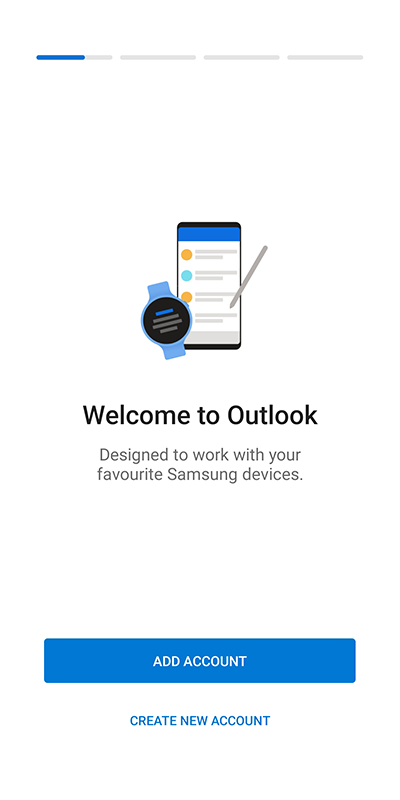
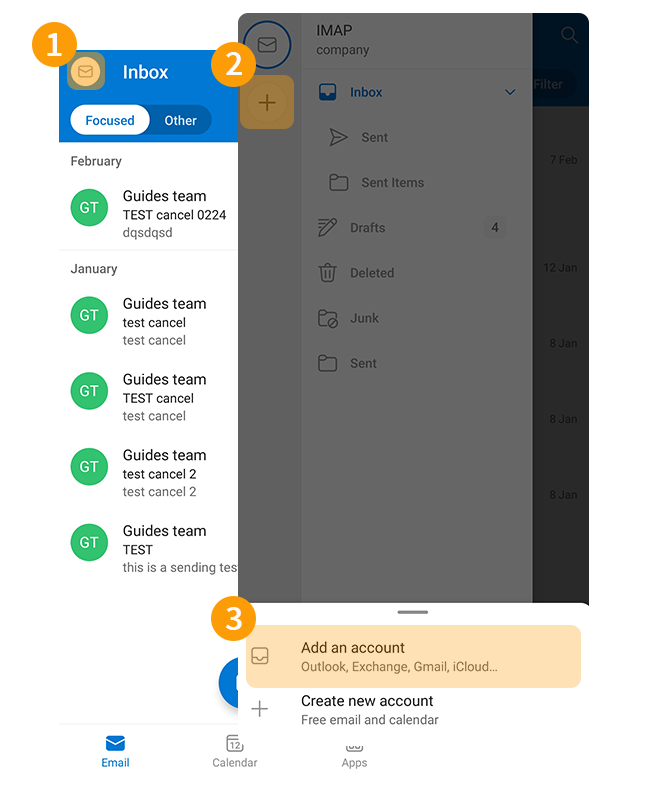
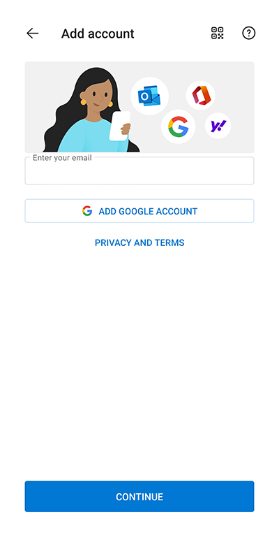
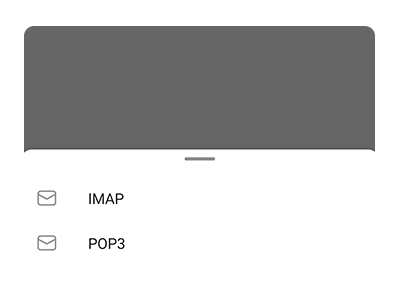
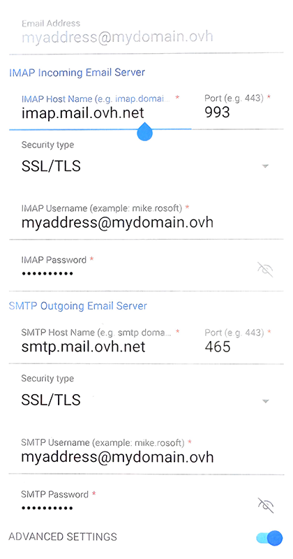
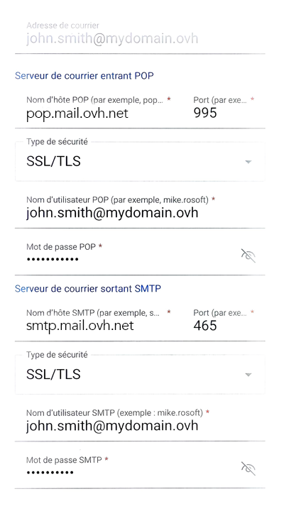
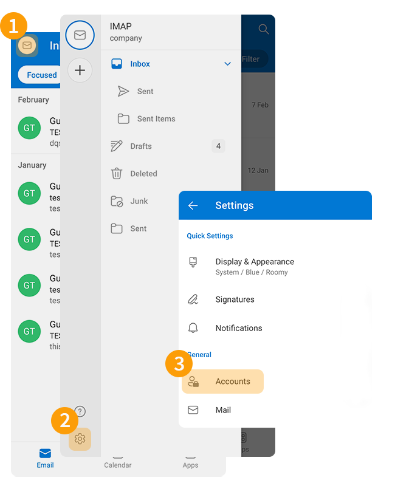
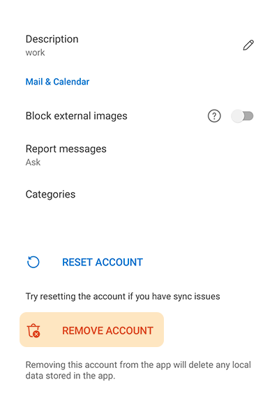

## Objetivo

Es posible configurar las cuentas MX Plan en el cliente de correo que usted utilice, siempre que sea compatible. para que pueda utilizar su dirección de correo desde cualquier dispositivo. La aplicación Outlook de Microsoft en Android está disponible gratuitamente desde Google Play Store.

**Descubra cómo configurar su cuenta MX Plan en la aplicación móvil Outlook para Android**

> [!warning]
>
> OVHcloud pone a su disposición servicios cuya configuración, gestión y responsabilidad recaen sobre usted. Por lo tanto, usted deberá asegurarse de que estos funcionen correctamente.
>
> Esta guía le ayudará a realizar las tareas más habituales. No obstante, si necesita ayuda, le recomendamos que contacte con un [partner especializado](https://marketplace.ovhcloud.com/c/support-collaboration) o con el editor del servicio. Nosotros no podremos asistirle. Para más información, consulte el apartado "Más información" de esta guía.

## Requisitos

- Disponer de una dirección de correo electrónico MX Plan (incluida en la solución MX Plan o en un [qplan de hosting de OVHcloud](/links/web/hosting)).
- Tener la aplicación Outlook en su dispositivo móvil [Android](https://play.google.com/store/apps/details?id=com.microsoft.office.outlook&hl=es).
- Disponer del nombre de usuario y la contraseña de la dirección de correo electrónico que quiera configurar.

## Procedimiento

### Añadir la cuenta 

- **Cuando inicie la aplicación por primera vez**, aparecerá un asistente de configuración y pulse `Añadir cuenta`{.action}.

{.thumbnail .w-400 .h-600}

- **Si ya tiene una cuenta configurada**:
    - Presione el sobre " &#9993;" en la parte superior izquierda de la pantalla.
    - A continuación, pulse el botón `+`{.action} en la barra vertical izquierda.
    - Pulsa `Añadir cuenta`{.action}.

{.thumbnail .w-400 .h-600}

Siga los etapas de instalación haciendo clic en las fichas siguientes:

> [!tabs]
> **Etapa 1**
>>
>> Introduzca su dirección de correo electrónico y pulse `Continuar`{.action}.
>>
>> {.thumbnail .w-400 .h-600}
>>
> **Etapa 2**
>>
>> Seleccione el protocolo de recepción, **IMAP**(recomendado) o **POP3**.
>>
>> {.thumbnail .w-400 .h-600}
>>
>> > [!warning]
>> >
>> > Si no aparece la ventana de selección de protocolo, pulse el botón `?` en la esquina superior derecha de la pantalla y seleccione `Cambiar proveedor de cuenta`{.action}. Seleccione `IMAP`(recomendado) o `POP3`. 
>> > ! [outlook android](images/outlook-app-android-add-step021.png){.thumbnail .w-400 .h-600}
>>
> **Etapa 3 - IMAP**
>>
>> En la siguiente ventana, marque `Parámetros avanzados`{.action} e introduzca la siguiente información:
>>
>> - **Dirección de correo electrónico**
>> - **Nombre completo** : Introduzca su dirección de correo electrónico completa
>> - **Descripción**
>> - **Servidor de correo electrónico de entrada IMAP**: - **Nombre de host IMAP**: Para **EUROPA**, introduzca `imap.mail.ovh.net` o `ssl0.ovh.net`. Para **AMÉRICA/ASIA**, introduzca `imap.mail.ovh.ca` - **Puerto**: 993 - **Tipo de seguridad**: SSL/TLS - **Nombre de usuario IMAP**: su dirección de correo electrónico completa - **Contraseña IMAP**: la de su dirección de correo electrónico
>> - **Servidor de correo electrónico entrante SMTP**: - **Nombre de host SMTP**: Para **EUROPA**, introduzca `smtp.mail.ovh.net` o `ssl0.ovh.net` . Para **AMÉRICA/ASIA**, introduzca `smtp.mail.ovh.ca` - **Puerto**: 465 - **Tipo de seguridad**: SSL/TLS - **Nombre de usuario SMTP**: su dirección de correo electrónico completa - **Contraseña SMTP**: la de su dirección de correo electrónico
>>
>> Para finalizar la configuración, haga clic en el botón " &#10003; "
>>
>> {.thumbnail .w-400 .h-600}
>>
> **Etapa 3 - POP3**
>>
>> En la siguiente ventana, marque `Parámetros avanzados`{.action} e introduzca la siguiente información:
>>
>> - **Dirección de correo electrónico**
>> - **Nombre completo** : Introduzca su dirección de correo electrónico completa
>> - **Descripción**
>> - **Servidor de correo entrante POP3**: - **Nombre de host POP3**: Para **EUROPA**, introduzca `pop.mail.ovh.net` o `ssl0.ovh.net` . Para **AMÉRICA/ASIA** introduzca `pop.mail.ovh.ca` - **Puerto**: 995 - **Tipo de seguridad**: SSL/TLS - **Nombre de usuario POP3** : Dirección de correo electrónico completa - **Contraseña POP3** : Contraseña de su dirección de correo electrónico
>> - **Servidor de correo electrónico entrante SMTP**: - **Nombre de host SMTP**: Para **EUROPA**, introduzca `smtp.mail.ovh.net` o `ssl0.ovh.net`. Para **AMÉRICA/ASIA**, introduzca `smtp.mail.ovh.ca` - **Puerto**: 465 - **Tipo de seguridad**: SSL/TLS - **Nombre de usuario SMTP**: su dirección de correo electrónico completa - **Contraseña SMTP**: la de su dirección de correo electrónico
>>
>> Para finalizar la configuración, haga clic en el botón " &#10003; "
>>
>> {.thumbnail .w-400 .h-600}
>>

> [!warning]
>
> Si, tras haber seguido los etapas de configuración anteriores, detecta un fallo de envío o recepción, consulte el apartado "[Modificar los parámetros existentes](#modify-settings)".

### Utilizar la dirección de correo electrónico

Una vez que haya configurado la dirección de correo electrónico, ¡ya puede empezar a utilizarla! Ya puede enviar y recibir mensajes.

OVHcloud ofrece una aplicación web con la que podrá acceder a su dirección de correo electrónico desde el navegador. Puede consultarla en el siguiente enlace: [Webmail](/links/web/email). Puede conectarse con las claves de su dirección de correo electrónico. Si tiene cualquier duda relativa a su uso, puede consultar nuestras guías [Consultar su cuenta desde la interfaz OWA](/pages/web_cloud/email_and_collaborative_solutions/using_the_outlook_web_app_webmail/email_owa) o [Utilizar su dirección de correo electrónico desde el webmail RoundCube](/pages/web_cloud/email_and_collaborative_solutions/mx_plan/email_roundcube).

### Cambiar la configuración existente 

La aplicación Outlook no permite modificar la configuración del servidor de su cuenta de correo.

Si su cuenta de correo ya está configurada y quiere volver a configurarla, deberá eliminarla y volver a crearla:

1. Pulse el sobre " &#9993; " en la parte superior izquierda de la pantalla.
2. Pulse el icono de sintonía " &#9965; " en la parte inferior de la columna izquierda.
3. En la sección "General", pulse "Cuentas" para ver todas las direcciones de correo configuradas en la aplicación.

{.thumbnail .w-400 .h-600}

- Seleccione la cuenta de correo correspondiente.
- Pulsa `Eliminar la cuenta`{.action}.
- Pulsa `Eliminar`{.action} en la pregunta "¿Quieres eliminar la cuenta?".

{.thumbnail .w-400 .h-600}

> [!success]
>
> Una vez que haya eliminado su cuenta de correo, siga las instrucciones del apartado "[Añadir cuenta](#add-account)" de esta guía.

### Aviso de los parámetros POP, IMAP y SMTP 

#### Parámetros de recepción IMAP y POP

Para la recepción de mensajes de correo, al elegir el tipo de cuenta, le recomendamos que utilice **IMAP**. Sin embargo, puede seleccionar **POP**.

> [!warning]
>
> Es necesario indicar el valor correspondiente a su localización (**EUROPA** o **AMÉRICA / ASIA-PACÍFICO**)

Siga los etapas de instalación haciendo clic en las fichas siguientes:

> [!tabs]
> **Configuración IMAP**
>>
>> - **Nombre de usuario**: Introduzca la dirección de correo electrónico **completa**
>> - **Contraseña**: Introduzca la contraseña de la dirección de correo
>> - **Servidor EUROPA (entrante)**: imap.mail.ovh.net **o** ssl0.ovh.net
>> - **Servidor AMERICA/ASIA-PACÍFICO (entrante)**: imap.mail.ovh.ca
>> - **Puerto**: 993
>> - **Tipo de seguridad**: SSL/TLS
>>
> **Configuración POP**
>>
>> - **Nombre de usuario**: Introduzca la dirección de correo electrónico **completa**
>> - **Contraseña**: Introduzca la contraseña de la dirección de correo
>> - **Servidor EUROPA (entrante)**: pop.mail.ovh.net **o** ssl0.ovh.net
>> - **Servidor AMERICA/ASIA-PACÍFICO (entrante)**: pop.mail.ovh.ca
>> - **Puerto**: 995
>> - **Tipo de seguridad**: SSL/TLS

#### Parámetros de envío SMTP

Para el envío de mensajes de correo electrónico, si debe introducir manualmente los parámetros **SMTP** en las preferencias de la cuenta, consulte a continuación los parámetros que debe utilizar:

**Configuración SMTP**

- **Nombre de usuario**: Introduzca la dirección de correo electrónico **completa**
- **Contraseña**: Introduzca la contraseña de la dirección de correo
- **Servidor EUROPA (entrante)**: pop.mail.ovh.net **o** ssl0.ovh.net
- **Servidor AMERICANO/ASIA-PACÍFICO (entrante)**: pop.mail.ovh.ca
- **Puerto**: 995
- **Tipo de seguridad**: SSL/TLS

> [!primary]
>
> **Cambiar la configuración**
>
> Si su dirección de correo electrónico está configurada en **IMAP** y desea cambiar esta configuración a **POP**, debe eliminar la cuenta y volver a crearla en **POP**. Consulte el capítulo "[Modificar la configuración existente](#modify-settings)" de esta guía.

## Más información 

> [!primary]
>
> Para obtener más información sobre la configuración de una dirección de correo electrónico desde la aplicación Outlook en Android, consulte [el Centro de ayuda de Microsoft](https://support.microsoft.com/es-es/office/configure-el-correo-%C3%A9e-e-mail-%C3%A0-l-aide-de-l-application-outlook-para-android-886db551-8dfa-4fd5-b835-f8e532091872).

Para servicios especializados (posicionamiento, desarrollo, etc.), contacte con [partners de OVHcloud](/links/partner).

Si quiere disfrutar de ayuda para utilizar y configurar sus soluciones de OVHcloud, puede consultar nuestras distintas soluciones [pestañas de soporte](/links/support).

Interactúe con nuestra [comunidad de usuarios](/links/community).