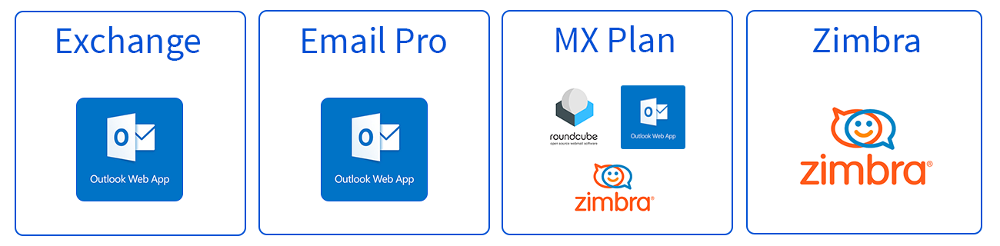

## Objective

This page answers questions about the Zimbra solution at OVHcloud

### General questions about Zimbra solutions at OVHcloud

#### What is Zimbra?

Zimbra is a popular open-source collaborative solution. Zimbra offers many features offered in the OVHcloud catalog.

To contextualize the Zimbra solution within OVHcloud, it is used for 2 email offers.

- **MX Plan**: Zimbra is used as part of a technological transition from Outlook Web App (OWA) to Zimbra webmail for the legacy MX Plan email solution.
- **Zimbra**: Zimbra is appearing in the OVHcloud catalog as a standalone solution with ["Zimbra Starter" currently in beta](https://labs.ovhcloud.com/en/zimbra-beta/).

To get a better understanding, the following graphic shows the technologies currently used on each OVHcloud solution. Outlook Web App (OWA) will gradually disappear from the MX Plan solution.

{.thumbnail .w-600 .h-600}

> [!warning]
>
> There are differences in functionality between the Zimbra solution used in the MX Plan solution and the Zimbra solution used in the Zimbra Starter solution. Find the features that have been maintained as part of the transition to the Zimbra solution for the MX Plan solution in [the table at the end of this FAQ](#features)

#### Where can I find guides?

A user guide for Zimbra is now available at [this address](/pages/web_cloud/email_and_collaborative_solutions/mx_plan/email_zimbra).

#### How do I configure my email address on an email client?

Visit our page “[Configuring your Zimbra email address in an email client](/pages/web_cloud/email_and_collaborative_solutions/zimbra/zimbra_mail_apps)”.

### Questions on MX Plan migration to Zimbra solution

As part of the MX Plan solution upgrade, a migration is planned from the current webmail using Outlook Web App (OWA) to the Zimbra solution's webmail.

If you are affected by this migration, you will find the most frequently asked questions here.

#### What are the differences between Outlook Web App (OWA) and Zimbra webmail?

Zimbra offers similar features and a user experience close to OWA. A user guide for Zimbra is now available at [this address](/pages/web_cloud/email_and_collaborative_solutions/mx_plan/email_zimbra).

#### Does migration open up new features?

Migrating to the new webmail maintains the same level of services as the previous one.

#### When will my services be migrated?

Notification emails for each service will be sent to you **2 week** and then **1 day** before the migration.

Services will be migrated gradually, so it is possible that your different services will be migrated several weeks apart.

#### How do I prepare for my migration to Zimbra?

The migration does not require any action on your part regarding the content of email accounts.

However, a short service interruption is required during the migration phase. It is therefore strongly recommended that you inform your users as soon as the migration date for your email accounts is communicated to you.

#### Do I need to make any changes when migrating to Zimbra?

This migration was designed to minimise the impact on our customers. No actions are expected from you.

No changes are expected from you.

#### Are there any changes to be expected in the OVHcloud Control Panel?

There are no changes planned in the Control Panel. Since the migration is under a new solution, some minor features may not be accessible in the first few weeks after the migration.

Find the list of features and their statuses for this migration [at the end of this FAQ](#features).

#### Will I need to reconfigure my email software?

No, the migration does not require a reconfiguration of your email software.

If you change your password, you will need to enter the new password in your email client.

#### Does the migration change the billing for my service?

No, the migration to the new Zimbra webmail solution is included in your solution. There are no changes to the billing or the contract of your MX Plan service.

#### Where will my emails be hosted after the migration?

The migration is done within our French data centres. Your data will remain in France.

#### Will there be any changes regarding the processing of my data?

No changes are planned regarding the processing of data and its use. You can find all this information in the contract for your MX Plan solution.

#### How do I stay on the current webmail (OWA)?

You can migrate your accounts at any time to Email Pro or Exchange in order to keep using the OWA webmail. To do this, please refer to our guide on [Migrating an MX Plan email account to an Email Pro or Exchange account](/pages/web_cloud/email_and_collaborative_solutions/migrating/migration_control_panel).

#### Can I oppose the migration?

No. OVHcloud is committed to providing a service with the best price performance ratio for its MX Plan offers. This is why we have chosen to migrate the current offers to the Zimbra solution.

However, you can still take advantage of the OWA interface [by migrating your email accounts to an Email Pro or Exchange solution](/pages/web_cloud/email_and_collaborative_solutions/migrating/migration_control_panel).

#### Can I cancel my MX Plan solution?

To cancel your solution in the "My services" section of the OVHcloud Control Panel, please refer to the MX Plan part of our guide on [Cancelling your OVHcloud services](/pages/account_and_service_management/managing_billing_payments_and_services/how_to_cancel_services#mxplan).

#### Features maintained, suspended or removed after migration to Zimbra  

| Function | Description | Status |
|-|-|-|
|**Email account management from the Control Panel** (Password, alias, quota)|Maintained|✅|
|**Offers and billing**|Maintained|✅|
|**Redirection/Alias/mailing list from the OVHcloud Control Panel**|Maintained|✅|
|**DNS configuration** (SPF/MX/SRV)|Maintained|✅|
|**Email account delegations**|Maintained via webmail|✅|
|**Logging in to email software** (IMAP/POP)|No configuration changes required|✅|
|**Email account content** (emails, folders, contacts)|Migrated|✅|
|**Emails received during the migration process**|Delivered|✅|
|**Automatic reply**|Maintained|✅|
|**Inbox rule**|- The rules configured from your email client will not be changed. - The rules configured from OWA webmail will be migrated to Zimbra webmail. Only a very small proportion of rules will not be migrated due to incompatibility. These will be sent as an email to the user's email account, and can be recreated manually. - *Incompatible rule* : A rule that uses two types of conditions, such as AND and OR, simultaneously. For example, if the message is received from (**john@mydomain.ovh** OR **mary@mydomain.ovh**) AND the subject contains "invoice", then move to the "Important" folder.|⚠️|
|**Personal signature**|- The signatures configured from your email software will not be changed. - Signatures configured from OWA webmail will not be migrated due to formatting.|⚠️|
|**Block/Authorise**|This feature, which allows you to block emails from a specific domain name or email address, will not be present on Zimbra. However, this can be easily recreated via an inbox rule from Zimbra.|❌|
|**Footer** (domain name signature configurable via the Control Panel)|This feature will not be present in the new Zimbra infrastructure. However, you can still configure a signature at the email account level.|❌|
|**Security Policy**|This Control Panel feature that allows you to change the password management policy will not be present on the Zimbra solution. The default security policy for passwords requires a minimum of 10 alphanumeric characters, 1 special character, 1 upper-case letter.|❌|
|**Spoofing**|Spoofing involves sending an email from an identity that is different from the email account you have been authenticated to. This practice is incompatible with the SPF and DKIM security protocols required for email deliverability. From Zimbra, you can configure another identity that is different from the email account used, provided that delegation is applied.|❌|
|**Support for Transport Layer Security (TLS) 1.0 and 1.1.**|Versions 1.0 and 1.1 are considered vulnerable to attack and no longer meet current security standards. If your web browser does not support **at least TLS 1.2**, we recommend installing the latest security and feature updates.|❌|

## Go further

[MX Plan - How to use Zimbra webmail](/pages/web_cloud/email_and_collaborative_solutions/mx_plan/email_zimbra)

For specialised services (SEO, development, etc.), contact [OVHcloud partners](/links/partner).

If you would like assistance using and configuring your OVHcloud solutions, please refer to our [support offers](/links/support).

Join our [community of users](/links/community).