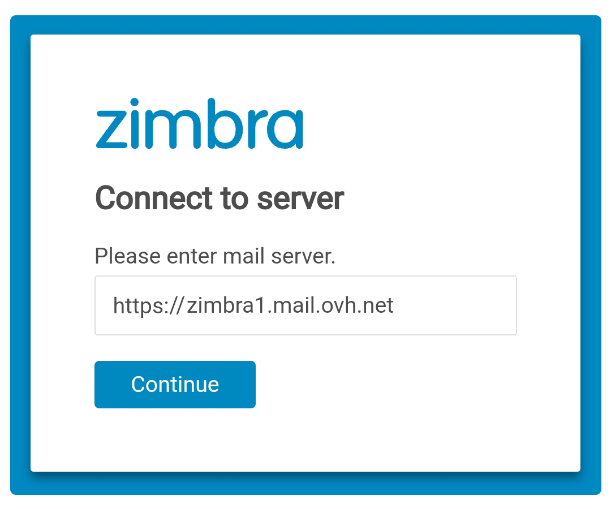
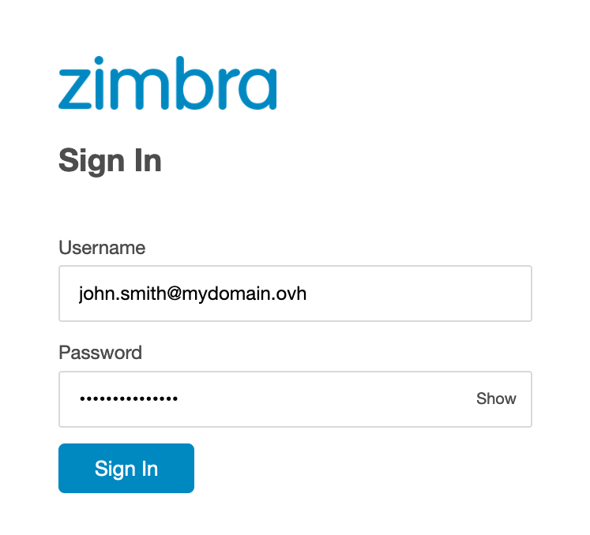
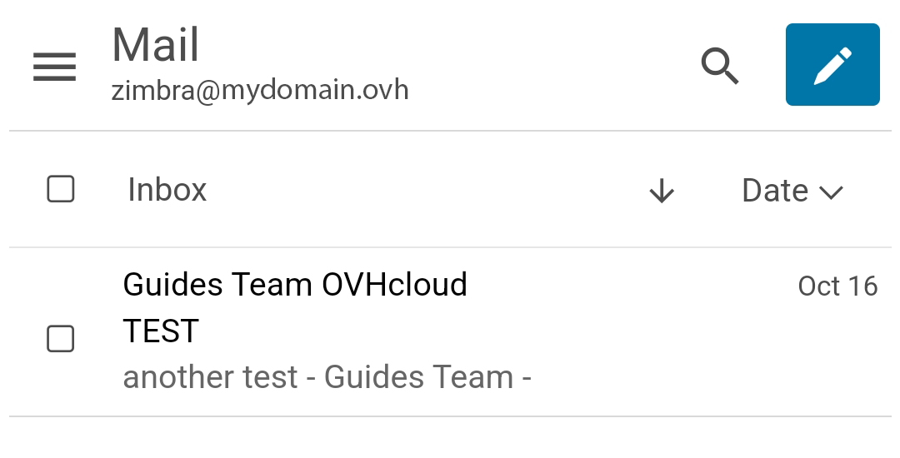
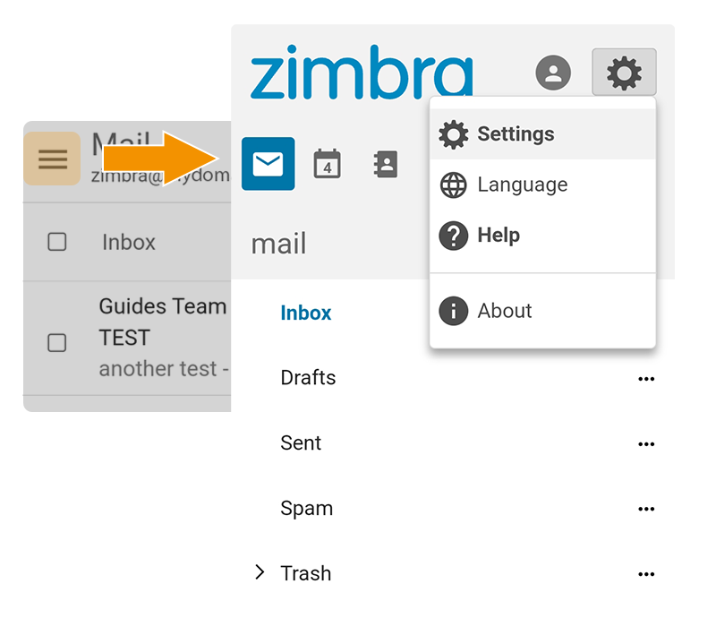

> [!warning]
>
> **Important**
>
> L'offre Zimbra est un produit en phase bêta.
>
> Il est uniquement disponible aux personnes ayant complété le [formulaire d'inscription à la bêta](https://labs.ovhcloud.com/en/zimbra-beta/).
>
> Certaines fonctionnalités ou limitations présentées dans ce guide sont susceptibles d'évoluer lorsque le produit sera commercialisé.

## Objectif

Les comptes e-mail Zimbra peuvent être configurés sur différents logiciels de messagerie compatibles. Cela vous permet d’utiliser votre adresse e-mail depuis l’appareil de votre choix. L'application Zimbra est disponible gratuitement sur Android et iOS

**Découvrez comment configurer votre adresse e-mail Zimbra sur l'application Zimbra.**

> [!warning]
>
> OVHcloud met à votre disposition des services dont la configuration, la gestion et la responsabilité vous incombent. Il vous revient de ce fait d'en assurer le bon fonctionnement.
>
> Nous mettons à votre disposition ce guide afin de vous accompagner au mieux sur des tâches courantes. Néanmoins, nous vous recommandons de faire appel à un [partenaire spécialisé](/links/partner) et/ou de contacter l'éditeur du service si vous éprouvez des difficultés. En effet, nous ne serons pas en mesure de vous fournir une assistance. Plus d'informations dans la section « Aller plus loin » de ce guide.

## Prérequis

- Disposer d’une adresse e-mail Zimbra.
- Avoir installé l'application Zimbra sur votre appareil [Android](https://play.google.com/store/apps/details?id=com.zimbra.modernapp&hl=fr) ou [iOS](https://apps.apple.com/cm/app/zimbra-email-collaboration/id1554848550).
- Posséder les identifiants relatifs à l'adresse e-mail que vous souhaitez paramétrer.

## En pratique

### Configurer son adresse e-mail

Suivez les étapes d'installation en cliquant sur les onglets ci-dessous :

> [!tabs]
> **Etape 1**
>>
>> lorsque vous lancez l'application pour la première fois, la fenêtre ci-dessous s'affiche. Saisissez l'URL du serveur Zimbra OVHcloud `https://zimbra1.mail.ovh.net`, appuyez sur `Continue`{.action} pour valider.
>>
>> {.thumbnail .w-600 .h-600}
>>
> **Etape 2**
>>
>> Saisissez votre **adresse e-mail** Zimbra et le  **mot de passe** associé, appuyez ensuite sur `Connexion`{.action}.
>>
>> {.thumbnail .w-600 .h-600}
>>
> **Etape 3**
>>
>> Vous avez maintenant accès au contenu de votre compte e-mail. Par défaut c'est votre boite de réception apparaît   
>>
>> {.thumbnail .w-600 .h-600}

> [!success]
>
> L'interface de l'application Zimbra est similaire au webmail. Pour plus de détails sur les fonctionnalités et paramètres, consultez notre guide « [Utiliser le webmail Zimbra](/pages/web_cloud/email_and_collaborative_solutions/mx_plan/email_zimbra) ».

### Utiliser l'adresse e-mail

Une fois l'adresse e-mail configurée, il ne reste plus qu’à l'utiliser ! Vous pouvez dès à présent envoyer et recevoir des messages.

OVHcloud propose aussi une application web permettant d'accéder à votre adresse e-mail depuis un navigateur internet. Celle-ci est accessible via [ce lien](/links/web/email). Vous pouvez vous y connecter grâce aux identifiants de votre adresse e-mail. Pour toute question relative à son utilisation, consultez notre guide « [Utiliser le webmail Zimbra](/pages/web_cloud/email_and_collaborative_solutions/) ».

### Consulter une autre adresse e-mail Zimbra 

L'application Zimbra ne permet de configurer qu'une seule adresse e-mail à la fois. Il faut donc se déconnecter du compte e-mail en cours d'utilisation pour pouvoir consulter un autre compte e-mail Zimbra.

Dirigez-vous vers le menu `☰`{.action} dans le coin supérieur gauche de votre écran, puis sélectionnez l'icône de profil dans la partie supérieure de votre écran. Enfin, appuyez sur `Déconnexion`.

{.thumbnail .w-600 .h-600}

### Que faire si un écran blanc apparait lorsque je lance l'application ?

Il s'agit d'un défaut de chargement lié à la connectivité au réseau. Il est conseillé de patienter quelques instants, le temps que l'application termine sa tentative de connexion.

Si rien de ne passe, vérifiez que la connectivité réseau de votre mobile est correcte, puis fermez complètement l'application et relancez-la. Répétez l'opération autant de fois que nécessaire.

Si le problème persiste, réinstallez l'application. Cela permettra de réinitialiser les paramètres et d'éliminer une potentielle corruption du fichier de configuration de l'application.

## Aller plus loin 

[Premiers pas avec l'offre Zimbra](/pages/web_cloud/email_and_collaborative_solutions/zimbra/getting_started_zimbra)

[Configurer son adresse e-mail Zimbra sur un logiciel de messagerie](/pages/web_cloud/email_and_collaborative_solutions/zimbra/zimbra_mail_apps)

[Utiliser le webmail Zimbra](/pages/web_cloud/email_and_collaborative_solutions/mx_plan/email_zimbra)

[FAQ sur la solution Zimbra OVHcloud](/pages/web_cloud/email_and_collaborative_solutions/mx_plan/faq-zimbra)

Pour des prestations spécialisées (référencement, développement, etc), contactez les [partenaires OVHcloud](/links/partner).

Si vous souhaitez bénéficier d'une assistance à l'usage et à la configuration de vos solutions OVHcloud, nous vous proposons de consulter nos différentes [offres de support](/links/support).

Échangez avec notre [communauté d'utilisateurs](/links/community).