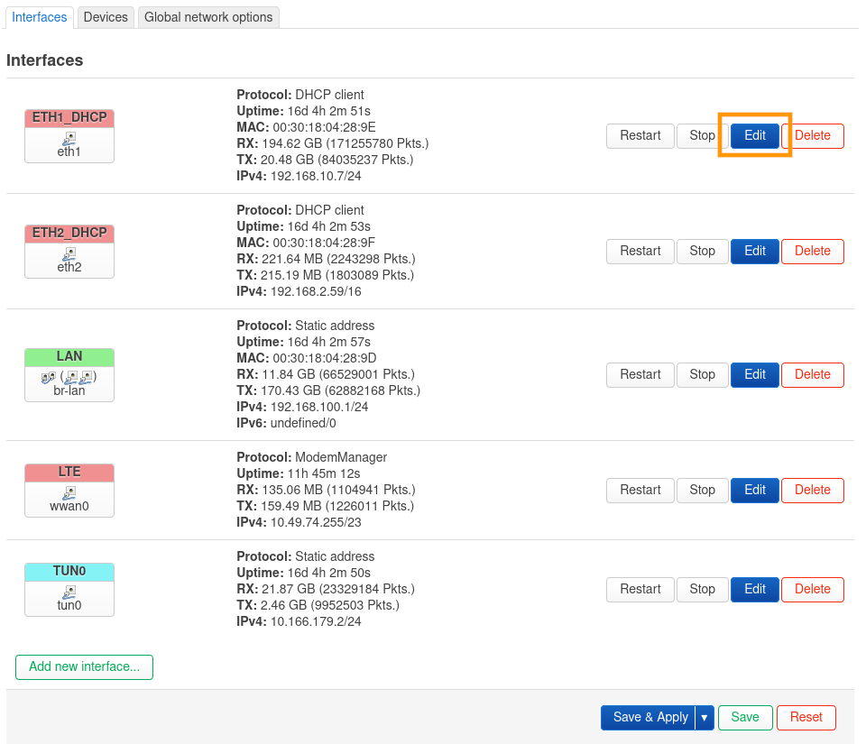
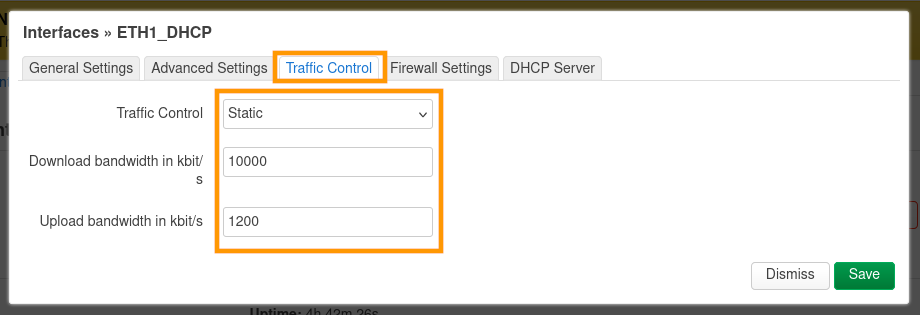
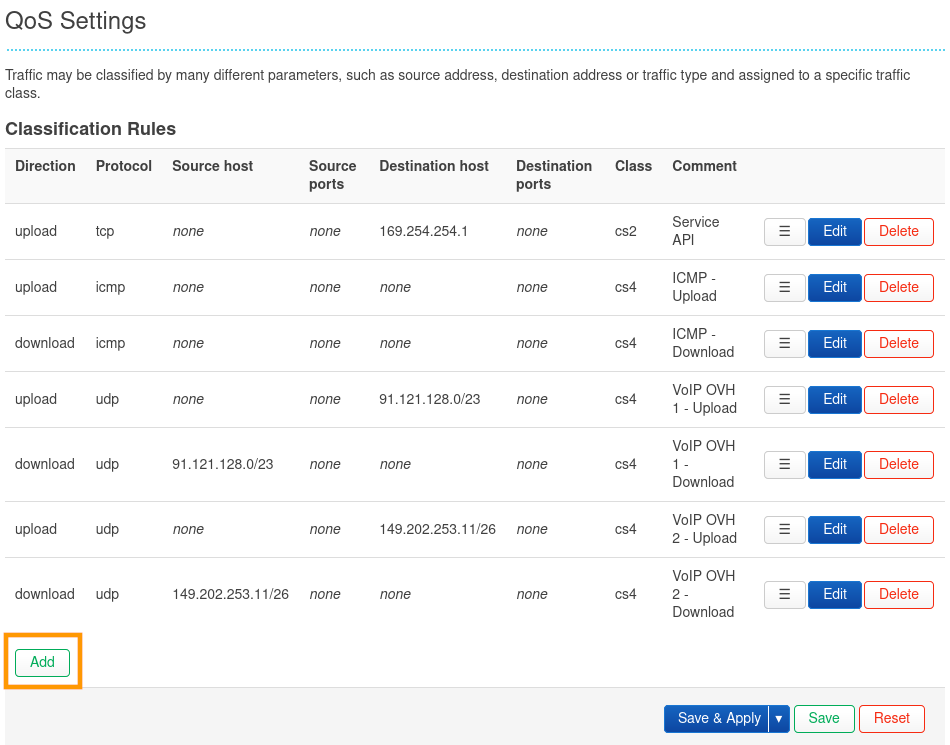
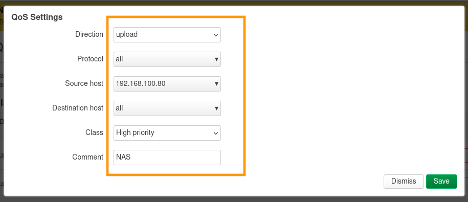
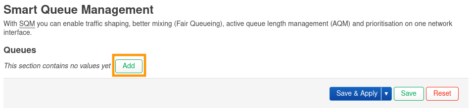
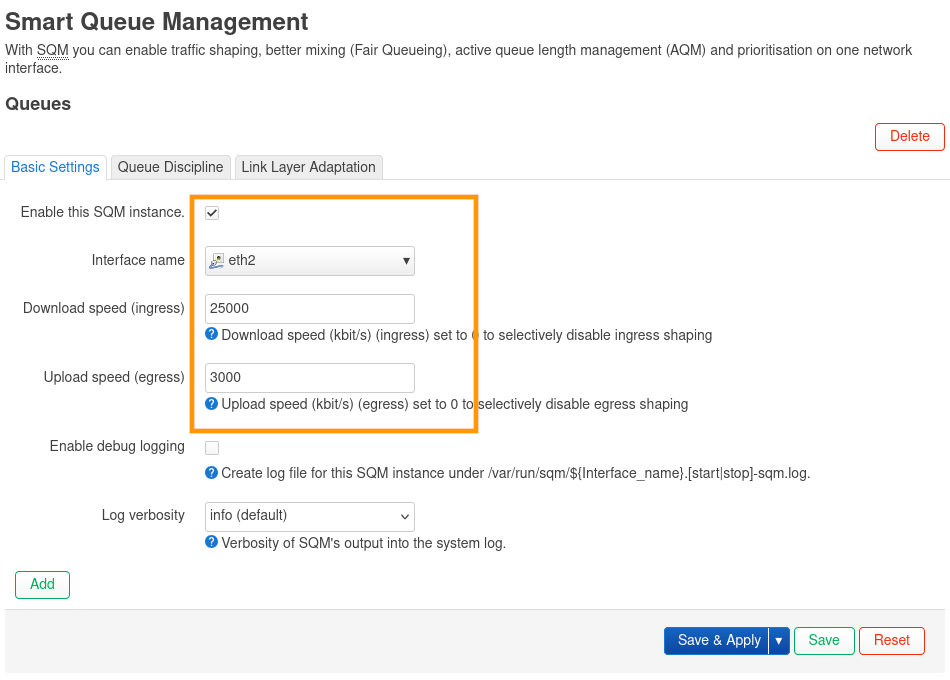

## Objectif

Découvrez comment modifier la QoS sur votre équipement OverTheBox, afin de prioriser certains flux réseaux et améliorer la gestion de votre bande passante.

## Prérequis

- Une **OverTheBox** fournie par OVHcloud ou une installation depuis [le projet Open Source](/pages/web_cloud/internet/overthebox/advanced_installer_limage_overthebox_sur_votre_materiel).
- Être connecté à l'interface web de l'**OverTheBox** depuis [overthebox.ovh](http://overthebox.ovh) ou [192.168.100.1](https://192.168.100.1).

## En pratique

### Configurer la QoS manuellement

> [!warn]
>
> Cette section ne fonctionne que sur les versions v0.9 et antérieures. Ce système a été remplacé par **SQM** à partir de la version v1.0.
>

Certaines règles sont déjà présentes par défaut, permettant notamment de prioriser les services de VoIP proposés par OVHcloud.

#### Étape 1 : préparation

> [!primary]
>
> Le débit descendant est la bande passante de l'Internet vers votre réseau local, c'est-à-dire votre débit de réception.
> Le débit montant est la bande passante de votre réseau vers l'Internet, c'est-à-dire votre débit d'émission.
>

Avant de configurer la  **QoS**, il est conseillé de connaître le débit maximum **montant et descendant** de chaque connexion utilisée par votre **OverTheBox**. Pour cela, vous pouvez utiliser l'outil [perf.overthebox.net](https://perf.overthebox.net/){.external} afin de déterminer les débits maximum de chacune de vos connexions.

**À titre d'exemple**, pour ce guide, voici les débits obtenus sur chaque connexion :

- **OVH-DSL1**: Débit descendant : **10 Mbps** / Débit montant : **1.2 Mbps**
- **OVH-DSL2**: Débit descendant : **5 Mbps** / Débit montant : **0.6 Mbps**

#### Étape 2 : activer le traffic control

> [!primary]
>
> Le *traffic control* ne bride pas votre connexion, il est utile pour mieux répartir le trafic en cas de saturation de la bande passante.
>

Une fois vos débits maximum connus, il est nécessaire d'activer le *traffic control*. Cet outil va permettre à votre **OverTheBox** de connaître le débit attendu pour chaque interface et ainsi correctement estimer la saturation de chaque lien.

- Rendez-vous dans l'onglet `Network > Interfaces`{.action}.
- Sélectionnez l'interface à modifier, dans notre exemple `eth1_dhcp`.
- Cliquez sur le bouton `Edit`{.action}.

{.thumbnail}

- Rendez-vous sur l'onglet `Traffic Control`{.action}.
- Modifiez le paramètre `Traffic Control`{.action} en `Static` à l'aide du menu déroulant.
- Dans le paramètre `Download bandwidth`{.action}, renseignez le débit descendant maximum de la connexion en **Kbps**. Pour notre exemple, pour un débit de 10Mbps, la valeur est `10000` Kbps.
- Dans le paramètre `Upload bandwidth`{.action}, renseignez le débit montant maximum de la connexion en **Kbps**. Pour notre exemple, pour un débit de 1,2Mbps, la valeur est `1200` Kbps.
- Confirmez vos changements avec le bouton `Save`{.action}.
- Appliquez vos changements avec le bouton `Save & Apply`{.action}.

{.thumbnail}

Refaites cette procédure complète pour chacune de vos connexions.

> [!warning]
>
> Une fois en place, si vous rencontrez des perturbations, vous pouvez essayer de configurer le *traffic control* en fixant les débits à 80% de votre débit maximum.
> Dans notre exemple, on remplacerait les valeurs 10000/1200 par 8000/960.
>

#### Étape 3 : créer une nouvelle règle QoS

> [!warning]
>
> La configuration par défaut est déjà optimisée pour une utilisation
> générique (Upload , VoIP  OVHcloud  etc.), la customisation n'est
> conseillée que si vous souhaitez prioriser une application particulière.
>

Dans notre exemple, nous souhaitons que le débit montant de notre serveur NAS soit priorisé afin d'améliorer la stabilité pour récupérer nos fichiers à distance lorsque nous sommes en déplacement.

- Rendez-vous dans l'onglet `OverTheBox > QoS Settings`{.action}.
- L'écran de configuration listant toutes les règles QoS s'affiche.
- Cliquez sur `Add`{.action}.

> [!primary]
>
> Les règles sont testées dans l'ordre du tableau, utilisez le bouton `≡`{.action} pour modifier la position d'une règle.
>

{.thumbnail}

- Rendez-vous sur l'onglet `Traffic Control`{.action}.
- Modifiez le paramètre `Direction`{.action} pour sélectionner le sens de la règle, montant ou descendant. Pour notre exemple, nous souhaitons que le débit montant émanant du **NAS** soit prioritaire, nous renseignons donc `upload`.
- Modifiez le paramètre `Protocol`{.action} pour sélectionner le protocole sur lequel s'applique la règle. Pour notre exemple, nous souhaitons n'importe quel protocole, nous renseignons donc `all`.
- Modifiez le paramètre `Source Host`{.action} pour sélectionner la source du trafic. Pour notre exemple, le **NAS** est l'hôte source, nous renseignons donc son adresse IP `192.168.100.80`.
- Modifiez le paramètre `Destination Host`{.action} pour sélectionner la destination du trafic. Pour notre exemple, nous souhaitons n'importe quelle destination, nous renseignons donc `all`.
- Modifiez le paramètre `Class`{.action} pour sélectionner la priorité du trafic. Pour notre exemple, nous souhaitons que le trafic soit prioritaire, nous renseignons donc `High priority`.
- Modifiez le paramètre `Comment`{.action} pour nommer la règle. Pour notre exemple, nous nommons la règle `NAS`.
- Confirmez vos changements avec le bouton `Save`{.action}.
- Appliquez vos changements avec le bouton `Save & Apply`{.action}.

{.thumbnail}

> [!primary]
>
> Il est possible que cette configuration ne soit pas prise en compte immédiatement.
> Si c'est le cas, veuillez procéder à un redémarrage électrique de l'OverTheBox ou déconnecter/reconnecter du réseau l'appareil concerné par la règle.
>

### Configurer la QoS à l'aide de SQM

> [!warn]
>
> Cette section ne fonctionne qu'à partir de la version v1.0. **SQM** est disponible en version v0.9 mais ne peut être configuré que sur une interface.
>

_Smart Queue Management_ (SQM) est un système de QoS unifié qui applique différents algorithmes pour améliorer la qualité de votre connexion internet. Ce système met en place automatiquement des politiques de planification réseau par flux et par paquet, de management de queue actif (AQM), de mise en forme du trafic (traffic shaping), de limite de débits (rate limiting) ou encore de priorisation.
De ce fait, il n'y a plus besoin de spécifier la QoS manuellement pour chaque flux, mais uniquement par interface.

#### Configuration automatique

Votre **OverTheBox** contient un service qui s'appelle `otb-auto-sqm`{.action} qui est capable de lancer des tâches en arrière-plan afin de configurer automatiquement SQM sur toutes les interfaces WAN disponibles.

- Connectez-vous en **SSH** sur l'**OverTheBox** :
```bash
ssh root@192.168.100.1
```
- Lancez l'outil de configuration automatique :
```bash
otb-action-autoqos
```
#### Configuration manuelle

L'outil de configuration automatique applique une configuration générale en fonction du débit de vos interfaces, il est possible que cette configuration ne soit pas optimale. Vous pouvez configurer manuellement SQM pour l'optimiser pour votre connexion.

#### Étape 1 : préparation

> [!primary]
>
> Le débit descendant est la bande passante de l'Internet vers votre réseau local, c'est-à-dire votre débit de réception.
> Le débit montant est la bande passante de votre réseau vers l'Internet, c'est-à-dire votre débit d'émission.
>

Avant de configurer la  **QoS**, il est conseillé de connaître le débit maximum **montant et descendant** de chaque connexion utilisée par votre **OverTheBox**. Pour cela, vous pouvez utiliser l'outil [perf.overthebox.net](https://perf.overthebox.net/){.external} afin de déterminer les débits maximum de chacune de vos connexions.

**À titre d'exemple**, pour ce guide, voici les débits obtenus sur chaque connexion :

- FTTH: Débit descendant : 1000 Mbps / Débit montant : 600 Mbps (nous ne configurons pas SQM sur ce lien, car supérieur à 300Mbps)
- VDSL: Débit descendant : 25 Mbps / Débit montant : 3 Mbps
- lte: Débit descendant : 10 Mbps / Débit montant :  10 Mbps

> [!warn]
>
> SQM est gourmands en ressources processeur, il n'est pas recommandé de l'activer sur des liens avec des débits supérieurs à 300Mbps, par exemple sur une connexion fibre.
>

#### Étape 2 : configuration

Une fois vos débits maximum connus, il est nécessaire de configurer **SQM**. Cet outil va permettre à votre **OverTheBox** de connaître le débit attendu pour chaque interface et ainsi correctement estimer la saturation de chaque lien.

- Rendez-vous dans l'onglet `Network > SQM QoS`{.action}.
- L'écran de configuration listant la configuration **SQM** s'affiche.
- Cliquez sur `Add`{.action}.

{.thumbnail}

- Cochez la case du paramètre `Enable this SQM instance`{.action} pour activer la configuration **SQM**.
- Modifiez le paramètre `Interface name`{.action} pour sélectionner l'interface sur laquelle **SQM** s'exécute. Pour notre exemple, notre lien **ADSL** est l'interface `eth2`, nous renseignons donc `eth2`.
- Dans le paramètre `Download speed (ingress)`{.action}, renseignez le débit descendant maximum de la connexion en **Kbps**. Pour notre exemple, pour un débit de 25Mbps, la valeur est `25000` Kbps.
- Dans le paramètre `Upload speed (egress)`{.action}, renseignez le débit montant maximum de la connexion en **Kbps**. Pour notre exemple, pour un débit de 3Mbps, la valeur est `3000` Kbps.
- Appliquez vos changements avec le bouton `Save & Apply`{.action}.

{.thumbnail}

## Aller plus loin

### Les différentes classes de trafic

> [!warn]
>
> Cette section concerne la page `OverTheBox > QoS Settings`{.action} disponible uniquement sur les versions v0.9 et antérieures.
>

Il existe quatre classes de trafic, ce qui vous permet de classer le trafic par priorités.

| Paramètre | Description |
| ------------- | ------------- |
| Latency - VoIP  | Pour un trafic très prioritaire et nécessitant une faible latence, comme la VoIP |
| High Priority  | Pour un trafic prioritaire |
| Normal | Pour la majorité du trafic, le trafic n'a pas de priorité particulière |
| Low Priority | Pour un trafic jugé non prioritaire |

N'hésitez pas à échanger avec notre communauté d'utilisateurs sur vos produits Télécom sur notre site [OVHcloud Community](https://community.ovh.com/c/telecom)
