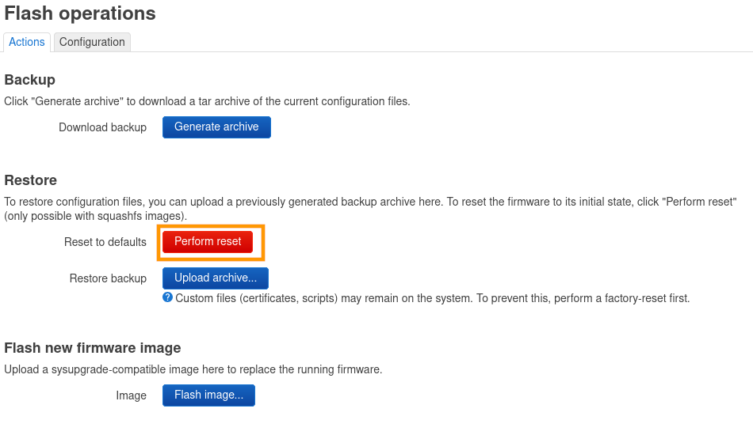
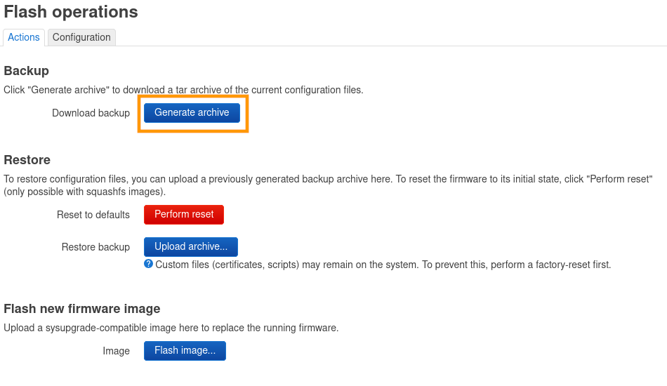
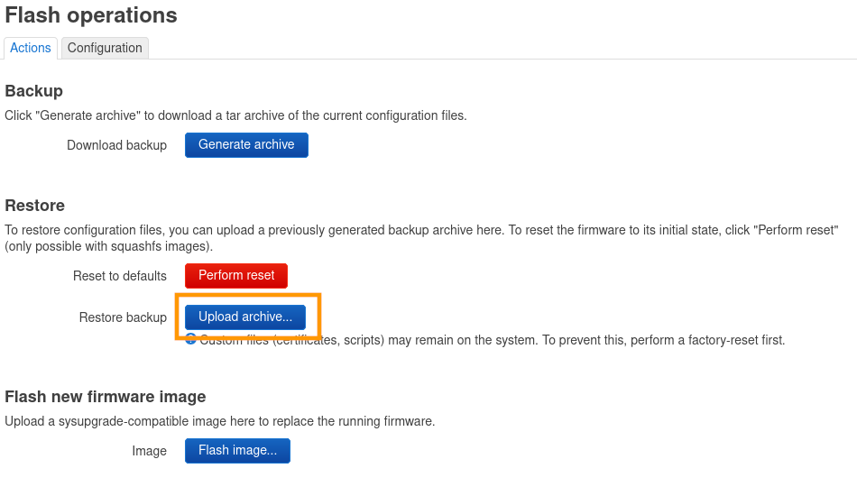
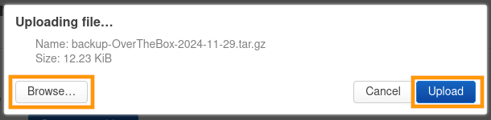

## Objectif

Découvrez comment réinitialiser ou restaurer la configuration de votre équipement **OverTheBox**. Ce guide vous permet de :

- Réinitialiser un équipement **OverTheBox** pour revenir sur la configuration par défaut.
- Sauvegarder et restaurer la configuration de votre équipement **OverTheBox**.

## Prérequis

- Une **OverTheBox** fournie par OVHcloud ou une installation depuis [le projet Open Source](/pages/web_cloud/internet/overthebox/advanced_installer_limage_overthebox_sur_votre_materiel).
- Être connecté à l'interface web de l'**OverTheBox** depuis [overthebox.ovh](http://overthebox.ovh) ou [192.168.100.1](https://192.168.100.1).

## En pratique

### Réinitialiser la configuration

Plusieurs méthodes sont possibles. Le résultat final étant identique, vous pouvez donc choisir celle qui vous convient le mieux.

#### Méthode 1 : réinitialisation physique

Si votre **OverTheBox** est fournie par OVHcloud, il est possible de la réinitialiser physiquement.

> [!tabs]
> Plus
>>
>> Dans le cas d'une **OTB V2b** vendue avec les anciennes offres **OverTheBox Plus**
>> Appuyez de façon répétée, en moins de 2 secondes, 5 fois sur le bouton `Power ON/OFF`{.action}.
>>
>> {.thumbnail}
>>
> IT
>>
>> Dans le cas d'une **OTB V2c** vendue avec les anciennes offres **OverTheBox IT**
>> Appuyez de façon répétée, en moins de 2 secondes, 5 fois sur le bouton Reset.
>>
>> {.thumbnail}
>>
>>

Attendez quelques minutes afin qu'**OverTheBox** soit de nouveau opérationnelle.

> [!success]
>
> Votre OvertheBox est maintenant réinitialisée, vous pouvez la réinstaller en suivant la procédure décrite dans les guides suivants :
>
> [Comment installer OverTheBox ?](/pages/web_cloud/internet/overthebox/plus_itv2_installation)
>

#### Méthode 2 : réinitialisation logicielle

> [!tabs]
> WEB
>>
>> Il est possible de réinitialiser la configuration depuis l'interface WEB de votre équipement.
>> - Rendez-vous dans l'onglet `System > Backup / Flash firmware`{.action}.
>> - Cliquez sur le bouton **rouge** `Perform reset`{.action}.
>>
>> {.thumbnail}
>>
> SSH
>>
>> Il est possible de réinitialiser l'**OverTheBox** depuis le CLI, accessible depuis une connexion SSH.
>> - Connectez vous en SSH à votre **OverTheBox** :
>>
>>```console
>>ssh root@overthebox.ovh
>>```
>> - Une fois connecté, entrez la commande suivante :
>>```console
>>firstboot -y
>>```
>>

Attendez quelques minutes afin qu' **OverTheBox** soit de nouveau opérationnelle.

> [!success]
>
> Votre  OvertheBox  est maintenant réinitialisée, vous pouvez la réinstaller en suivant la procédure décrite dans les guides suivants :
>
> [Comment installer OverTheBox ?](/pages/web_cloud/internet/overthebox/plus_itv2_installation)
>

#### Sauvegarder la configuration

Il est possible de sauvegarder configuration de votre **OverTheBox**.

- Rendez-vous dans l'onglet `System > Backup / Flash firmware`{.action}.
- Cliquez sur le bouton `Generate archive`{.action}.

{.thumbnail}

### Restaurer la configuration

Il est possible de restaurer la configuration de votre **OverTheBox** à l'aide d'un fichier de sauvegarde.

- Rendez-vous dans l'onglet `System > Backup / Flash firmware`{.action}.
- Cliquez sur le bouton `Upload archive...`{.action}.

{.thumbnail}

- Cliquez sur le bouton `Browse...`{.action} et sélectionnez le fichier de sauvegarde.
- Cliquez sur le bouton `Upload`{.action} pour appliquer la sauvegarde.

{.thumbnail}

## Aller plus loin

### Réinitialisation par clé USB

Vous pouvez suivre le guide « [Installer l’image OverTheBox sur votre matériel](/pages/web_cloud/internet/overthebox/advanced_installer_limage_overthebox_sur_votre_materiel) » pour installer manuellement la dernière image du système OverTheBox.

Échangez avec notre [communauté d'utilisateurs](/links/community).
